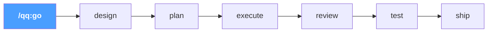
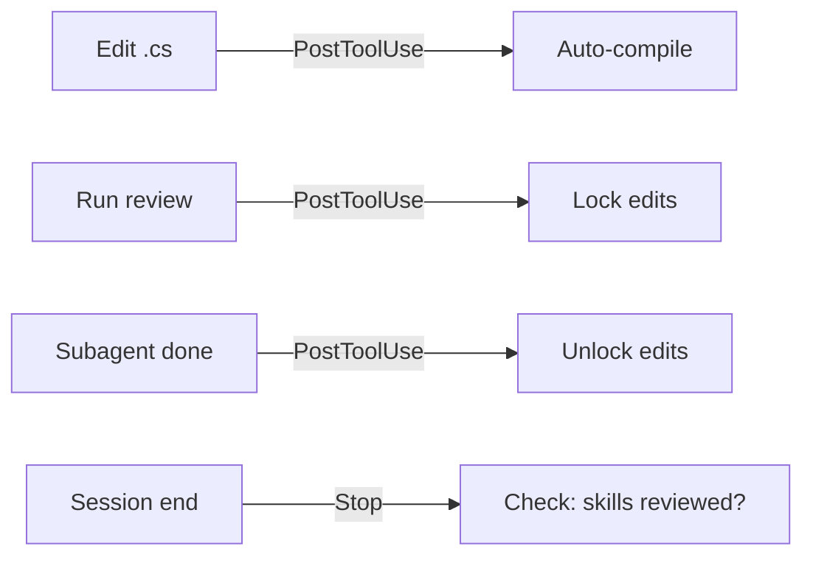
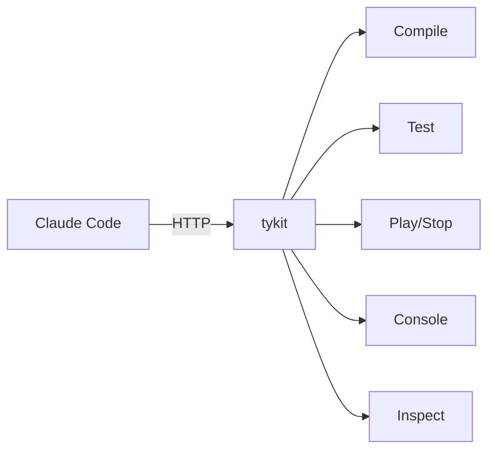
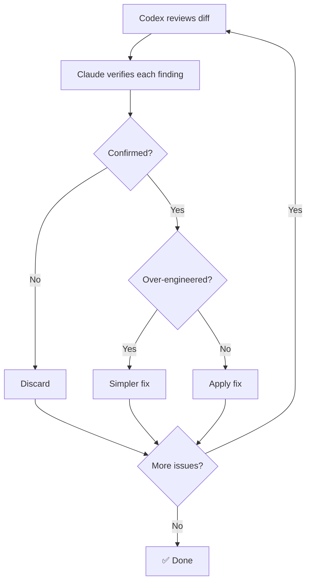

<p align="center">
  
</p>

<h1 align="center">quick-question</h1>

<p align="center">
  <strong>Unity Agent Harness for Claude Code</strong><br>
  Auto-compile, test pipelines, cross-model code review — out of the box.<br><br>
  Built on the principles from <a href="https://tyksworks.com/posts/ai-coding-workflow-en/">AI Coding in Practice: An Indie Developer's Document-First Approach</a>
</p>

<p align="center">
  <a href="https://github.com/tykisgod/quick-question/actions/workflows/validate.yml"></a>
  
  <a href="https://github.com/tykisgod/quick-question/blob/main/LICENSE"></a>
  
  
  
  
  <a href="https://github.com/tykisgod/quick-question/stargazers"></a>
</p>

<p align="center">
  English |
  <a href="docs/README.zh-CN.md">中文</a> |
  <a href="docs/README.ja.md">日本語</a> |
  <a href="docs/README.ko.md">한국어</a>
</p>

---

> 🪟 **Windows support is in preview** — see details in each language section below.

# English

## What It Does

- **`/qq:go` — lifecycle-aware routing.** Detects where you are in the dev cycle and suggests the next step. Design doc? Plan. Code written? Review. Tests pass? Ship.
- **tykit — lightweight Unity Editor control, zero config.** In-process HTTP server. No Node.js, no WebSocket bridge. Starts automatically, responds in milliseconds. Also compatible with [mcp-unity](https://github.com/CoderGamester/mcp-unity) and [Unity-MCP](https://github.com/IvanMurzak/Unity-MCP) as alternative backends.
- **Auto-compilation** on every `.cs` edit via hook
- **Test pipeline** — EditMode + PlayMode + runtime error check
- **Cross-model code review** — Claude orchestrates, Codex reviews, every finding verified
- **22 skills** covering the full dev lifecycle — design, plan, execute, review, test, ship

## Why quick-question

| | quick-question | Typical AI tools |
|---|:---:|:---:|
| Know where you are in the dev cycle | ✅ Lifecycle-aware routing | ❌ You decide |
| Auto-compile on edit | ✅ Hook-driven | ❌ Manual |
| Test pipeline | ✅ EditMode + PlayMode + error check | ❌ Manual |
| Cross-model review | ✅ Claude + Codex with verification | ⚠️ Single model |
| Control Unity Editor | ✅ tykit (in-process, zero config) | ❌ No access |
| MCP backend support | ✅ mcp-unity / Unity-MCP | — |
| Pre-push safety | ✅ Optional git hook | ❌ None |

## Lifecycle Pipeline



Type `/qq:go` — qq reads your project state and routes you to the right step. Each step suggests the next. Use `--auto` to run the full pipeline hands-free.

## Install

**Requirements:**
- macOS or Windows ([Git for Windows](https://gitforwindows.org/) required on Windows)
- Unity 2021.3+
- [Claude Code](https://docs.anthropic.com/en/docs/claude-code)
- curl, python3, jq
- [Codex CLI](https://github.com/openai/codex) *(optional, for cross-model review)*

*Windows support is in preview — expect rough edges for the next few weeks.*

**Step 1 — Plugin (skills + hooks):**
```
/plugin marketplace add tykisgod/quick-question
/plugin install qq@quick-question-marketplace
```

**Step 2 — tykit (Unity package):**

> Step 2 is optional if you only need the skills — tykit adds direct Unity Editor control.

```bash
git clone https://github.com/tykisgod/quick-question.git /tmp/qq-install
/tmp/qq-install/install.sh /path/to/your-unity-project
rm -rf /tmp/qq-install
```

## Quick Start

```bash
/qq:go                  # Where am I? What should I do next?
/qq:go "add health system"   # Start from an idea
/qq:go --auto design.md      # Full pipeline, no prompts
```

Or use any skill directly:
```bash
/qq:test                      # Run tests
/qq:best-practice             # Quick 18-rule check
/qq:codex-code-review         # Cross-model review
/qq:commit-push               # Ship it
```

## Commands

| Command | Description |
|---------|-------------|
| **Workflow** | |
| `/qq:go` | Entry point — detect current state, guide you to the right next step |
| `/qq:design` | Write a game design document from a one-liner, rough draft, or discussion |
| `/qq:plan` | Generate a technical implementation plan from a design doc or description |
| `/qq:execute` | Smart implementation — read a plan, pick execution strategy, build step by step |
| **Testing** | |
| `/qq:test` | Run unit/integration tests with error checking |
| **Code Review (Codex)** | *Requires [Codex CLI](https://github.com/openai/codex)* |
| `/qq:codex-code-review` | Cross-model code review (Claude + Codex with verification) |
| `/qq:codex-plan-review` | Cross-model design document review |
| **Code Review (Claude-only)** | *No extra tools needed* |
| `/qq:claude-code-review` | Deep code review using Claude subagents |
| `/qq:claude-plan-review` | Deep design document review using Claude subagents |
| **Code Review (Quick)** | |
| `/qq:best-practice` | Quick best-practice check — 18 rules for anti-patterns, performance, runtime safety |
| `/qq:self-review` | Review skill/config changes for quality |
| **Analysis** | |
| `/qq:brief` | Architecture diff + PR checklist (2 docs) |
| `/qq:timeline` | Commit history timeline with phase analysis (2 docs) |
| `/qq:full-brief` | Run brief + timeline in parallel (4 docs total) |
| `/qq:deps` | `.asmdef` dependency graph + matrix + health check |
| `/qq:doc-drift` | Compare design docs vs code, find inconsistencies |
| **Utilities** | |
| `/qq:commit-push` | Batch commit and push |
| `/qq:explain` | Explain module architecture in plain language |
| `/qq:grandma` | Explain any concept using everyday analogies anyone can understand |
| `/qq:research` | Search open-source solutions for current problem |
| `/qq:changes` | Summarize all changes in current conversation |
| `/qq:doc-tidy` | Scan repo docs, analyze organization, suggest cleanup |

## Scenarios

### 1. Build a feature from scratch

> Solo developer. One-line requirement: "add a food system."

```
/qq:go "add a food system"
```

qq suggests `/qq:design`. Asks 3 questions (reference games? data format? MVP?), writes a design doc.

→ "Design ready. Run `/qq:plan`?" — reads the design, explores the codebase, outputs a 6-step implementation plan with file paths and interfaces.

→ "Plan ready. Run `/qq:execute`?" — creates `IFoodSource` interface, implements `HungerSystem` and `FoodContainer`, wires into existing `NeedSystem`. Each `.cs` save auto-compiles via hook.

→ "Run `/qq:best-practice`?" — catches `GetComponent` in `Update` and a missing event unsubscription. Fixed.

→ "Run `/qq:test`?" — all green. → "Run `/qq:commit-push`?"

**Or skip all prompts:** `/qq:go --auto "add a food system"` runs everything end-to-end.

---

### 2. Review code before merging

> Team developer. 400 lines of C# across 5 files. Ready for review.

```
/qq:go
```

qq detects uncommitted `.cs` changes. Suggests `/qq:best-practice`. Catches a `public` field that should be `[SerializeField] private` and a missing `CompareTag`. Fixed in 30 seconds.

→ "Run `/qq:codex-code-review`?" — diff sent to Codex. Review Gate locks edits. Subagents verify: 1 critical confirmed (no `isDead` guard during respawn), 1 false positive rejected. Fix applied, gate unlocks.

→ "Run `/qq:doc-drift`?" — design doc says fire starts at 30% HP, code uses 25%. Doc updated.

→ "Run `/qq:commit-push`?" — pre-push hook runs tests. All green. Pushed.

---

### 3. Understand a large codebase

> New team member. Day one on a 200k-line Unity project.

```
/qq:grandma "task system"
```
> "Imagine a restaurant. Each crew member is a waiter. The task system is the manager who looks at all the tables, decides who's closest and free, and assigns them. Urgent tables jump the queue."

Now the technical version:

```
/qq:explain TaskSystem
```

Outputs: responsibilities, key classes, data flow, lifecycle hooks, design decisions.

```
/qq:deps
```

Mermaid dependency graph of all `.asmdef` modules. `TaskSystem` depends on `NavigationSystem` and `NeedSystem` but not `CombatSystem` — clean boundaries.

## tykit

tykit is a lightweight HTTP server inside the Unity Editor process:

- **Zero setup** — add one line to `manifest.json`, open Unity, done
- **In-process** — commands execute in milliseconds, no serialization overhead
- **No dependencies** — no Node.js, no WebSocket bridge, no external process
- **Auto-configured** — port derived from project path, no manual config

**Use it standalone** (no quick-question needed):
```json
"com.tyk.tykit": "https://github.com/tykisgod/tykit.git"
```

**Or with qq** — where it powers auto-compilation and testing behind the scenes.

```bash
PORT=$(python3 -c "import json; print(json.load(open('Temp/tykit.json'))['port'])")

# Compile
curl -s -X POST http://localhost:$PORT/ \
  -d '{"command":"compile-status"}' -H 'Content-Type: application/json'

# Run tests
curl -s -X POST http://localhost:$PORT/ \
  -d '{"command":"run-tests","args":{"mode":"editmode"}}' -H 'Content-Type: application/json'

# Read errors
curl -s -X POST http://localhost:$PORT/ \
  -d '{"command":"console","args":{"count":50,"filter":"error"}}' -H 'Content-Type: application/json'
```

tykit is just HTTP. Use it from Python, GitHub Actions, or any AI agent. See [tykit API Reference](docs/tykit-api.md) for all 13 commands.

## How It Works

### Three layers, each doing one job:

- **`/qq:go` routes.** Reads project state — design docs, plans, uncommitted code, test results — and recommends the right next skill. It never does work itself; it only routes.
- **Hooks guard.** Fire automatically on every `.cs` edit (compile), every code review (lock edits until verified), every skill change (must review before session ends).
- **tykit bridges.** HTTP server inside Unity Editor. When qq needs to compile, run tests, or read the console, it talks to tykit. No UI automation — just HTTP.





### Cross-Model Review (Tribunal)



## Customization

### CLAUDE.md

Your coding standards. The auto-compilation hook and test commands respect whatever rules you define here. See [`templates/CLAUDE.md.example`](templates/CLAUDE.md.example) for Unity-specific defaults.

### AGENTS.md

Your architecture rules and review criteria. The `/qq:best-practice`, `/qq:claude-code-review`, and cross-model review commands read this file to detect anti-patterns and module boundary violations. See [`templates/AGENTS.md.example`](templates/AGENTS.md.example) for a starting template.

### Priority System

All review commands classify findings by impact:

| Priority | Scope | Action |
|----------|-------|--------|
| **P0** | Architecture changes, anti-patterns, lifecycle issues | Must review |
| **P1** | Business logic, performance, error handling | Worth reviewing |
| **P2** | Getters/setters, logging, config tweaks | Quick scan |

## Design Principles

- **Document-first** — write the design before the code. `/qq:design` → `/qq:plan` → `/qq:execute` enforces this order.
- **Verify, don't trust** — cross-model review findings are independently verified by subagents before any code is changed.
- **Proportionate fixes** — every review includes an over-engineering check. If the fix is heavier than the problem, use a simpler alternative.
- **Automatic safety nets** — hooks fire without you asking. Compilation, review gates, and skill enforcement are always on.
- **Loose coupling** — each skill does one thing. The pipeline is advisory ("want to run X next?"), not rigid.

Built on the principles from [AI Coding in Practice: An Indie Developer's Document-First Approach](https://tyksworks.com/posts/ai-coding-workflow-en/).

## FAQ

**1. Does this work on Windows?**
Yes. macOS + Windows are both supported. Windows requires [Git for Windows](https://gitforwindows.org/) (provides bash and standard Unix tools). On macOS, `osascript` is used as a fallback for Editor detection; on Windows, the equivalent PowerShell path is used instead.

**2. Do I need Codex CLI?**
No, but recommended. `/qq:claude-code-review` works with Claude only, but `/qq:codex-code-review` produces better results — a second model catches blind spots that a single model misses. Cross-model review is the default for a reason.

**3. Can I use this with Cursor / Copilot / other AI tools?**
The skills and hooks require Claude Code. tykit (the HTTP server) works with any tool that can send HTTP requests. If you use an MCP Unity server (mcp-unity or Unity-MCP), qq skills will detect and use it automatically — see [MCP Support](#mcp-support).

**4. What happens when compilation fails?**
The auto-compile hook shows the error in the terminal. Claude reads it, fixes the code, and re-compiles. You don't need to do anything.

**5. Can I use tykit without quick-question?**
Yes. Add one line to `Packages/manifest.json` and tykit works standalone. See [tykit API Reference](docs/tykit-api.md).

## MCP Support

qq works with third-party MCP servers for Unity as alternatives to tykit:

- **[mcp-unity](https://github.com/CoderGamester/mcp-unity)** — Node.js + WebSocket bridge (requires Unity 6+)
- **[Unity-MCP](https://github.com/IvanMurzak/Unity-MCP)** — standalone server, supports Docker/remote

If an MCP server is configured in Claude Code, qq skills automatically prefer MCP tools for compilation, testing, and console access. No configuration needed — Claude detects available MCP tools at runtime.

**tykit becomes optional** when using an MCP backend. The auto-compile hook still runs as a fallback, but MCP tools take priority when available.

**Compatibility:** mcp-unity requires Unity 6+. Unity-MCP has no specific version requirement. qq itself targets Unity 2021.3+.

| Capability | tykit | mcp-unity | Unity-MCP |
|-----------|-------|-----------|-----------|
| Compile | `compile` | `recompile_scripts` | `assets-refresh` |
| Run tests | `run-tests` | `run_tests` | `tests-run` |
| Read console | `console` | `get_console_logs` | `console-get-logs` |
| Clear console | `clear-console` | — | — |

## Limitations

- **macOS + Windows** — Windows requires [Git for Windows](https://gitforwindows.org/); `osascript` and `/Applications/Unity` paths are macOS-specific, Windows uses equivalent PowerShell and registry-based paths via `scripts/platform/windows.sh`
- **Codex CLI required** for cross-model review features
- **Unity 2021.3+** required by tykit package
- **tykit is localhost-only, no authentication** — acceptable for dev machines, not for shared environments without network controls
- **Console log scraping** for compile verification — use `clear-console` before critical compiles to avoid stale errors

## Contributing

Contributions are welcome! Please open an issue or submit a pull request.

## License

[MIT](LICENSE) © Yukang Tian
