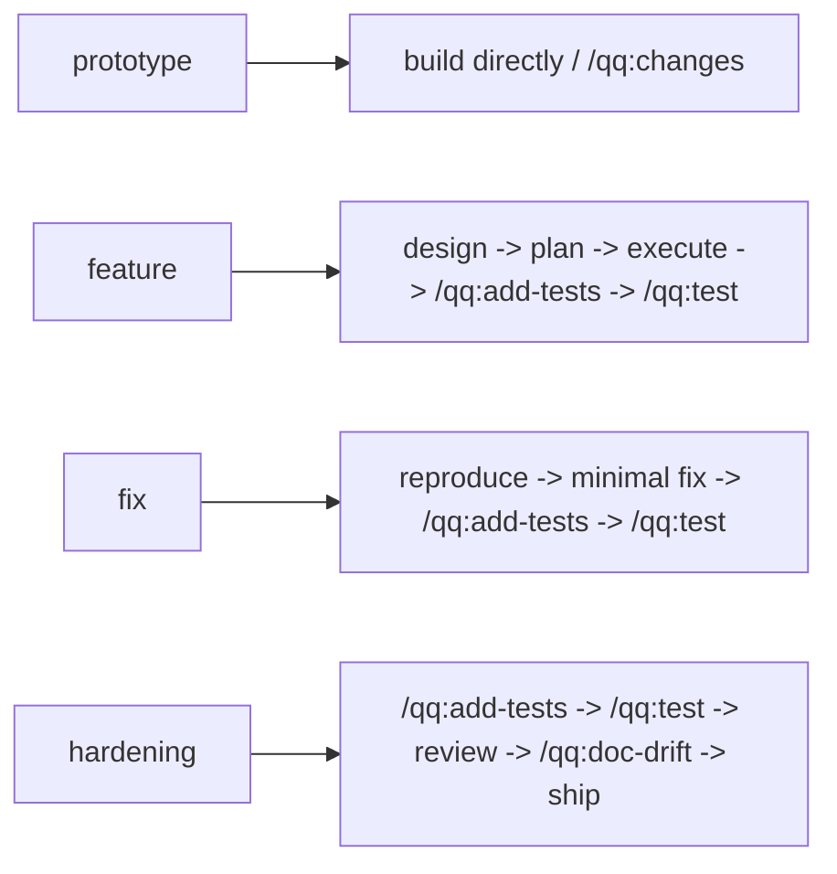
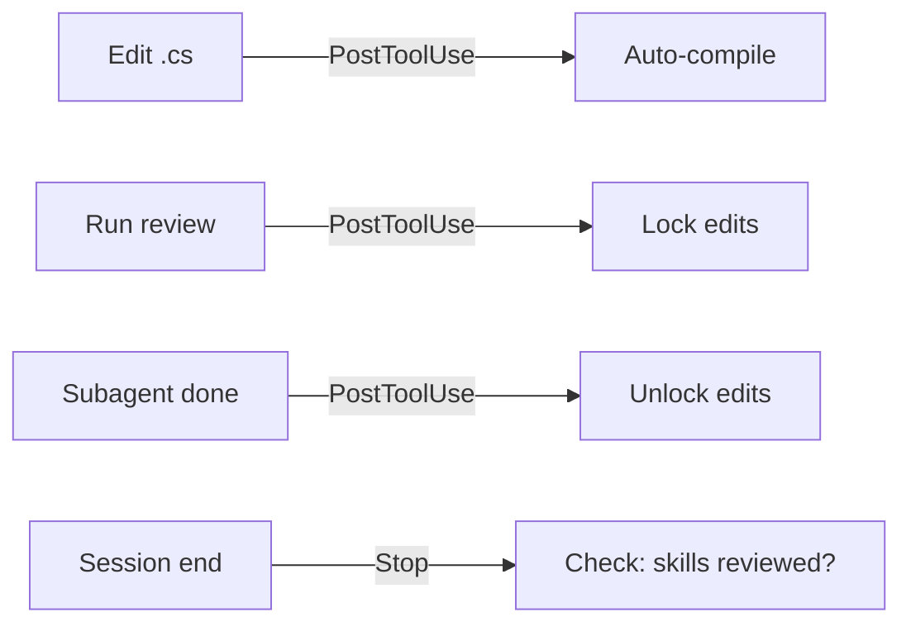
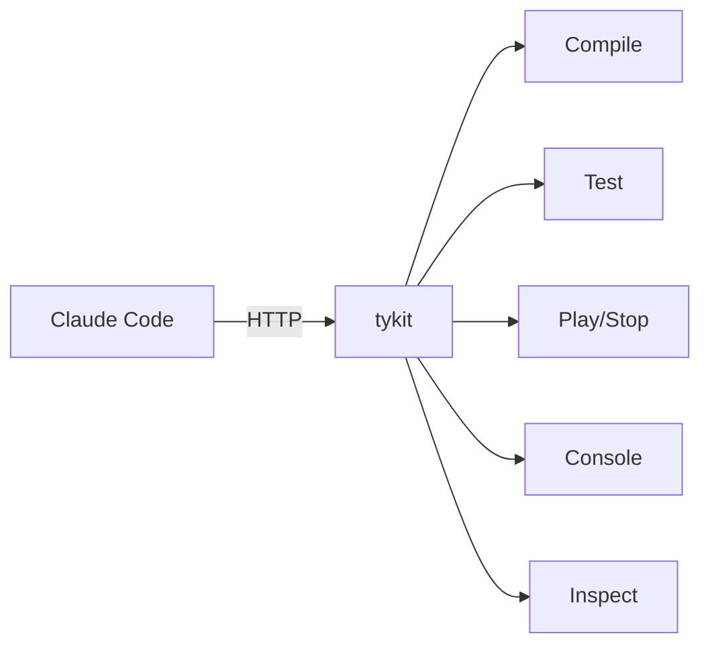
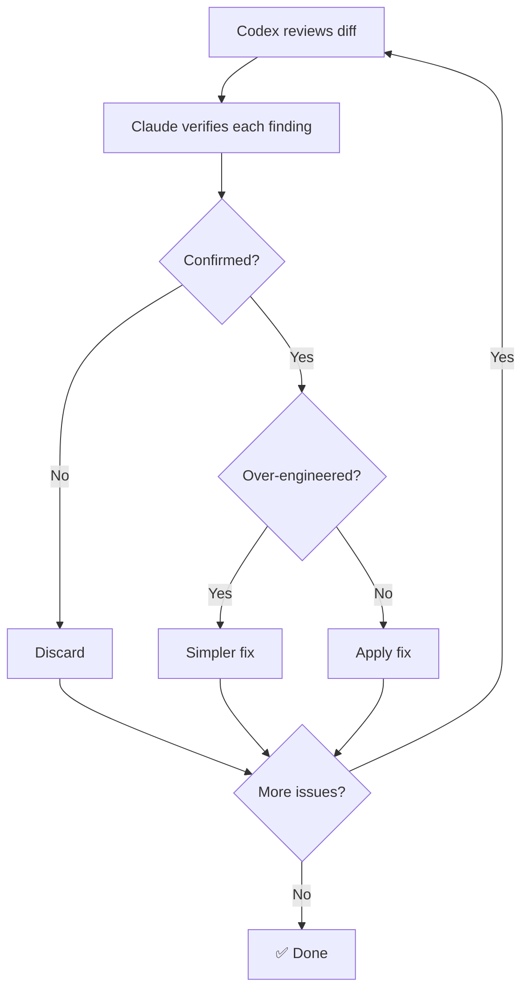

<p align="center">
  
</p>

<h1 align="center">quick-question</h1>

<p align="center">
  <strong>Unity Developer-Loop Runtime for Claude Code</strong><br>
  Artifact-driven controller, auto-compile, test pipelines, executable policy — out of the box.<br><br>
  Built on the principles from <a href="https://tyksworks.com/posts/ai-coding-workflow-en/">AI Coding in Practice: An Indie Developer's Document-First Approach</a>
</p>

<p align="center">
  <a href="https://github.com/tykisgod/quick-question/actions/workflows/validate.yml"></a>
  <a href="https://github.com/tykisgod/quick-question/releases"></a>
  <a href="https://github.com/tykisgod/quick-question/blob/main/LICENSE"></a>
  
  
  
  
  <a href="https://github.com/tykisgod/quick-question/stargazers"></a>
</p>

<p align="center">
  English |
  <a href="docs/README.zh-CN.md">中文</a> |
  <a href="docs/README.ja.md">日本語</a> |
  <a href="docs/README.ko.md">한국어</a>
</p>

---

> 🪟 **Windows support is in preview** — see details in each language section below.

# English

## What It Does

- **`/qq:go` — artifact-driven controller.** Reads real project state plus `work_mode`, then recommends the next step. Prototype? Keep it light. Feature? Design and plan. Hardening? Review and doc drift.
- **tykit — lightweight Unity Editor control, zero config.** In-process HTTP server. No Node.js, no WebSocket bridge. Starts automatically, responds in milliseconds. Also compatible with [mcp-unity](https://github.com/CoderGamester/mcp-unity) and [Unity-MCP](https://github.com/IvanMurzak/Unity-MCP) as alternative backends.
- **Auto-compilation** on every `.cs` edit via hook
- **Test pipeline** — EditMode + PlayMode + runtime error check
- **Runtime data layer** — `.qq/runs`, `.qq/state`, `.qq/telemetry` for local loop, pre-push, and future CI reuse
- **Context Capsule** — thin resume handoff built from runtime state, not chat history, with narrow auto triggers by default
- **Deterministic policy checks** — quick, executable Unity rules before deeper model review
- **Cross-model code review** — Claude orchestrates, Codex reviews, every finding verified
- **Optional skill packs** on top of the runtime — design, plan, execute, review, test, ship

The qq plugin currently ships **23 slash commands / skills** on top of the runtime layer.

qq is moving toward explicit code-side execution: a lightweight `Task Contract`, a first-class `Evaluator` that decides `pass / block / continue`, structured `Run Evidence` in `.qq/`, and `Resume / Recover` flows that continue from runtime state instead of chat history.

## Why quick-question

| | quick-question | Typical AI tools |
|---|:---:|:---:|
| Know where you are in the dev cycle | ✅ Lifecycle-aware routing | ❌ You decide |
| Auto-compile on edit | ✅ Hook-driven | ❌ Manual |
| Test pipeline | ✅ EditMode + PlayMode + error check | ❌ Manual |
| Cross-model review | ✅ Claude + Codex with verification | ⚠️ Single model |
| Control Unity Editor | ✅ tykit (in-process, zero config) | ❌ No access |
| MCP backend support | ✅ mcp-unity / Unity-MCP | — |
| Pre-push safety | ✅ Optional git hook | ❌ None |

## Work Modes

qq supports the whole dev cycle, but it should not force the same process on every task. Put the shared default in `qq.yaml`, then let each engineer/worktree override it in `.qq/local.yaml` when their task is in a different phase.

The single source of truth for product direction is [Core Roadmap](docs/core-roadmap.md).

For contributors working on `quick-question` itself rather than a Unity consumer project:

- [Containerization](docs/containerization.md)
- [Developer Workflow](docs/developer-workflow.md)

`work_mode` and `policy_profile` are intentionally separate:

- `work_mode` answers: "What kind of task is this?"
- `policy_profile` answers: "How much verification should this project expect before moving on?"

The controller reads both. It picks a task path from `work_mode`, then applies a verification floor from `policy_profile`.

The goal is not to make every task heavier. Low-risk work should stay light by mode, while higher-risk work gets more explicit contract, evaluator, and evidence requirements.

| Mode | Use When | qq Defaults |
|---|---|---|
| `prototype` | New mechanic, greybox, fun check | Keep compile green, stay playable, summarize keep/drop/observe instead of forcing docs |
| `feature` | Building a retainable system | Concise design, implementation plan, compile, targeted tests, light review |
| `fix` | Bug fix, regression repair | Reproduce first, smallest safe change, add the regression guardrail, then verify |
| `hardening` | Risky refactor, release prep, stability push | Tests, review, doc/code consistency, then ship |

Type `/qq:go` — qq reads your project state from artifacts, recent run records, and `work_mode`, then routes you to the right next step. Use separate worktrees for unrelated tasks, and let each worktree keep its own `.qq/local.yaml`.

Example shared config with built-in profiles:

```bash
cat > qq.yaml <<'EOF'
version: 1

default_profile: feature

profiles:
  lightweight:
    work_mode: prototype
    policy_profile: core
    packs:
      - runtime-core
      - workflow-basic
      - workflow-utility
      - hooks-auto-compile
EOF
```

Example local override for one worktree:

```bash
mkdir -p .qq
cat > .qq/local.yaml <<'EOF'
profile: lightweight
work_mode: prototype
EOF
```

## Install

**Requirements:**
- macOS or Windows ([Git for Windows](https://gitforwindows.org/) required on Windows)
- Unity 2021.3+
- [Claude Code](https://docs.anthropic.com/en/docs/claude-code)
- curl, python3, jq
- [Codex CLI](https://github.com/openai/codex) *(optional, for cross-model review)*

*Windows support is in preview — expect rough edges for the next few weeks.*

**Step 1 — Plugin (skills + hooks):**
```
/plugin marketplace add tykisgod/quick-question
/plugin install qq@quick-question-marketplace
```

**Step 2 — tykit (Unity package):**

> Step 2 is optional if you only need the skills — tykit adds direct Unity Editor control.

```bash
git clone https://github.com/tykisgod/quick-question.git /tmp/qq-install
/tmp/qq-install/install.sh --profile feature /path/to/your-unity-project
rm -rf /tmp/qq-install
```

`install.sh` now does three things for the consumer project by default:

- installs or refreshes the project-local qq scripts
- wires `.mcp.json` to the built-in `scripts/qq_mcp.py` bridge
- adds `./scripts/qq-doctor.sh` so you can inspect direct-path and MCP routing

It also keeps `com.tyk.tykit` pinned to the current tested release instead of leaving older git revisions in place.

It also creates a starter `qq.yaml` in the Unity project if one does not already exist. The shared default profile is `feature`; override it per engineer/task in `.qq/local.yaml` when the task risk changes.

`install.sh --profile <lightweight|core|feature|hardening>` sets the starter `default_profile` in `qq.yaml`.

That means one engineer can stay in `prototype` mode for a spike while another uses `hardening` in a different worktree, without rewriting the project's shared defaults.

When MCP is enabled, qq should prefer this project-local built-in bridge before falling back to third-party Unity MCP servers.

Claude reads the generated `.mcp.json` automatically. Codex does not, so Codex users should explicitly register the project-local bridge once:

```bash
cd /path/to/your-unity-project
python3 ./scripts/qq-codex-mcp.py install --pretty
```

After that, prefer the thin project wrapper when you want Codex to execute inside the project. It keeps the working root pinned to the current worktree, adds the source worktree as writable scope when closeout needs it, and auto-injects the latest qq `Context Capsule` when the current run looks like a continuation rather than a fresh one-off.

```bash
python3 ./scripts/qq-codex-exec.py "Call unity_health and reply true or false only."
python3 ./scripts/qq-codex-exec.py --dry-run --pretty "Summarize current qq state."
```

## Quick Start

```bash
/qq:go                  # Where am I? What should I do next?
/qq:go "add health system"   # Start from an idea
/qq:go --auto design.md      # Full pipeline, no prompts
python3 ./scripts/qq-project-state.py --pretty   # Inspect controller state
python3 ./scripts/qq-worktree.py status --pretty # Inspect qq-managed worktree context
cat qq.yaml                                      # See shared profile, packs, and policy defaults
cat .qq/local.yaml                               # Optional local override for this worktree
./scripts/qq-policy-check.sh --json              # Run deterministic checks on changed .cs files
python3 ./scripts/qq-capability.py resolve --capability compile --engine unity --pretty
./scripts/qq-doctor.sh --pretty                  # Discover providers, active mode/profile, mode path, and effective next step
python3 ./scripts/qq-context-capsule.py config --pretty # Inspect effective capsule config
python3 ./scripts/qq-context-capsule.py build --trigger pre_clear --pretty # Force-build a thin handoff before clearing context
python3 ./scripts/qq-context-capsule.py consume --agent codex --pretty # Ask qq whether this host should consume the latest capsule
python3 ./scripts/qq-codex-mcp.py status --pretty # Inspect Codex MCP registration for this project
python3 ./scripts/qq-codex-exec.py "Continue the current qq task." # Auto-consumes Context Capsule when qq sees a continuation signal
python3 ./scripts/qq-codex-exec.py --no-resume "Run a clean one-off query." # Opt out for this exec
python3 ./scripts/qq-codex-exec.py --dry-run --pretty "Summarize current qq state" # Inspect the Codex exec context qq will use
```

Control the process intensity yourself:

- change `profile` when you want a different preset bundle
- change `work_mode` when the task changes
- change `policy_profile` when you want lighter or heavier verification
- explicit test arguments still override the default test scope

Or use any skill directly:
```bash
/qq:execute plan.md --worktree   # Create an isolated linked worktree first
/qq:add-tests                 # Add targeted test coverage
/qq:test                      # Run tests
/qq:best-practice             # Quick 18-rule check
/qq:codex-code-review         # Cross-model review
/qq:commit-push               # Ship it
```

## Parallel Worktrees

When unrelated tasks should progress in parallel, prefer qq-managed linked worktrees over reusing one filesystem and flipping branches in place.

Create one manually:

```bash
python3 ./scripts/qq-worktree.py create --name sea-monster --pretty
```

That creates:

- a linked branch such as `feature/crew-wt-sea-monster`
- a sibling worktree directory such as `../project-wt-sea-monster`
- local metadata in `.qq/state/worktree.json`
- a seeded `Library/` cache when the source worktree already has one, so `/qq:test` can run from the linked worktree without paying the full cold-import cost

After the task is verified and pushed, finish from inside that linked worktree:

```bash
python3 ./scripts/qq-worktree.py closeout --auto-yes --delete-branch --pretty
```

`closeout` merges the linked branch back into the source branch, publishes the source branch when needed, and removes the current linked worktree directory. Treat it as the final action in that session. `qq-worktree status` still exposes `canMergeBack`, `canPushSource`, and `canCleanup` when you need to debug a blocked closeout.

If a managed worktree ever loses its local `Library/`, you can reseed it manually:

```bash
python3 ./scripts/qq-worktree.py seed-runtime-cache --pretty
```

`./scripts/unity-test.sh` already does this automatically before falling back to batch mode in a qq-managed linked worktree.

## Repository Development

When you are changing `quick-question` itself, use:

- worktrees for task isolation
- Docker / Dev Containers for repo-side script and docs work
- the host machine for real Unity / `tykit` validation

Quick entrypoints:

```bash
./scripts/docker-dev.sh build
./scripts/docker-dev.sh shell
./scripts/docker-dev.sh test
```

See [Containerization](docs/containerization.md) and [Developer Workflow](docs/developer-workflow.md).

## Commands

| Command | Description |
|---------|-------------|
| **Workflow** | |
| `/qq:go` | Entry point — controller that reads project state and recommends the next step |
| `/qq:design` | Write a game design document from a one-liner, rough draft, or discussion |
| `/qq:plan` | Generate a technical implementation plan from a design doc or description |
| `/qq:execute` | Smart implementation — read a plan, pick execution strategy, build step by step |
| **Testing** | |
| `/qq:add-tests` | Author targeted EditMode, PlayMode, or regression coverage |
| `/qq:test` | Run unit/integration tests with error checking |
| **Code Review (Codex)** | *Requires [Codex CLI](https://github.com/openai/codex)* |
| `/qq:codex-code-review` | Cross-model code review (Claude + Codex with verification) |
| `/qq:codex-plan-review` | Cross-model design document review |
| **Code Review (Claude-only)** | *No extra tools needed* |
| `/qq:claude-code-review` | Deep code review using Claude subagents |
| `/qq:claude-plan-review` | Deep design document review using Claude subagents |
| **Code Review (Quick)** | |
| `/qq:best-practice` | Quick best-practice check — deterministic policy first, then model review |
| `/qq:self-review` | Review skill/config changes for quality |
| **Analysis** | |
| `/qq:brief` | Architecture diff + PR checklist (2 docs) |
| `/qq:timeline` | Commit history timeline with phase analysis (2 docs) |
| `/qq:full-brief` | Run brief + timeline in parallel (4 docs total) |
| `/qq:deps` | `.asmdef` dependency graph + matrix + health check |
| `/qq:doc-drift` | Compare design docs vs code, find inconsistencies |
| **Utilities** | |
| `/qq:commit-push` | Batch commit and push |
| `/qq:explain` | Explain module architecture in plain language |
| `/qq:grandma` | Explain any concept using everyday analogies anyone can understand |
| `/qq:research` | Search open-source solutions for current problem |
| `/qq:changes` | Summarize all changes in current conversation |
| `/qq:doc-tidy` | Scan repo docs, analyze organization, suggest cleanup |

## Scenarios

### 1. Build a feature from scratch

> Solo developer. One-line requirement: "add a food system."

```
/qq:go "add a food system"
```

qq suggests `/qq:design`. Asks 3 questions (reference games? data format? MVP?), writes a design doc.

→ "Design ready. Run `/qq:plan`?" — reads the design, explores the codebase, outputs a 6-step implementation plan with file paths and interfaces.

→ "Plan ready. Run `/qq:execute`?" — creates `IFoodSource` interface, implements `HungerSystem` and `FoodContainer`, wires into existing `NeedSystem`. Each `.cs` save auto-compiles via hook.

→ "Run `/qq:best-practice`?" — catches `GetComponent` in `Update` and a missing event unsubscription. Fixed.

→ "Run `/qq:add-tests`?" — adds focused EditMode coverage for hunger logic and a regression test for empty containers.

→ "Run `/qq:test`?" — all green. → "Run `/qq:commit-push`?"

**Or skip all prompts:** `/qq:go --auto "add a food system"` runs everything end-to-end.

---

### 2. Review code before merging

> Team developer. 400 lines of C# across 5 files. Ready for review.

```
/qq:go
```

qq detects uncommitted `.cs` changes. Suggests `/qq:best-practice`. Catches a `public` field that should be `[SerializeField] private` and a missing `CompareTag`. Fixed in 30 seconds.

→ "Run `/qq:codex-code-review`?" — diff sent to Codex. Review Gate locks edits. Subagents verify: 1 critical confirmed (no `isDead` guard during respawn), 1 false positive rejected. Fix applied, gate unlocks.

→ "Run `/qq:doc-drift`?" — design doc says fire starts at 30% HP, code uses 25%. Doc updated.

→ "Run `/qq:commit-push`?" — pre-push hook runs tests. All green. Pushed.

---

### 3. Understand a large codebase

> New team member. Day one on a 200k-line Unity project.

```
/qq:grandma "task system"
```
> "Imagine a restaurant. Each crew member is a waiter. The task system is the manager who looks at all the tables, decides who's closest and free, and assigns them. Urgent tables jump the queue."

Now the technical version:

```
/qq:explain TaskSystem
```

Outputs: responsibilities, key classes, data flow, lifecycle hooks, design decisions.

```
/qq:deps
```

Mermaid dependency graph of all `.asmdef` modules. `TaskSystem` depends on `NavigationSystem` and `NeedSystem` but not `CombatSystem` — clean boundaries.

## tykit

tykit is a lightweight HTTP server inside the Unity Editor process:

- **Zero setup** — add one line to `manifest.json`, open Unity, done
- **In-process** — commands execute in milliseconds, no serialization overhead
- **No dependencies** — no Node.js, no WebSocket bridge, no external process
- **Auto-configured** — port derived from project path, no manual config

**Use it standalone** (no quick-question needed):
```json
"com.tyk.tykit": "https://github.com/tykisgod/tykit.git"
```

**Or with qq** — where it powers auto-compilation and testing behind the scenes.

```bash
PORT=$(python3 -c "import json; print(json.load(open('Temp/tykit.json'))['port'])")

# Compile
curl -s -X POST http://localhost:$PORT/ \
  -d '{"command":"compile-status"}' -H 'Content-Type: application/json'

# Run tests
curl -s -X POST http://localhost:$PORT/ \
  -d '{"command":"run-tests","args":{"mode":"editmode"}}' -H 'Content-Type: application/json'

# Read errors
curl -s -X POST http://localhost:$PORT/ \
  -d '{"command":"console","args":{"count":50,"filter":"error"}}' -H 'Content-Type: application/json'
```

tykit is just HTTP. Use it from Python, GitHub Actions, or any AI agent. If your agent prefers MCP, use the bundled [`tykit_mcp.py`](scripts/tykit_mcp.py) bridge — see [tykit MCP Bridge](docs/tykit-mcp.md). See [tykit API Reference](docs/tykit-api.md) for the raw command surface.

## How It Works

### Four layers, each doing one job:

- **`/qq:go` controls.** Reads project state plus `work_mode` — design docs, plans, uncommitted code, compile/test state, review gate state, and current task intensity — then recommends the right next step. Shared defaults come from `qq.yaml`; local task overrides live in `.qq/local.yaml`.
- **Hooks guard.** Fire automatically on every `.cs` edit (compile), every code review (lock edits until verified), every skill change (must review before session ends).
- **Runtime data persists.** `.qq/runs`, `.qq/state`, and `.qq/telemetry` keep structured results for the local loop now and CI later.
- **tykit bridges.** HTTP server inside Unity Editor. When qq needs to compile, run tests, or read the console, it talks to tykit. No UI automation — just HTTP.







### Cross-Model Review (Tribunal)



## Customization

### CLAUDE.md

Your coding standards. The auto-compilation hook and test commands respect whatever rules you define here. See [`templates/CLAUDE.md.example`](templates/CLAUDE.md.example) for Unity-specific defaults.

### AGENTS.md

Your architecture rules and review criteria. The `/qq:best-practice`, `/qq:claude-code-review`, and cross-model review commands read this file to detect anti-patterns and module boundary violations. See [`templates/AGENTS.md.example`](templates/AGENTS.md.example) for a starting template.

### qq.yaml

Your qq runtime and workflow preset. `qq.yaml` defines:

- built-in or custom `profile`
- shared `work_mode`
- shared `policy_profile`
- active `packs`
- enabled rules / hooks / skills

Use `.qq/local.yaml` for per-worktree overrides.

Built-in profiles:

- `lightweight` — smallest usable loop: runtime, `/qq:go`, `/qq:add-tests`, `/qq:test`, `/qq:execute`, `/qq:changes`, auto-compile
- `core` — low-friction daily work with light verification
- `feature` — planning + review packs enabled
- `hardening` — stronger tests, review, and doc-consistency pressure

### Priority System

All review commands classify findings by impact:

| Priority | Scope | Action |
|----------|-------|--------|
| **P0** | Architecture changes, anti-patterns, lifecycle issues | Must review |
| **P1** | Business logic, performance, error handling | Worth reviewing |
| **P2** | Getters/setters, logging, config tweaks | Quick scan |

## Design Principles

- **Document-first** — write the design before the code. `/qq:design` → `/qq:plan` → `/qq:execute` enforces this order.
- **Artifact-driven control** — `/qq:go` should read facts, not guess stages from prompt context alone.
- **Verify, don't trust** — cross-model review findings are independently verified by subagents before any code is changed.
- **Executable policy first** — deterministic checks should catch low-dispute Unity problems before deeper model review.
- **Proportionate fixes** — every review includes an over-engineering check. If the fix is heavier than the problem, use a simpler alternative.
- **Automatic safety nets** — hooks fire without you asking. Compilation, review gates, and skill enforcement are always on.
- **Loose coupling** — each skill does one thing. The pipeline is advisory ("want to run X next?"), not rigid.

Built on the principles from [AI Coding in Practice: An Indie Developer's Document-First Approach](https://tyksworks.com/posts/ai-coding-workflow-en/).

## FAQ

**1. Does this work on Windows?**
Yes. macOS + Windows are both supported. Windows requires [Git for Windows](https://gitforwindows.org/) (provides bash and standard Unix tools). On macOS, `osascript` is used as a fallback for Editor detection; on Windows, the equivalent PowerShell path is used instead.

**2. Do I need Codex CLI?**
No, but recommended. `/qq:claude-code-review` works with Claude only, but `/qq:codex-code-review` produces better results — a second model catches blind spots that a single model misses. Cross-model review is the default for a reason.

**3. Can I use this with Cursor / Copilot / other AI tools?**
The skills and hooks require Claude Code. tykit itself works with any tool that can send HTTP requests, and this repo now ships a stdio MCP bridge for general-purpose agents — see [tykit MCP Bridge](docs/tykit-mcp.md). If you want qq to use MCP, prefer the built-in `tykit_mcp` bridge first; third-party Unity MCP servers remain compatible fallbacks — see [MCP Support](#mcp-support).

**4. What happens when compilation fails?**
The auto-compile hook shows the error in the terminal. Claude reads it, fixes the code, and re-compiles. You don't need to do anything.

**5. Can I use tykit without quick-question?**
Yes. Add one line to `Packages/manifest.json` and tykit works standalone. See [tykit API Reference](docs/tykit-api.md).

## MCP Support

qq works with third-party MCP servers for Unity as alternatives to tykit:

- **[mcp-unity](https://github.com/CoderGamester/mcp-unity)** — Node.js + WebSocket bridge (requires Unity 6+)
- **[Unity-MCP](https://github.com/IvanMurzak/Unity-MCP)** — standalone server, supports Docker/remote

If qq's built-in `tykit_mcp` bridge is configured in Claude Code, qq skills should prefer its `unity_*` tools for compilation, testing, and console access. Third-party MCP servers remain compatible fallbacks when the built-in bridge is not configured or a host-specific workflow requires them.

This repo also includes a **built-in stdio MCP bridge for tykit**:

- [`scripts/qq-capabilities.json`](scripts/qq-capabilities.json) — core capability registry and provider preference data
- [`scripts/tykit_mcp.py`](scripts/tykit_mcp.py) — exposes tykit as MCP tools for Codex, Cursor, Continue, and similar hosts
- [tykit MCP Bridge](docs/tykit-mcp.md) — setup, profiles, tool list, Windows notes
- [Agent Integration](docs/agent-integration.md) — routing strategy and third-party coexistence
- [Adapter Contract](docs/architecture/adapter-contract.md) — core/adapter boundary
- [Consumer Rollout](docs/consumer-rollout.md) — how demo/sample projects should consume qq and tykit like external users

The intended split is:

- **qq / Claude high-frequency workflows** keep using local scripts and hooks directly
- **qq / Claude MCP workflows** should prefer the built-in tykit bridge when using MCP
- **general-purpose MCP clients** use the tykit bridge
- **third-party Unity MCP servers** continue to coexist as compatible fallbacks; the bridge uses its own `unity_*` tool namespace and does not override upstream tool names

To inspect which route a consumer project will actually use, run:

```bash
./scripts/qq-doctor.sh
```

**tykit remains the canonical backend.** The built-in `tykit_mcp` bridge wraps tykit for MCP hosts. Only third-party MCP backends make tykit optional.

**Compatibility:** mcp-unity requires Unity 6+. Unity-MCP has no specific version requirement. qq itself targets Unity 2021.3+.

| Capability | tykit direct | tykit_mcp | mcp-unity | Unity-MCP |
|-----------|--------------|-----------|-----------|-----------|
| Compile | `compile` | `unity_compile` | `recompile_scripts` | `assets-refresh` |
| Run tests | `run-tests` | `unity_run_tests` | `run_tests` | `tests-run` |
| Read console | `console` | `unity_console` | `get_console_logs` | `console-get-logs` |
| Clear console | `clear-console` | `unity_console` (`action=clear`) | — | — |

## Limitations

- **macOS + Windows** — Windows requires [Git for Windows](https://gitforwindows.org/); `osascript` and `/Applications/Unity` paths are macOS-specific, Windows uses equivalent PowerShell and registry-based paths via `scripts/platform/windows.sh`
- **Codex CLI required** for cross-model review features
- **Unity 2021.3+** required by tykit package
- **tykit is localhost-only, no authentication** — acceptable for dev machines, not for shared environments without network controls
- **Console log scraping** for compile verification — use `clear-console` before critical compiles to avoid stale errors

## Contributing

Contributions are welcome! Please open an issue or submit a pull request.

## License

[MIT](LICENSE) © Yukang Tian
