<p align="center">
  
</p>

<h1 align="center">quick-question</h1>

<p align="center">
  <strong>Unity Agent Harness for Claude Code</strong><br>
  Auto-compile, test pipelines, cross-model code review — out of the box.<br><br>
  Built on the principles from <a href="https://tyksworks.com/posts/ai-coding-workflow-en/">AI Coding in Practice: An Indie Developer's Document-First Approach</a>
</p>

<p align="center">
  <a href="https://github.com/tykisgod/quick-question/actions/workflows/validate.yml"></a>
  
  <a href="https://github.com/tykisgod/quick-question/blob/main/LICENSE"></a>
  
  
  
  <a href="https://github.com/tykisgod/quick-question/stargazers"></a>
</p>

<p align="center">
  <a href="#english">English</a> |
  <a href="#中文">中文</a> |
  <a href="#日本語">日本語</a> |
  <a href="#한국어">한국어</a>
</p>

---

# English

## What It Does

**`/qq:go` — lifecycle-aware routing.** Detects where you are in the dev cycle and suggests the next step. Design doc exists? It suggests planning. Code written? It suggests review. Tests pass? It suggests shipping.

**tykit — Unity Editor under AI control.** An HTTP server inside Unity Editor that any AI agent can call. Compile, run tests, control Play Mode, read console logs, find and inspect GameObjects — all via `curl`. No SDK needed, no UI automation. Works standalone or with qq.

Plus: auto-compilation on every `.cs` edit, EditMode + PlayMode test pipelines, cross-model code review (Claude + Codex with verification), and 22 skills covering the full dev lifecycle.

## Why quick-question

| | quick-question | Typical AI tools |
|---|:---:|:---:|
| Know where you are in the dev cycle | ✅ Lifecycle-aware routing | ❌ You decide |
| Auto-compile on edit | ✅ Hook-driven | ❌ Manual |
| Test pipeline | ✅ EditMode + PlayMode + error check | ❌ Manual |
| Cross-model review | ✅ Claude + Codex with verification | ⚠️ Single model |
| Control Unity Editor | ✅ tykit (HTTP) | ❌ No access |
| Pre-push safety | ✅ Optional git hook | ❌ None |

## Lifecycle Pipeline

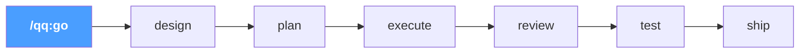

Type `/qq:go` — qq reads your project state and routes you to the right step. Each step suggests the next. Use `--auto` to run the full pipeline hands-free.

## Install

**Requirements:** macOS, Unity 2021.3+, [Claude Code](https://docs.anthropic.com/en/docs/claude-code), curl, python3, jq. [Codex CLI](https://github.com/openai/codex) optional (for cross-model review).

**Step 1 — Plugin (skills + hooks):**
```
/plugin marketplace add tykisgod/quick-question
/plugin install qq@quick-question-marketplace
```

**Step 2 — tykit (Unity package):**

> Step 2 is optional if you only need the skills — tykit adds direct Unity Editor control.

```bash
git clone https://github.com/tykisgod/quick-question.git /tmp/qq-install
/tmp/qq-install/install.sh /path/to/your-unity-project
rm -rf /tmp/qq-install
```

## Quick Start

```bash
/qq:go                  # Where am I? What should I do next?
/qq:go "add health system"   # Start from an idea
/qq:go --auto design.md      # Full pipeline, no prompts
```

Or use any skill directly:
```bash
/qq:test                      # Run tests
/qq:best-practice             # Quick 18-rule check
/qq:codex-code-review         # Cross-model review
/qq:commit-push               # Ship it
```

## Commands

| Command | Description |
|---------|-------------|
| **Workflow** | |
| `/qq:go` | Entry point — detect current state, guide you to the right next step |
| `/qq:design` | Write a game design document from a one-liner, rough draft, or discussion |
| `/qq:plan` | Generate a technical implementation plan from a design doc or description |
| `/qq:execute` | Smart implementation — read a plan, pick execution strategy, build step by step |
| **Testing** | |
| `/qq:test` | Run unit/integration tests with error checking |
| **Code Review (Codex)** | *Requires [Codex CLI](https://github.com/openai/codex)* |
| `/qq:codex-code-review` | Cross-model code review (Claude + Codex with verification) |
| `/qq:codex-plan-review` | Cross-model design document review |
| **Code Review (Claude-only)** | *No extra tools needed* |
| `/qq:claude-code-review` | Deep code review using Claude subagents |
| `/qq:claude-plan-review` | Deep design document review using Claude subagents |
| **Code Review (Quick)** | |
| `/qq:best-practice` | Quick best-practice check — 18 rules for anti-patterns, performance, runtime safety |
| `/qq:self-review` | Review skill/config changes for quality |
| **Analysis** | |
| `/qq:brief` | Architecture diff + PR checklist (2 docs) |
| `/qq:timeline` | Commit history timeline with phase analysis (2 docs) |
| `/qq:full-brief` | Run brief + timeline in parallel (4 docs total) |
| `/qq:deps` | `.asmdef` dependency graph + matrix + health check |
| `/qq:doc-drift` | Compare design docs vs code, find inconsistencies |
| **Utilities** | |
| `/qq:commit-push` | Batch commit and push |
| `/qq:explain` | Explain module architecture in plain language |
| `/qq:grandma` | Explain any concept using everyday analogies anyone can understand |
| `/qq:research` | Search open-source solutions for current problem |
| `/qq:changes` | Summarize all changes in current conversation |
| `/qq:doc-tidy` | Scan repo docs, analyze organization, suggest cleanup |

## Scenarios

### 1. Build a feature from scratch

> Solo developer. One-line requirement: "add a food system."

```
/qq:go "add a food system"
```

qq suggests `/qq:design`. Asks 3 questions (reference games? data format? MVP?), writes a design doc.

→ "Design ready. Run `/qq:plan`?" — reads the design, explores the codebase, outputs a 6-step implementation plan with file paths and interfaces.

→ "Plan ready. Run `/qq:execute`?" — creates `IFoodSource` interface, implements `HungerSystem` and `FoodContainer`, wires into existing `NeedSystem`. Each `.cs` save auto-compiles via hook.

→ "Run `/qq:best-practice`?" — catches `GetComponent` in `Update` and a missing event unsubscription. Fixed.

→ "Run `/qq:test`?" — all green. → "Run `/qq:commit-push`?"

**Or skip all prompts:** `/qq:go --auto "add a food system"` runs everything end-to-end.

---

### 2. Review code before merging

> Team developer. 400 lines of C# across 5 files. Ready for review.

```
/qq:go
```

qq detects uncommitted `.cs` changes. Suggests `/qq:best-practice`. Catches a `public` field that should be `[SerializeField] private` and a missing `CompareTag`. Fixed in 30 seconds.

→ "Run `/qq:codex-code-review`?" — diff sent to Codex. Review Gate locks edits. Subagents verify: 1 critical confirmed (no `isDead` guard during respawn), 1 false positive rejected. Fix applied, gate unlocks.

→ "Run `/qq:doc-drift`?" — design doc says fire starts at 30% HP, code uses 25%. Doc updated.

→ "Run `/qq:commit-push`?" — pre-push hook runs tests. All green. Pushed.

---

### 3. Understand a large codebase

> New team member. Day one on a 200k-line Unity project.

```
/qq:grandma "task system"
```
> "Imagine a restaurant. Each crew member is a waiter. The task system is the manager who looks at all the tables, decides who's closest and free, and assigns them. Urgent tables jump the queue."

Now the technical version:

```
/qq:explain TaskSystem
```

Outputs: responsibilities, key classes, data flow, lifecycle hooks, design decisions.

```
/qq:deps
```

Mermaid dependency graph of all `.asmdef` modules. `TaskSystem` depends on `NavigationSystem` and `NeedSystem` but not `CombatSystem` — clean boundaries.

## tykit

tykit is a standalone HTTP server inside Unity Editor. Any AI agent can control Unity via HTTP — compile, run tests, play/stop, read console, inspect GameObjects. No SDK required.

**Use it standalone** (no quick-question needed):
```json
"com.tyk.tykit": "https://github.com/tykisgod/tykit.git"
```

**Or with qq** — where it powers auto-compilation and testing behind the scenes.

```bash
PORT=$(python3 -c "import json; print(json.load(open('Temp/eval_server.json'))['port'])")

# Compile
curl -s -X POST http://localhost:$PORT/ \
  -d '{"command":"compile-status"}' -H 'Content-Type: application/json'

# Run tests
curl -s -X POST http://localhost:$PORT/ \
  -d '{"command":"run-tests","args":{"mode":"editmode"}}' -H 'Content-Type: application/json'

# Read errors
curl -s -X POST http://localhost:$PORT/ \
  -d '{"command":"console","args":{"count":50,"filter":"error"}}' -H 'Content-Type: application/json'
```

tykit is just HTTP. Use it from Python, GitHub Actions, or any AI agent. See [tykit API Reference](docs/tykit-api.md) for all 13 commands.

## How It Works

### Three layers, each doing one job:

**`/qq:go` routes.** It reads your project state — design docs, implementation plans, uncommitted code, test results — and recommends the right next skill. It never does work itself; it only routes.

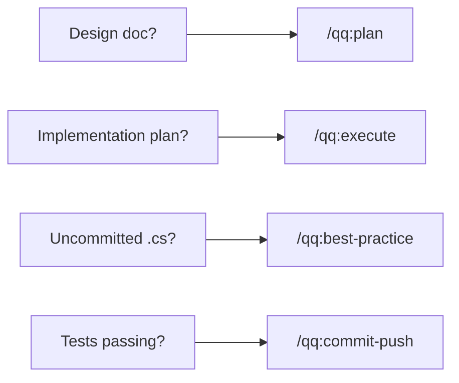

**Hooks guard.** They fire automatically — you don't invoke them. Every `.cs` edit triggers compilation. Every code review activates a gate that blocks edits until findings are verified. Every skill change is tracked and must be reviewed before the session ends.

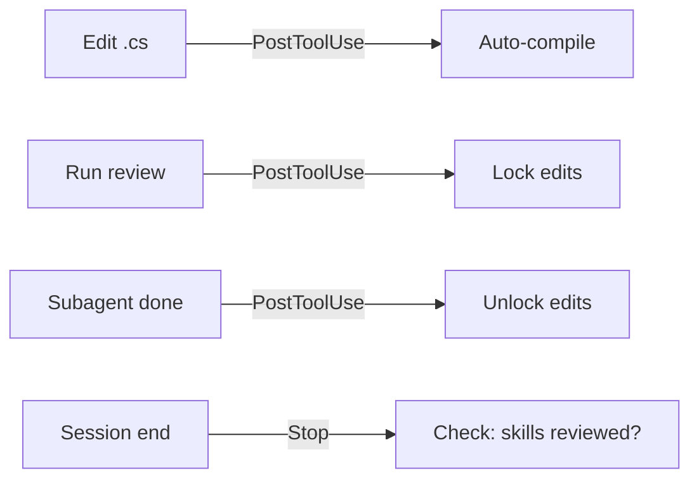

**tykit bridges.** An HTTP server inside Unity Editor. When qq needs to compile, run tests, or read the console, it talks to tykit. No UI automation — just HTTP.

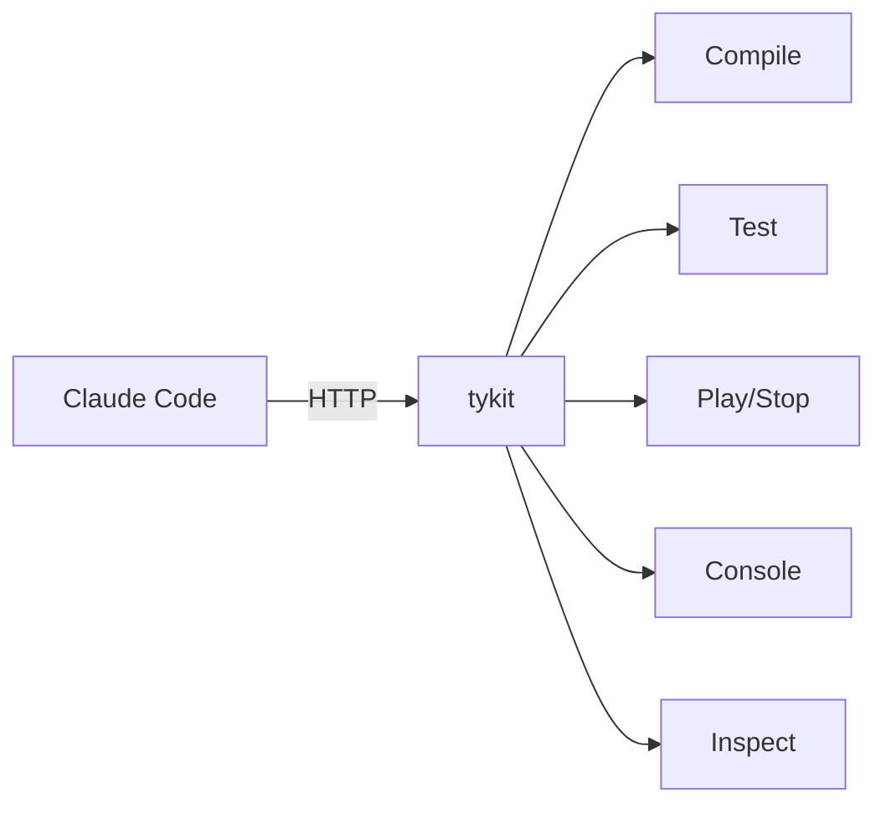

### Cross-Model Review (Tribunal)

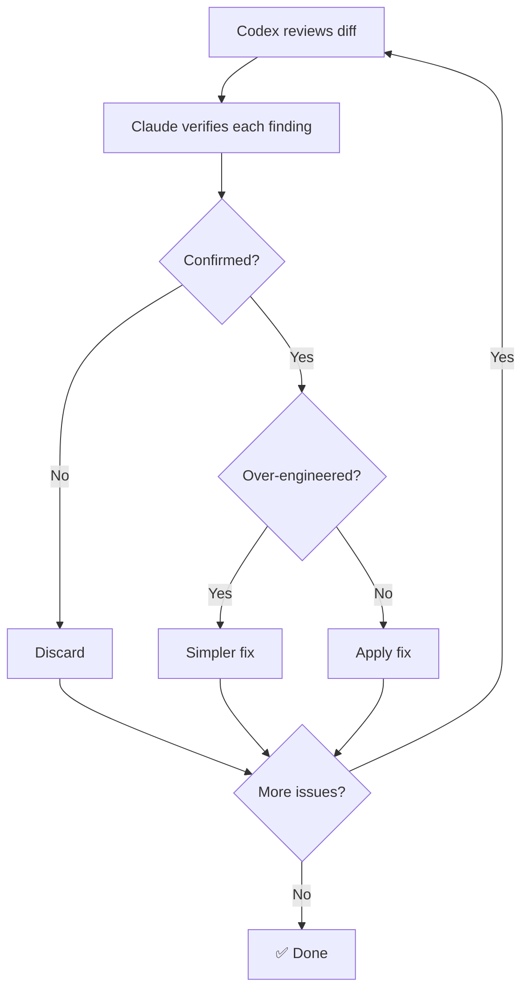

## Customization

### CLAUDE.md

Your coding standards. The auto-compilation hook and test commands respect whatever rules you define here. See [`templates/CLAUDE.md.example`](templates/CLAUDE.md.example) for Unity-specific defaults.

### AGENTS.md

Your architecture rules and review criteria. The `/qq:best-practice`, `/qq:claude-code-review`, and cross-model review commands read this file to detect anti-patterns and module boundary violations. See [`templates/AGENTS.md.example`](templates/AGENTS.md.example) for a starting template.

### Priority System

All review commands classify findings by impact:

| Priority | Scope | Action |
|----------|-------|--------|
| **P0** | Architecture changes, anti-patterns, lifecycle issues | Must review |
| **P1** | Business logic, performance, error handling | Worth reviewing |
| **P2** | Getters/setters, logging, config tweaks | Quick scan |

## Design Principles

- **Document-first** — write the design before the code. `/qq:design` → `/qq:plan` → `/qq:execute` enforces this order.
- **Verify, don't trust** — cross-model review findings are independently verified by subagents before any code is changed.
- **Proportionate fixes** — every review includes an over-engineering check. If the fix is heavier than the problem, use a simpler alternative.
- **Automatic safety nets** — hooks fire without you asking. Compilation, review gates, and skill enforcement are always on.
- **Loose coupling** — each skill does one thing. The pipeline is advisory ("want to run X next?"), not rigid.

Built on the principles from [AI Coding in Practice: An Indie Developer's Document-First Approach](https://tyksworks.com/posts/ai-coding-workflow-en/).

## FAQ

**1. Does this work on Windows?**
Not yet. v1 is macOS only (scripts use osascript and macOS paths). Windows support is planned for v2.

**2. Do I need Codex CLI?**
No, but recommended. `/qq:claude-code-review` works with Claude only, but `/qq:codex-code-review` produces better results — a second model catches blind spots that a single model misses. Cross-model review is the default for a reason.

**3. Can I use this with Cursor / Copilot / other AI tools?**
The skills and hooks require Claude Code. tykit (the HTTP server) works with any tool that can send HTTP requests.

**4. What happens when compilation fails?**
The auto-compile hook shows the error in the terminal. Claude reads it, fixes the code, and re-compiles. You don't need to do anything.

**5. Can I use tykit without quick-question?**
Yes. Add one line to `Packages/manifest.json` and tykit works standalone. See [tykit API Reference](docs/tykit-api.md).

## Limitations

- **macOS only** (v1) — scripts use `osascript`, `/Applications/Unity`, `~/Library/Logs`
- **Codex CLI required** for cross-model review features
- **Unity 2021.3+** required by tykit package
- **tykit is localhost-only, no authentication** — acceptable for dev machines, not for shared environments without network controls
- **Console log scraping** for compile verification — use `clear-console` before critical compiles to avoid stale errors

## Contributing

Contributions are welcome! Please open an issue or submit a pull request.

## License

[MIT](LICENSE) © Yukang Tian

---

# 中文

## 功能

**`/qq:go` — 生命周期感知路由。** 检测你在开发周期的哪个阶段，建议下一步。有设计文档？建议规划。代码写好了？建议审阅。测试通过？建议发布。

**tykit — AI 控制下的 Unity Editor。** Unity Editor 内的 HTTP 服务器，任何 AI agent 都能调用。编译、运行测试、控制 Play Mode、读取控制台日志、查找和检视 GameObject — 全部通过 `curl`。无需 SDK，无需 UI 自动化。可独立使用，也可配合 qq。

另外：每次 `.cs` 编辑自动编译，EditMode + PlayMode 测试流水线，跨模型代码审阅（Claude + Codex 验证循环），22 个 skill 覆盖完整开发周期。

## 为什么选择 qq

| | quick-question | 传统 AI 工具 |
|---|:---:|:---:|
| 感知开发周期阶段 | ✅ 生命周期感知路由 | ❌ 自己决定 |
| 编辑即编译 | ✅ Hook 驱动 | ❌ 手动 |
| 测试流水线 | ✅ EditMode + PlayMode + 错误检查 | ❌ 手动 |
| 跨模型审阅 | ✅ Claude + Codex 验证循环 | ⚠️ 单模型 |
| 控制 Unity Editor | ✅ tykit (HTTP) | ❌ 无法访问 |
| 推送前安全检查 | ✅ 可选 git hook | ❌ 无 |

## 生命周期流水线

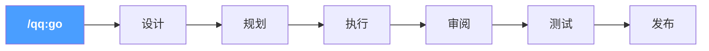

输入 `/qq:go` — qq 读取项目状态，引导你到正确的步骤。每步完成后建议下一步。使用 `--auto` 全自动走完。

## 安装

**前置条件：** macOS，Unity 2021.3+，[Claude Code](https://docs.anthropic.com/en/docs/claude-code)，curl，python3，jq。[Codex CLI](https://github.com/openai/codex) 可选（用于跨模型审阅）。

**第 1 步 — 插件（skills + hooks）：**
```
/plugin marketplace add tykisgod/quick-question
/plugin install qq@quick-question-marketplace
```

**第 2 步 — tykit（Unity 包）：**

> 第 2 步是可选的 — 如果只需要 skills，可以跳过。tykit 提供直接控制 Unity Editor 的能力。

```bash
git clone https://github.com/tykisgod/quick-question.git /tmp/qq-install
/tmp/qq-install/install.sh /path/to/your-unity-project
rm -rf /tmp/qq-install
```

## 快速开始

```bash
/qq:go                  # 我在哪？下一步该做什么？
/qq:go "add health system"   # 从一个想法开始
/qq:go --auto design.md      # 全自动流水线，无需确认
```

或者直接使用任意 skill：
```bash
/qq:test                      # 运行测试
/qq:best-practice             # 快速 18 条规则检查
/qq:codex-code-review         # 跨模型审阅
/qq:commit-push               # 提交发布
```

## 命令

| 命令 | 描述 |
|------|------|
| **工作流** | |
| `/qq:go` | 入口 — 检测当前状态，引导你到正确的下一步 |
| `/qq:design` | 从一句话、草案或讨论写出游戏设计文档 |
| `/qq:plan` | 从设计文档或描述生成技术实现计划 |
| `/qq:execute` | 智能实现 — 读取计划，选择执行策略，逐步构建 |
| **测试** | |
| `/qq:test` | 运行单元/集成测试并检查错误 |
| **代码审阅（Codex）** | *需要 [Codex CLI](https://github.com/openai/codex)* |
| `/qq:codex-code-review` | 跨模型代码审阅（Claude + Codex + 验证循环） |
| `/qq:codex-plan-review` | 跨模型设计文档审阅 |
| **代码审阅（Claude）** | *无需额外工具* |
| `/qq:claude-code-review` | Claude subagent 深度代码审阅 |
| `/qq:claude-plan-review` | Claude subagent 深度设计文档审阅 |
| **代码审阅（快速）** | |
| `/qq:best-practice` | 快速最佳实践检查 — 18 条规则覆盖反模式、性能、运行时安全 |
| `/qq:self-review` | 审阅 skill/配置变更的质量 |
| **分析** | |
| `/qq:brief` | 架构 diff + PR 清单（2 份文档） |
| `/qq:timeline` | 提交历史时间线及阶段分析（2 份文档） |
| `/qq:full-brief` | 并行运行 brief + timeline（共 4 份文档） |
| `/qq:deps` | `.asmdef` 依赖关系图 + 矩阵 + 健康检查 |
| `/qq:doc-drift` | 对比设计文档与代码，找出不一致 |
| **工具** | |
| `/qq:commit-push` | 批量提交并推送 |
| `/qq:explain` | 用通俗语言解释模块架构 |
| `/qq:grandma` | 用日常类比解释任何概念，人人都能听懂 |
| `/qq:research` | 搜索当前问题的开源解决方案 |
| `/qq:changes` | 汇总当前会话的所有变更 |
| `/qq:doc-tidy` | 扫描仓库文档，分析组织问题，建议清理 |

## 场景

### 1. 从零构建功能

> 独立开发者。一句话需求："加个食物系统。"

```
/qq:go "add a food system"
```

qq 建议 `/qq:design`。问 3 个问题（参考游戏？数据格式？MVP？），写出设计文档。

→ "设计完成。运行 `/qq:plan`？" — 读取设计文档，探索代码库，输出 6 步实现计划，包含文件路径和接口。

→ "计划就绪。运行 `/qq:execute`？" — 创建 `IFoodSource` 接口，实现 `HungerSystem` 和 `FoodContainer`，接入现有的 `NeedSystem`。每次 `.cs` 保存通过 hook 自动编译。

→ "运行 `/qq:best-practice`？" — 发现 `Update` 里的 `GetComponent` 和缺失的事件退订。已修复。

→ "运行 `/qq:test`？" — 全部通过。→ "运行 `/qq:commit-push`？"

**或跳过所有确认：** `/qq:go --auto "add a food system"` 端到端全自动运行。

---

### 2. 合并前审阅代码

> 团队开发者。5 个文件，400 行 C# 改动。准备审阅。

```
/qq:go
```

qq 检测到未提交的 `.cs` 改动。建议 `/qq:best-practice`。发现一个 `public` 字段应该是 `[SerializeField] private`，还有缺失的 `CompareTag`。30 秒修复。

→ "运行 `/qq:codex-code-review`？" — diff 发送给 Codex。审阅门控锁定编辑。子 agent 验证：1 个关键问题确认（重生时无 `isDead` 守卫），1 个误报驳回。修复应用，门控解锁。

→ "运行 `/qq:doc-drift`？" — 设计文档写着 30% 血量着火，代码用的是 25%。文档已更新。

→ "运行 `/qq:commit-push`？" — pre-push hook 运行测试。全部通过。已推送。

---

### 3. 理解大型代码库

> 新团队成员。第一天面对 20 万行 Unity 项目。

```
/qq:grandma "task system"
```
> "想象一家餐厅。每个组员是服务员。任务系统是经理 — 看所有桌子，判断谁最近、谁有空，然后分配。紧急的桌子插队。"

技术版本：

```
/qq:explain TaskSystem
```

输出：职责、核心类、数据流、生命周期钩子、设计决策。

```
/qq:deps
```

所有 `.asmdef` 模块的 Mermaid 依赖图。`TaskSystem` 依赖 `NavigationSystem` 和 `NeedSystem`，但不依赖 `CombatSystem` — 边界清晰。

## tykit

tykit 是 Unity Editor 内的独立 HTTP 服务器。任何 AI agent 都可以通过 HTTP 控制 Unity — 编译、运行测试、Play/Stop、读取控制台、检视 GameObject。无需 SDK。

**独立使用**（不需要 quick-question）：
```json
"com.tyk.tykit": "https://github.com/tykisgod/tykit.git"
```

**或配合 qq** — 在后台驱动自动编译和测试。

```bash
PORT=$(python3 -c "import json; print(json.load(open('Temp/eval_server.json'))['port'])")

# 编译
curl -s -X POST http://localhost:$PORT/ \
  -d '{"command":"compile-status"}' -H 'Content-Type: application/json'

# 运行测试
curl -s -X POST http://localhost:$PORT/ \
  -d '{"command":"run-tests","args":{"mode":"editmode"}}' -H 'Content-Type: application/json'

# 读取错误
curl -s -X POST http://localhost:$PORT/ \
  -d '{"command":"console","args":{"count":50,"filter":"error"}}' -H 'Content-Type: application/json'
```

tykit 就是 HTTP。可以从 Python、GitHub Actions 或任何 AI agent 调用。完整 API 参见 [tykit API Reference](docs/tykit-api.md)，共 13 个命令。

## 工作原理

### 三层架构，各司其职：

**`/qq:go` 路由。** 读取项目状态 — 设计文档、实现计划、未提交代码、测试结果 — 推荐正确的下一个 skill。它自己不做任何工作，只负责路由。

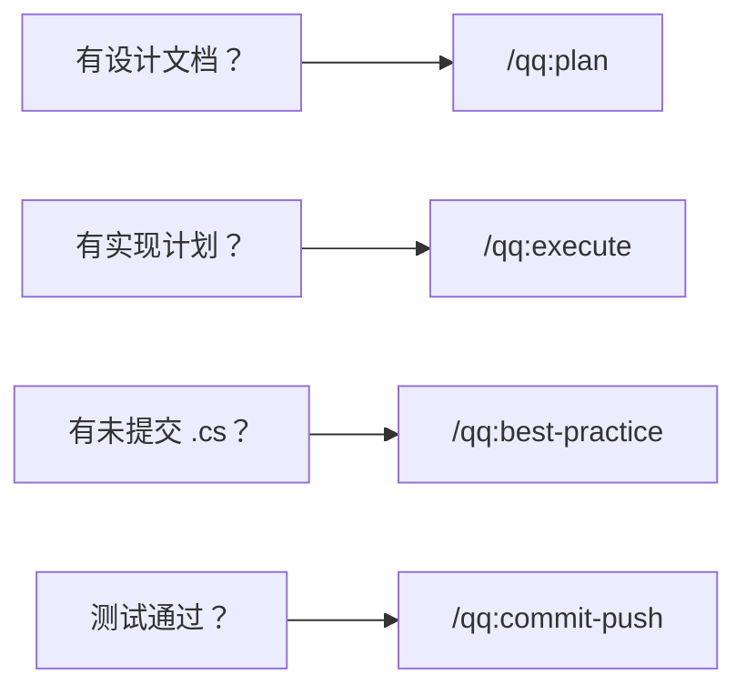

**Hooks 守卫。** 自动触发 — 你不需要调用它们。每次 `.cs` 编辑触发编译。每次代码审阅激活门控，阻止编辑直到发现被验证。每次 skill 改动被追踪，会话结束前必须审阅。

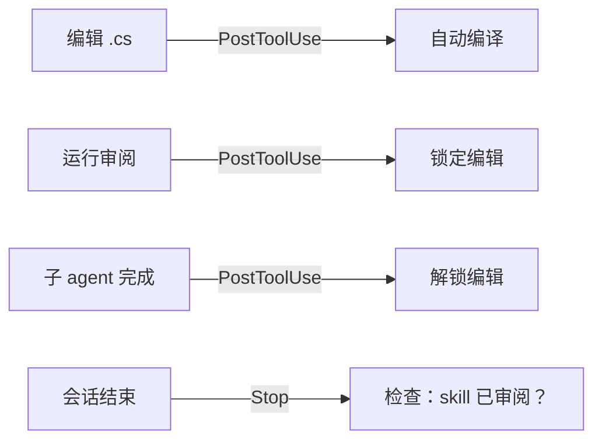

**tykit 桥接。** Unity Editor 内的 HTTP 服务器。当 qq 需要编译、运行测试或读取控制台时，它与 tykit 通信。没有 UI 自动化 — 只有 HTTP。

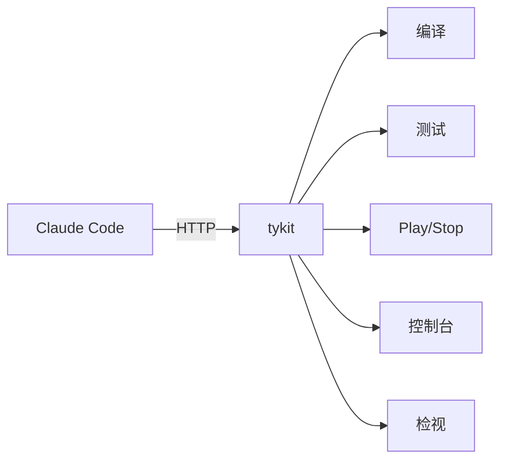

### 跨模型审阅（Tribunal）

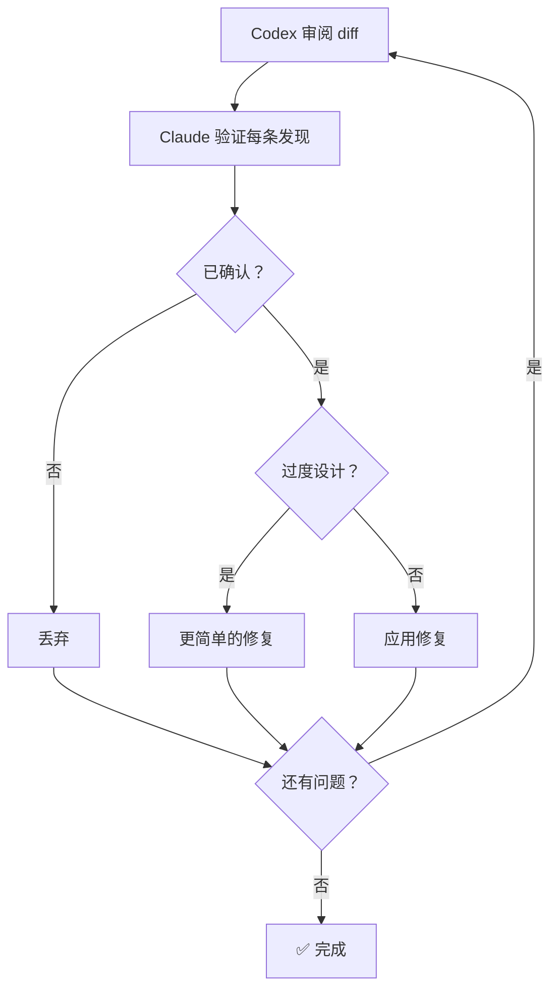

## 自定义

### CLAUDE.md

你的编码规范。自动编译 hook 和测试命令会遵循你在此定义的规则。参见 [`templates/CLAUDE.md.example`](templates/CLAUDE.md.example) 获取 Unity 专用默认值。

### AGENTS.md

你的架构规则和审阅标准。`/qq:best-practice`、`/qq:claude-code-review` 和跨模型审阅命令会读取此文件来检测反模式和模块边界违规。参见 [`templates/AGENTS.md.example`](templates/AGENTS.md.example) 获取起始模板。

### 优先级系统

所有审阅命令按影响程度分类发现：

| 优先级 | 范围 | 处理 |
|--------|------|------|
| **P0** | 架构变更、反模式、生命周期问题 | 必须审阅 |
| **P1** | 业务逻辑、性能、错误处理 | 建议审阅 |
| **P2** | Getter/Setter、日志、配置微调 | 快速扫一眼 |

## 设计原则

- **文档先行** — 先写设计再写代码。`/qq:design` → `/qq:plan` → `/qq:execute` 强制这个顺序。
- **验证，而非信任** — 跨模型审阅的发现会由子 agent 独立验证，然后才修改代码。
- **修复要适度** — 每次审阅都包含过度设计检查。如果修复比问题本身还重，用更简单的方案。
- **自动安全网** — hooks 无需你主动调用就会触发。编译、审阅门控、skill 强制始终开启。
- **松耦合** — 每个 skill 只做一件事。流水线是建议性的（"要运行 X 吗？"），不是强制的。

基于 [AI 编程实践：独立开发者的文档驱动方法](https://tyksworks.com/posts/ai-coding-workflow-zh/) 的理念开发。

## 常见问题

**1. 支持 Windows 吗？**
暂不支持。v1 仅支持 macOS（脚本依赖 osascript 和 macOS 路径）。v2 计划支持 Windows。

**2. 必须安装 Codex CLI 吗？**
不是必须，但推荐。`/qq:claude-code-review` 仅用 Claude 也能工作，但 `/qq:codex-code-review` 效果更好——第二个模型能抓住单模型的盲区。跨模型审阅是默认推荐方式。

**3. 能和 Cursor / Copilot / 其他 AI 工具一起用吗？**
skills 和 hooks 需要 Claude Code。tykit（HTTP 服务器）可以和任何能发 HTTP 请求的工具配合。

**4. 编译失败了会怎样？**
自动编译 hook 会在终端显示错误。Claude 读取错误信息，修复代码，重新编译。你不需要做任何事。

**5. 能不装 quick-question 单独用 tykit 吗？**
可以。在 `Packages/manifest.json` 里加一行就行。详见 [tykit API 参考](docs/tykit-api.md)。

## 限制

- **仅 macOS**（v1）— 脚本使用 `osascript`、`/Applications/Unity`、`~/Library/Logs`
- **跨模型审阅功能需要 Codex CLI**
- **Unity 2021.3+**，tykit 包要求
- **tykit 仅限 localhost，无认证** — 适用于开发机，不适用于未做网络管控的共享环境
- **编译验证使用控制台日志抓取** — 关键编译前使用 `clear-console` 避免残留错误

## 贡献

欢迎贡献！请提交 Issue 或 Pull Request。

## 许可证

[MIT](LICENSE) © Yukang Tian

---

# 日本語

## 機能

**`/qq:go` — ライフサイクル対応ルーティング。** 開発サイクルのどこにいるかを検出し、次のステップを提案する。設計ドキュメントがある？計画を提案。コード実装済み？レビューを提案。テスト通過？出荷を提案。

**tykit — AI が制御する Unity Editor。** Unity Editor 内の HTTP サーバー。あらゆる AI エージェントから呼び出せる。コンパイル、テスト実行、Play Mode 制御、コンソールログ読み取り、GameObject の検索・検査 — すべて `curl` で。SDK 不要、UI 自動化不要。qq なしでも単独で動作する。

さらに：`.cs` 編集ごとの自動コンパイル、EditMode + PlayMode テストパイプライン、クロスモデルコードレビュー（Claude + Codex + 検証）、開発ライフサイクル全体をカバーする 22 個のスキル。

## ライフサイクルパイプライン

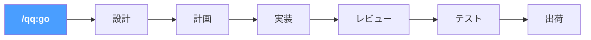

`/qq:go` と入力すると、qq がプロジェクト状態を読み取り、適切なステップにルーティングする。各ステップが次を提案。`--auto` で全パイプラインを自動実行。

## インストール

**前提条件：** macOS、Unity 2021.3+、[Claude Code](https://docs.anthropic.com/en/docs/claude-code)、curl、python3、jq。[Codex CLI](https://github.com/openai/codex) はオプション（クロスモデルレビュー用）。

**ステップ 1 — プラグイン（スキル + フック）：**
```
/plugin marketplace add tykisgod/quick-question
/plugin install qq@quick-question-marketplace
```

**ステップ 2 — tykit（Unity パッケージ）：**

> ステップ 2 はオプション。スキルだけ使うなら不要 — tykit は Unity Editor の直接制御を追加する。

```bash
git clone https://github.com/tykisgod/quick-question.git /tmp/qq-install
/tmp/qq-install/install.sh /path/to/your-unity-project
rm -rf /tmp/qq-install
```

## クイックスタート

```bash
/qq:go                  # 今どこ？次に何をすべき？
/qq:go "add health system"   # アイデアからスタート
/qq:go --auto design.md      # 全パイプライン自動実行
```

または任意のスキルを直接使用：
```bash
/qq:test                      # テスト実行
/qq:best-practice             # 18 ルールのクイックチェック
/qq:codex-code-review         # クロスモデルレビュー
/qq:commit-push               # 出荷
```

---

# 한국어

## 기능

**`/qq:go` — 라이프사이클 인식 라우팅.** 개발 주기에서 현재 위치를 감지하고 다음 단계를 제안한다. 설계 문서가 있다면? 계획을 제안. 코드가 작성되었다면? 리뷰를 제안. 테스트가 통과했다면? 배포를 제안.

**tykit — AI가 제어하는 Unity Editor.** Unity Editor 내부의 HTTP 서버. 어떤 AI 에이전트에서든 호출할 수 있다. 컴파일, 테스트 실행, Play Mode 제어, 콘솔 로그 읽기, GameObject 검색 및 검사 — 모두 `curl`로. SDK 불필요, UI 자동화 불필요. qq 없이도 단독으로 동작한다.

추가 기능: `.cs` 편집마다 자동 컴파일, EditMode + PlayMode 테스트 파이프라인, 크로스 모델 코드 리뷰(Claude + Codex + 검증), 전체 개발 라이프사이클을 커버하는 22개 스킬.

## 라이프사이클 파이프라인

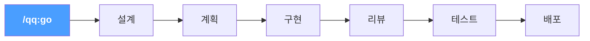

`/qq:go`를 입력하면 qq가 프로젝트 상태를 읽고 적절한 단계로 라우팅한다. 각 단계가 다음을 제안. `--auto`로 전체 파이프라인을 자동 실행.

## 설치

**사전 요구사항:** macOS, Unity 2021.3+, [Claude Code](https://docs.anthropic.com/en/docs/claude-code), curl, python3, jq. [Codex CLI](https://github.com/openai/codex)는 선택(크로스 모델 리뷰용).

**1단계 — 플러그인(스킬 + 훅):**
```
/plugin marketplace add tykisgod/quick-question
/plugin install qq@quick-question-marketplace
```

**2단계 — tykit(Unity 패키지):**

> 2단계는 선택사항. 스킬만 사용한다면 불필요 — tykit은 Unity Editor 직접 제어를 추가한다.

```bash
git clone https://github.com/tykisgod/quick-question.git /tmp/qq-install
/tmp/qq-install/install.sh /path/to/your-unity-project
rm -rf /tmp/qq-install
```

## 빠른 시작

```bash
/qq:go                  # 지금 어디? 다음에 뭘 해야 하지?
/qq:go "add health system"   # 아이디어에서 시작
/qq:go --auto design.md      # 전체 파이프라인 자동 실행
```

또는 아무 스킬이나 직접 사용:
```bash
/qq:test                      # 테스트 실행
/qq:best-practice             # 18개 규칙 빠른 점검
/qq:codex-code-review         # 크로스 모델 리뷰
/qq:commit-push               # 배포
```
