<p align="center">
  
</p>

<h1 align="center">quick-question</h1>

<p align="center">
  <strong>Unity Agent Harness for Claude Code</strong><br>
  Auto-compile, test pipelines, cross-model code review — out of the box.<br><br>
  Built on the principles from <a href="https://tyksworks.com/posts/ai-coding-workflow-en/">AI Coding in Practice: An Indie Developer's Document-First Approach</a>
</p>

<p align="center">
  <a href="https://github.com/tykisgod/quick-question/actions/workflows/validate.yml"></a>
  <a href="https://github.com/tykisgod/quick-question/blob/main/LICENSE"></a>
  
  
  
  <a href="https://github.com/tykisgod/quick-question/stargazers"></a>
</p>

<p align="center">
  <a href="#english">English</a> |
  <a href="#中文">中文</a> |
  <a href="#日本語">日本語</a> |
  <a href="#한국어">한국어</a>
</p>

---

# English

## What It Does

> Edit → Compile → Test → Review → Ship. Fully automated.

🔧 **Auto-Compilation** — Edit a `.cs` file, compilation runs automatically via hook<br>
🧪 **Test Pipeline** — EditMode + PlayMode tests with runtime error checking<br>
🔍 **Cross-Model Review** — Claude orchestrates, Codex reviews, every finding verified against source<br>
⚡ **21 Slash Commands** — test, commit, review, explain, dependency analysis, and more<br>
🎮 **tykit** — HTTP server inside Unity Editor for AI agent control (play/stop/console/run tests)

```
Edit .cs file
     │ (PostToolUse hook)
     ▼
┌──────────────────┐
│  Smart Compile   │──── tykit (fast) / Editor trigger / Batch mode
└────────┬─────────┘
         ▼
┌──────────────────┐
│   /qq:test       │──── EditMode + PlayMode + error check
└────────┬─────────┘
         ▼
┌──────────────────────────┐
│  /qq:codex-code-review   │──── Codex reviews → Claude verifies → fix → loop
└────────┬─────────────────┘
         ▼
┌──────────────────┐
│  /qq:commit-push │──── commit + push
└──────────────────┘
```

### Architecture

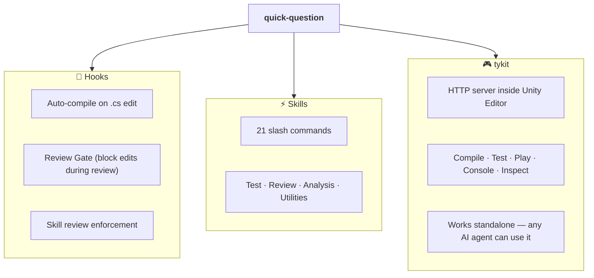

## A Day with qq

> Alex is working on a GTA-style open world game in Unity. 200k lines of C#, 15 service modules, 4 developers. She just installed qq. Here's her Tuesday.

**9:00 AM — Start coding**

Alex asks Claude to add a vehicle health system — cars should take damage from collisions, catch fire at low HP, and explode. Claude writes `VehicleDamageSystem.cs`, `FireEffect.cs`, and modifies `CollisionHandler.cs`.

She doesn't run any compile command. Each time Claude saves a `.cs` file, a hook fires automatically:

```
⚙️ Compiling Unity... ✅ Compilation successful (1.2s)
```

Three files edited, three automatic compiles. She doesn't even notice.

**9:30 AM — Run tests**

```
/qq:test
```

```
EditMode:  186/186 passed
PlayMode:   42/42 passed
Runtime errors: 1 found
  [Error] NullReferenceException at VehicleDamageSystem.cs:34
  Source: VehicleDamageSystem.OnEnable() — _rigidbody not assigned
```

All 228 tests "passed", but qq caught a runtime error hiding in the console — a `GetComponent` that runs before the Rigidbody is ready. Claude reads the code, moves the call to `Start()`, auto-compiles. Clean.

**10:00 AM — A new team member asks: "How does our damage system work?"**

```
/qq:grandma "vehicle damage system"
```

> "Imagine every car is a balloon. Crashing into things pokes tiny holes — that's damage. When enough holes open up, air leaks out fast — that's the fire stage. Eventually there's no air left, and the balloon pops — that's the explosion. The armor stat is like how thick the balloon's skin is."

The new dev gets it in 30 seconds.

Later, Alex needs to explain the **module architecture** to the tech lead:

```
/qq:explain VehicleDamageSystem
```

Claude reads the source and design docs, then outputs a structured breakdown: responsibilities, dependencies, data flow, and key design decisions. Technical but clear.

**10:30 AM — The fire VFX feels wrong**

Alex isn't sure how other games handle vehicle fire progression.

```
/qq:research
```

| Game | Fire Model | Pros | Cons |
|------|-----------|------|------|
| GTA V | HP threshold stages (smoke → fire → explosion) | Intuitive, cinematic | Rigid, no player agency |
| Assassin's Creed | Damage-over-time with spread | Realistic | Complex, hard to balance |
| Just Cause | Instant explosion at threshold | Simple, satisfying | No warning for player |

Alex picks the GTA V model — three visual stages based on HP thresholds. Proven, players already understand it.

**11:00 AM — Check module dependencies before going deeper**

```
/qq:deps
```

Claude scans all `.asmdef` files, generates a Mermaid dependency graph and a matrix table. Alex spots that `VehicleSystem` accidentally depends on `WeaponSystem` — a layer violation. She fixes the dependency before it spreads.

```
/qq:deps VehicleSystem
```

This time just the upstream/downstream of `VehicleSystem` — a focused view showing exactly what it touches.

**11:30 AM — Check if the design doc is still accurate**

```
/qq:doc-drift --module vehicle
```

Claude compares the vehicle design doc against actual code. Found 2 mismatches: the doc says fire starts at 30% HP, code uses 25%. And a planned "repair mechanic" is documented but not implemented yet — marked as "not yet built, not a bug."

**2:00 PM — Cross-model code review before asking the team to review**

```
/qq:codex-code-review
```

The diff is sent to Codex for review. ~5 minutes later, findings come back. A **Review Gate** activates — Claude can't edit any code until each finding is verified by an independent subagent.

```
=== Round 1/5 ===

Codex found:
  [Critical] VehicleDamageSystem applies damage during respawn — no isDead guard
  [Medium] FireEffect instantiates VFX every frame — should pool
  [Suggestion] CollisionHandler.OnCollisionEnter allocates a new List every call

Dispatching 2 verification subagents...

  [Critical] isDead guard: CONFIRMED — VehicleDamageSystem.cs:47, no check
  [Medium] VFX pooling: CONFIRMED — FireEffect.cs:23, Instantiate in Update

Gate unlocked. Fixing confirmed issues...
  ✅ Compiled. 186/186 EditMode, 42/42 PlayMode passed.

=== Round 2/5 ===
No [Critical] issues. Review passed.
```

> *Tip: `/qq:claude-code-review` does the same thing without needing Codex CLI — uses Claude subagents instead. Same Gate, same verification loop, no external dependency.*

**3:00 PM — Generate review materials for the team**

```
/qq:full-brief
```

Two agents run in parallel. Four documents land in `Docs/qq/`:

```
arch-review     — Mermaid diagram: VehicleDamageSystem → Rigidbody, FireEffect → VFXPool
pr-review       — P0: isDead guard, P1: VFX pooling, P2: List allocation
timeline-arch   — Phase 1: base damage, Phase 2: fire stages, Phase 3: explosion + respawn
timeline-review — review items grouped by development phase
```

These aren't PR description copy-paste — they're structured materials for human reviewers. The tech lead opens the arch diagram, traces the dependency flow, then reads the P0 items. Review done in 15 minutes instead of an hour.

**3:30 PM — What did we do today?**

```
/qq:changes
```

Claude summarizes: 3 new files, 2 modified, 1 bug fixed (isDead guard), 1 performance fix (VFX pooling). Ready to write the commit messages.

**3:45 PM — Before committing, one more check**

```
/qq:best-practice
```

A quick project-specific review — checks against the team's own rules in `AGENTS.md`: no `FindObjectOfType` in runtime, no missing `OnDestroy` cleanup, no cross-module dependency violations. Catches that `FireEffect` doesn't unsubscribe from `OnDamageChanged` in `OnDestroy`. Fixed.

**4:00 PM — Ship it**

```
/qq:commit-push
```

Claude groups changes into 3 logical commits:
- `feat: vehicle damage system with HP-based collision damage`
- `feat: fire VFX stages (smoke → fire → explosion)`
- `fix: isDead guard + VFX pooling + event cleanup`

Pre-push hook runs tests one last time:

```
[pre-push] EditMode 186/186 ✅ PlayMode 42/42 ✅
[pre-push] Runtime errors: 0
All tests passed, push allowed.
```

**4:15 PM — The repo is getting messy**

Over the past month, design docs, review outputs, and temp specs have piled up everywhere.

```
/qq:doc-tidy
```

Claude scans the entire repo, categorizes 47 doc files, and outputs a cleanup plan:
- 12 temp review files → archive
- 5 duplicate design docs → merge
- 3 orphaned docs referencing deleted modules → delete
- Root directory has 8 files that should be in `Docs/`

Alex reviews the plan, approves, and the repo is clean again.

**End of day**

```
/qq:timeline
```

Looking at the branch history, the timeline skill groups 11 commits into 3 semantic phases:
1. Core damage system (commits 1-4)
2. Fire VFX stages (commits 5-8)
3. Bug fixes and cleanup (commits 9-11)

Each phase has its own architecture evolution doc and code review checklist. Perfect for the Friday team review meeting.

---

> Every step had a safety net. Auto-compile caught syntax errors instantly. Tests caught logic bugs. Runtime error checking caught hidden exceptions. Cross-model review caught design flaws. The Gate prevented premature fixes. Pre-push hook was the final checkpoint.
>
> Alex never had to remember "which command should I run now." The harness guided her.

## Prerequisites

| Requirement | Notes |
|-------------|-------|
| macOS | v1 limitation — Windows/Linux planned for v2 |
| Git | Required — hooks and review commands depend on it |
| Unity 2021.3+ | Required by tykit |
| [Claude Code](https://docs.anthropic.com/en/docs/claude-code) | CLI or IDE extension |
| curl, python3, jq | `brew install curl python3 jq` |
| [Codex CLI](https://github.com/openai/codex) | Optional — only for cross-model review |

## Install

### Step 1: Install Plugin (skills + hooks)

In Claude Code:
```
/plugin marketplace add tykisgod/quick-question
/plugin install qq@quick-question-marketplace
```

This gives you all 17 skills and hooks (auto-compile, skill review enforcement). No files are copied into your project — the plugin runs from its cache.

### Step 2: Install tykit (Unity package)

tykit is the HTTP server that lets Claude control Unity Editor:

```bash
git clone https://github.com/tykisgod/quick-question.git /tmp/qq-install
/tmp/qq-install/install.sh /path/to/your-unity-project
rm -rf /tmp/qq-install
```

The installer handles Unity-specific setup:
- Adds tykit to `Packages/manifest.json`
- Copies shell scripts to `scripts/`
- Creates `CLAUDE.md` and `AGENTS.md` from templates (only if missing, never overwrites)

## Quick Start

After installation, open your Unity project and start Claude Code:

```bash
# Run tests and check for errors
/qq:test

# Run PlayMode only
/qq:test play

# Filter by test name
/qq:test --filter "Health"

# Cross-model code review
/qq:codex-code-review

# Commit and push
/qq:commit-push
```

## tykit — Unity Editor HTTP Server

tykit is a standalone HTTP server that auto-starts inside Unity Editor. **Any AI agent** (Claude Code, Codex, custom tools) can control Unity via simple HTTP calls — no SDK, no plugin API, no UI automation.

You can use tykit independently or as part of quick-question. When used with qq, it powers auto-compilation and test execution.

### Standalone Install

No need to install quick-question. Just add one line to your Unity project's `Packages/manifest.json`:

```json
"com.tyk.tykit": "https://github.com/tykisgod/tykit.git"
```

Open Unity — tykit starts automatically. Port is stored in `Temp/eval_server.json`.

### What You Can Do

**Run tests and get results:**
```bash
PORT=$(python3 -c "import json; print(json.load(open('Temp/eval_server.json'))['port'])")

# Start EditMode tests
curl -s -X POST http://localhost:$PORT/ \
  -d '{"command":"run-tests","args":{"mode":"editmode"}}' \
  -H 'Content-Type: application/json'

# Poll for results
curl -s -X POST http://localhost:$PORT/ \
  -d '{"command":"get-test-result"}' \
  -H 'Content-Type: application/json'
```

**Control Play Mode:**
```bash
curl -s -X POST http://localhost:$PORT/ \
  -d '{"command":"play"}' -H 'Content-Type: application/json'

# Read console output while running
curl -s -X POST http://localhost:$PORT/ \
  -d '{"command":"console","args":{"count":20,"filter":"error"}}' \
  -H 'Content-Type: application/json'

curl -s -X POST http://localhost:$PORT/ \
  -d '{"command":"stop"}' -H 'Content-Type: application/json'
```

**Find and inspect GameObjects:**
```bash
curl -s -X POST http://localhost:$PORT/ \
  -d '{"command":"find","args":{"name":"Player"}}' \
  -H 'Content-Type: application/json'

curl -s -X POST http://localhost:$PORT/ \
  -d '{"command":"inspect","args":{"id":12345}}' \
  -H 'Content-Type: application/json'
```

### Full API Reference

| Command | Args | Description |
|---------|------|-------------|
| `status` | — | Editor state overview |
| `compile-status` | — | Current compilation state |
| `get-compile-result` | — | Compilation result with errors |
| `run-tests` | `mode`, `filter` | Start EditMode/PlayMode tests |
| `get-test-result` | `runId` (optional) | Poll test results |
| `play` | — | Enter Play Mode |
| `stop` | — | Exit Play Mode |
| `console` | `count`, `filter` | Read console logs |
| `find` | `name` or `type` | Find GameObjects in scene |
| `inspect` | `id` | Inspect GameObject components |
| `refresh` | — | Refresh AssetDatabase |
| `save-scene` | — | Save current scene |
| `clear-console` | — | Clear console buffer |

### How quick-question Uses tykit

When qq's auto-compile hook fires, it tries tykit first — a single HTTP call that triggers incremental compilation without stealing keyboard focus. If tykit isn't available, it falls back to osascript or batch mode. Tests via `/qq:test` also run through tykit for fast, non-blocking execution. This is why qq is significantly faster than batch-mode alternatives.

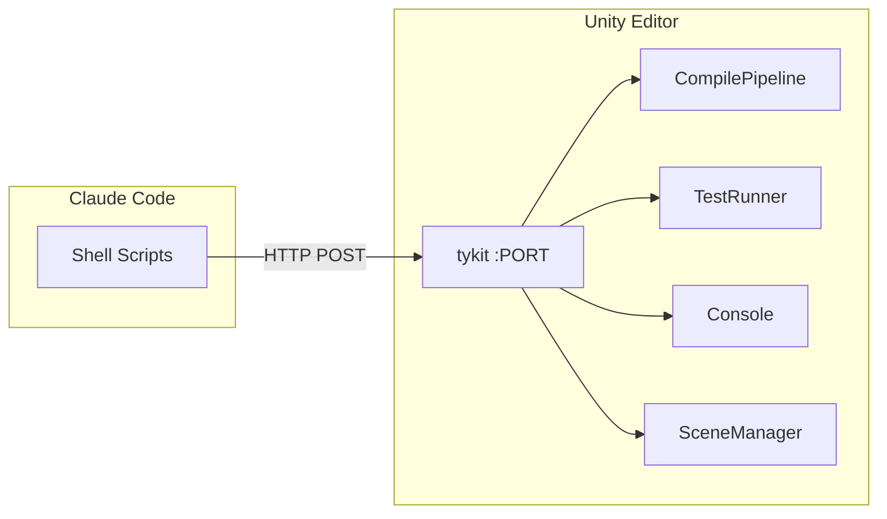

## Commands

| Command | Description |
|---------|-------------|
| **Workflow** | |
| `/qq:go` | Entry point — detect current state, guide you to the right next step |
| `/qq:plan` | Generate a technical implementation plan from a design doc or description |
| `/qq:execute` | Smart implementation — read a plan, pick execution strategy, build step by step |
| **Testing** | |
| `/qq:test` | Run unit/integration tests with error checking |
| **Code Review (Codex)** | *Requires [Codex CLI](https://github.com/openai/codex)* |
| `/qq:codex-code-review` | Cross-model code review (Claude + Codex with verification) |
| `/qq:codex-plan-review` | Cross-model design document review |
| **Code Review (Claude-only)** | *No extra tools needed* |
| `/qq:claude-code-review` | Deep code review using Claude subagents |
| `/qq:claude-plan-review` | Deep design document review using Claude subagents |
| **Code Review (Quick)** | |
| `/qq:best-practice` | Quick best-practice check — 18 rules for anti-patterns, performance, runtime safety |
| `/qq:self-review` | Review skill/config changes for quality |
| **Analysis** | |
| `/qq:brief` | Architecture diff + PR checklist (2 docs) |
| `/qq:timeline` | Commit history timeline with phase analysis (2 docs) |
| `/qq:full-brief` | Run brief + timeline in parallel (4 docs total) |
| `/qq:deps` | `.asmdef` dependency graph + matrix + health check |
| `/qq:doc-drift` | Compare design docs vs code, find inconsistencies |
| **Utilities** | |
| `/qq:commit-push` | Batch commit and push |
| `/qq:explain` | Explain module architecture in plain language |
| `/qq:grandma` | Explain any concept using everyday analogies anyone can understand |
| `/qq:research` | Search open-source solutions for current problem |
| `/qq:changes` | Summarize all changes in current conversation |
| `/qq:doc-tidy` | Scan repo docs, analyze organization, suggest cleanup |

## How It Works

### Auto-Compilation (PostToolUse Hook)

Every time Claude edits a `.cs` file, a PostToolUse hook triggers smart compilation:

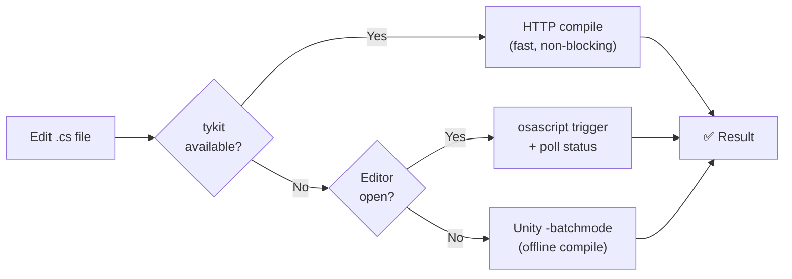

### tykit (HTTP Server)

See the dedicated [tykit section](#tykit--unity-editor-http-server) above for standalone install, API reference, and use cases.

### Cross-Model Review (Tribunal)

Two AI models reviewing each other's work with automatic verification:

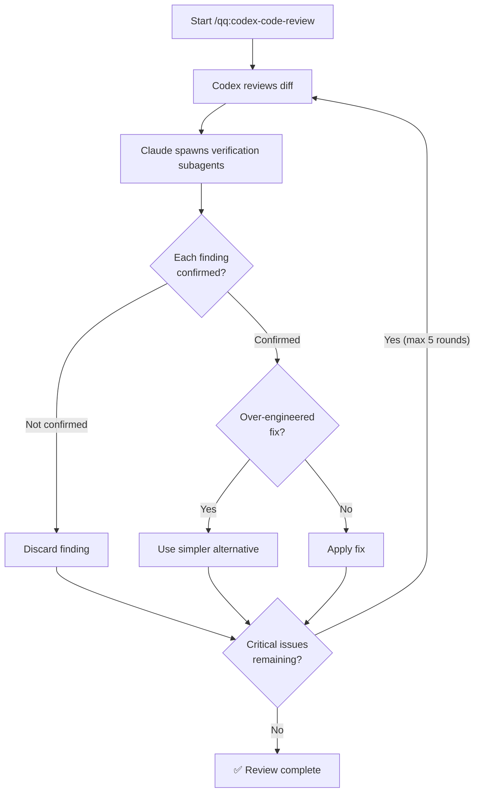

**Review Gate:** While verification subagents are running, a PreToolUse hook blocks edits to `.cs` files and `Docs/*.md` — preventing premature fixes before findings are confirmed.

### Skill Review Enforcement (Stop Hook)

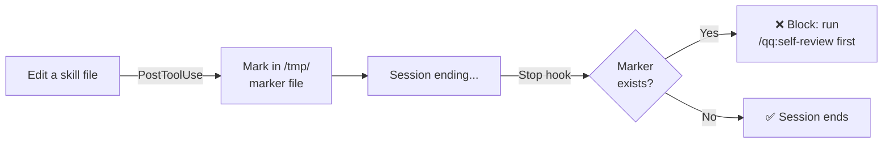

### Pre-Push Testing (Git Hook, Optional)

Automatically runs EditMode + PlayMode tests before every `git push`. If tests fail, the push is blocked.

```bash
# Install with pre-push hook
./install.sh /path/to/project --with-pre-push

# Skip for a single push
git push --no-verify
```

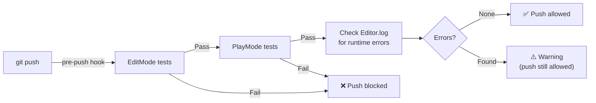

## All Hooks Summary

| Hook | Trigger | What It Does | Default | Impact |
|------|---------|-------------|:-------:|--------|
| **Auto-compile** | Edit .cs file | Runs smart compilation | On | Every .cs edit |
| **Skill change marker** | Edit skill file | Records change for self-review | On | Only when editing skills |
| **Self-review enforcement** | Session ending | Blocks if unreviewed skill changes | On | Only when skills were edited |
| **Review Gate (set)** | Run code-review.sh | Locks code edits until verified | On | Only during `/qq:codex-*` reviews |
| **Review Gate (check)** | Edit .cs / docs | Blocks if gate is locked | On | Only when gate is active |
| **Review Gate (count)** | Subagent completes | Unlocks gate after verification | On | Only when gate is active |
| **Gate cleanup** | Session ending | Clears gate marker | On | Automatic, no impact |
| **Pre-push testing** | git push | Runs tests, blocks on failure | **Off** | Every push (when enabled) |

### Disabling Hooks

The Review Gate hooks only activate during cross-model review — **zero impact** on normal development.

To disable auto-compilation or self-review enforcement, override in your project's `.claude/settings.local.json`:

```json
{
  "hooks": {
    "PostToolUse": [{ "matcher": "Write|Edit", "hooks": [] }],
    "Stop": [{ "matcher": "", "hooks": [] }]
  }
}
```

This disables **all** PostToolUse and Stop hooks. To disable only specific ones, keep the hooks array but remove the entry you don't want.

To remove the pre-push hook:
```bash
rm .githooks/pre-push
git config --unset core.hooksPath
```

## Comparison

| Feature | quick-question | Typical AI Tools |
|---------|:---:|:---:|
| Auto-compile on edit | ✅ Hook-driven | ❌ Manual |
| Test pipeline | ✅ EditMode + PlayMode + error check | ❌ Manual |
| Cross-model review | ✅ Claude + Codex with verification loop | ⚠️ Single model |
| Runtime Editor control | ✅ tykit (HTTP) | ❌ No access |
| Skill review enforcement | ✅ Stop hook blocks until reviewed | ⚠️ Honor system |
| Scene restoration | ✅ Auto-restores after PlayMode tests | ❌ Left on test scene |
| Pre-push test gate | ✅ Optional git hook | ❌ None |

## Customization

### CLAUDE.md

Your coding standards. The auto-compilation hook and test commands respect whatever rules you define here. See [`templates/CLAUDE.md.example`](templates/CLAUDE.md.example) for Unity-specific defaults.

### AGENTS.md

Your architecture rules and review criteria. The `/qq:best-practice`, `/qq:claude-code-review`, and cross-model review commands read this file to detect anti-patterns and module boundary violations. See [`templates/AGENTS.md.example`](templates/AGENTS.md.example) for a starting template.

### Priority System

All review commands classify findings by impact:

| Priority | Scope | Action |
|----------|-------|--------|
| **P0** | Architecture changes, anti-patterns, lifecycle issues | Must review |
| **P1** | Business logic, performance, error handling | Worth reviewing |
| **P2** | Getters/setters, logging, config tweaks | Quick scan |

## Limitations

- **macOS only** (v1) — scripts use `osascript`, `/Applications/Unity`, `~/Library/Logs`
- **Codex CLI required** for cross-model review features
- **Unity 2021.3+** required by tykit package
- **tykit is localhost-only, no authentication** — acceptable for dev machines, not for shared/CI environments
- **Console log scraping** for compile verification — use `clear-console` before critical compiles to avoid stale errors

## Contributing

Contributions are welcome! Please open an issue or submit a pull request.

## License

[MIT](LICENSE) © Yukang Tian

---

# 中文

> 基于 [AI 编程实践：独立开发者的文档驱动方法](https://tyksworks.com/posts/ai-coding-workflow-zh/) 的理念开发

## 功能

> 编辑 → 编译 → 测试 → 审阅 → 发布，全自动。

🔧 **自动编译** — 编辑 .cs 文件后自动编译验证<br>
🧪 **测试流水线** — EditMode + PlayMode 测试 + 运行时错误检查<br>
🔍 **跨模型审阅** — Claude 编排，Codex 审阅，每条发现逐一验证<br>
⚡ **21 个斜杠命令** — 测试、提交、审阅、解释、依赖分析等<br>
🎮 **tykit** — Unity Editor 内的 HTTP 服务器，AI agent 可控制

```
编辑 .cs 文件
     │ (PostToolUse hook)
     ▼
┌──────────────────┐
│    智能编译      │──── tykit（快速）/ Editor 触发 / Batch 模式
└────────┬─────────┘
         ▼
┌──────────────────┐
│   /qq:test       │──── EditMode + PlayMode + 错误检查
└────────┬─────────┘
         ▼
┌──────────────────────────┐
│  /qq:codex-code-review   │──── Codex 审阅 → Claude 验证 → 修复 → 循环
└────────┬─────────────────┘
         ▼
┌──────────────────┐
│  /qq:commit-push │──── 提交 + 推送
└──────────────────┘
```

### 架构

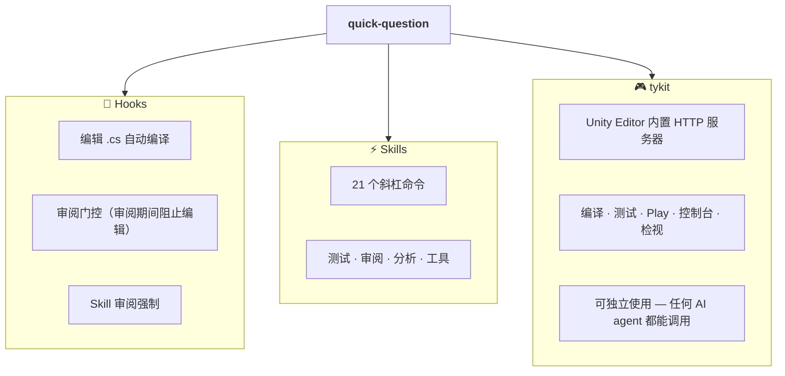

## qq 的一天

> 小明在做一个类 GTA 的开放世界游戏，Unity 项目。20 万行 C#，15 个服务模块，4 个开发者。他刚装好 qq。以下是他的周二。

**9:00 — 开始写代码**

小明让 Claude 加一个载具血量系统——车辆碰撞扣血、低血量着火、最终爆炸。Claude 写了 `VehicleDamageSystem.cs`、`FireEffect.cs`，并修改了 `CollisionHandler.cs`。

他不需要跑任何编译命令。每次 Claude 保存 `.cs` 文件，hook 自动触发：

```
⚙️ Compiling Unity... ✅ Compilation successful (1.2s)
```

改了三个文件，自动编译了三次。他甚至没注意到。

**9:30 — 跑测试**

```
/qq:test
```

```
EditMode:  186/186 passed
PlayMode:   42/42 passed
Runtime errors: 1 found
  [Error] NullReferenceException at VehicleDamageSystem.cs:34
  Source: VehicleDamageSystem.OnEnable() — _rigidbody not assigned
```

228 个测试全"通过"了，但 qq 在 console 里抓到一个隐藏的运行时错误——一个 `GetComponent` 在 Rigidbody 准备好之前就执行了。Claude 读了代码，把调用移到 `Start()`，自动编译。干净了。

**10:00 — 新人问："咱们的伤害系统是怎么运作的？"**

```
/qq:grandma "vehicle damage system"
```

> "想象每辆车都是一个气球。撞东西就是在气球上戳小洞——这就是伤害。洞多了，气漏得越来越快——这就是着火阶段。最后气漏完了，气球炸了——这就是爆炸。护甲值就是气球皮的厚度。"

新人 30 秒就懂了。

后来，小明需要给技术主管解释**模块架构**：

```
/qq:explain VehicleDamageSystem
```

Claude 读取源码和设计文档，输出结构化解析：职责、依赖关系、数据流、关键设计决策。技术性强但清晰明了。

**10:30 — 着火特效感觉不对**

小明不确定其他游戏是怎么处理载具着火过程的。

```
/qq:research
```

| 游戏 | 火焰模型 | 优点 | 缺点 |
|------|---------|------|------|
| GTA V | 血量阈值阶段（冒烟 → 着火 → 爆炸） | 直觉化，有电影感 | 僵硬，玩家没有能动性 |
| 刺客信条 | 持续伤害 + 火焰扩散 | 写实 | 复杂，难平衡 |
| 正当防卫 | 到阈值直接爆炸 | 简单，爽快 | 玩家没有预警 |

小明选了 GTA V 的方案——基于血量阈值的三个视觉阶段。经过验证的设计，玩家已经习惯了。

**11:00 — 深入之前先检查模块依赖**

```
/qq:deps
```

Claude 扫描所有 `.asmdef` 文件，生成 Mermaid 依赖图和矩阵表。小明发现 `VehicleSystem` 意外依赖了 `WeaponSystem`——层级违规。他在问题扩散之前修复了这个依赖。

```
/qq:deps VehicleSystem
```

这次只看 `VehicleSystem` 的上下游——聚焦视图，看它到底碰了哪些模块。

**11:30 — 设计文档还准不准？**

```
/qq:doc-drift --module vehicle
```

Claude 对比载具设计文档和实际代码。发现 2 处不一致：文档说 30% 血量着火，代码写的是 25%。还有一个计划中的"维修机制"写在文档里但还没实现——标注为"尚未实现，不是 bug"。

**14:00 — 提交人工审阅前，先做跨模型代码审阅**

```
/qq:codex-code-review
```

Diff 发送给 Codex 审阅。大约 5 分钟后，审阅结果返回。**审阅门控**激活——在每条发现被独立 subagent 验证之前，Claude 不能编辑任何代码。

```
=== Round 1/5 ===

Codex found:
  [Critical] VehicleDamageSystem applies damage during respawn — no isDead guard
  [Medium] FireEffect instantiates VFX every frame — should pool
  [Suggestion] CollisionHandler.OnCollisionEnter allocates a new List every call

Dispatching 2 verification subagents...

  [Critical] isDead guard: CONFIRMED — VehicleDamageSystem.cs:47, no check
  [Medium] VFX pooling: CONFIRMED — FireEffect.cs:23, Instantiate in Update

Gate unlocked. Fixing confirmed issues...
  ✅ Compiled. 186/186 EditMode, 42/42 PlayMode passed.

=== Round 2/5 ===
No [Critical] issues. Review passed.
```

> *提示：`/qq:claude-code-review` 做同样的事情，不需要 Codex CLI——用 Claude subagent 代替。同样的 Gate，同样的验证循环，没有外部依赖。*

**15:00 — 生成人工审阅材料**

```
/qq:full-brief
```

两个 agent 并行运行。四份文档落入 `Docs/qq/`：

```
arch-review     — Mermaid 图：VehicleDamageSystem → Rigidbody, FireEffect → VFXPool
pr-review       — P0: isDead guard, P1: VFX pooling, P2: List allocation
timeline-arch   — 阶段 1: 基础伤害, 阶段 2: 着火阶段, 阶段 3: 爆炸 + 重生
timeline-review — 按开发阶段分组的审阅项
```

这不是拿来粘贴到 PR 描述里的——而是给人类 reviewer 看的结构化材料。技术主管打开架构图，追踪依赖流，然后看 P0 项。审阅 15 分钟搞定，而不是一个小时。

**15:30 — 今天做了什么？**

```
/qq:changes
```

Claude 总结：3 个新文件，2 个修改，1 个 bug 修复（isDead guard），1 个性能修复（VFX pooling）。可以准备写 commit message 了。

**15:45 — 提交之前，再检查一遍**

```
/qq:best-practice
```

快速的项目专属审阅——按 `AGENTS.md` 里的团队规则检查：运行时不许用 `FindObjectOfType`，`OnDestroy` 必须清理，不允许跨模块依赖违规。抓到 `FireEffect` 没在 `OnDestroy` 退订 `OnDamageChanged` 事件。修了。

**16:00 — 提交上去**

```
/qq:commit-push
```

Claude 把改动分成 3 个逻辑 commit：
- `feat: vehicle damage system with HP-based collision damage`
- `feat: fire VFX stages (smoke → fire → explosion)`
- `fix: isDead guard + VFX pooling + event cleanup`

Pre-push hook 最后跑一次测试：

```
[pre-push] EditMode 186/186 ✅ PlayMode 42/42 ✅
[pre-push] Runtime errors: 0
All tests passed, push allowed.
```

**16:15 — 仓库有点乱了**

过去一个月，设计文档、审阅输出、临时 spec 到处堆积。

```
/qq:doc-tidy
```

Claude 扫描整个仓库，分类 47 个文档文件，输出整理方案：
- 12 个临时审阅文件 → 归档
- 5 个重复的设计文档 → 合并
- 3 个引用已删除模块的孤立文档 → 删除
- 根目录有 8 个文件应该放到 `Docs/`

小明看了方案，批准执行，仓库又干净了。

**一天结束**

```
/qq:timeline
```

回顾分支历史，timeline skill 把 11 个 commit 分成 3 个语义阶段：
1. 核心伤害系统（commit 1-4）
2. 着火特效阶段（commit 5-8）
3. Bug 修复和清理（commit 9-11）

每个阶段有独立的架构演化文档和代码审阅清单。周五团队会议的完美材料。

---

> 每一步都有安全网。自动编译当场抓住语法错误。测试抓住逻辑 bug。运行时错误检查抓住隐藏的异常。跨模型审阅抓住设计缺陷。Gate 阻止未验证的修复。Pre-push hook 是最后一道关卡。
>
> 小明从来不需要想"现在该跑什么命令"。这套工具链在引导他。

## 前置条件

| 需求 | 说明 |
|------|------|
| macOS | v1 限制 — Windows/Linux 计划在 v2 支持 |
| Git | 必需 — hooks 和审阅命令依赖 git |
| Unity 2021.3+ | tykit 要求 |
| [Claude Code](https://docs.anthropic.com/en/docs/claude-code) | CLI 或 IDE 扩展 |
| curl, python3, jq | `brew install curl python3 jq` |
| [Codex CLI](https://github.com/openai/codex) | 可选 — 仅跨模型审阅需要 |

## 安装

### 第 1 步：安装插件（skills + hooks）

在 Claude Code 中：
```
/plugin marketplace add tykisgod/quick-question
/plugin install qq@quick-question-marketplace
```

这会安装全部 17 个 skill 和 hooks（自动编译、skill 审阅强制）。不会向你的项目复制任何文件 — 插件从缓存运行。

### 第 2 步：安装 tykit（Unity 包）

tykit 是让 Claude 控制 Unity Editor 的 HTTP 服务器：

```bash
git clone https://github.com/tykisgod/quick-question.git /tmp/qq-install
/tmp/qq-install/install.sh /path/to/your-unity-project
rm -rf /tmp/qq-install
```

安装器处理 Unity 相关配置：
- 将 tykit 添加到 `Packages/manifest.json`
- 复制 shell 脚本到 `scripts/`
- 从模板创建 `CLAUDE.md` 和 `AGENTS.md`（仅在不存在时创建，不会覆盖）

## 快速开始

安装完成后，打开 Unity 项目并启动 Claude Code：

```bash
# 运行测试并检查错误
/qq:test

# 仅运行 PlayMode
/qq:test play

# 按测试名过滤
/qq:test --filter "Health"

# 跨模型代码审阅
/qq:codex-code-review

# 提交并推送
/qq:commit-push
```

## tykit — Unity Editor HTTP 服务器

tykit 是 Unity Editor 内自动启动的 HTTP 服务器。**任何 AI agent**（Claude Code、Codex、自定义工具）都可以通过简单的 HTTP 调用控制 Unity — 无需 SDK、无需插件 API、无需 UI 自动化。

tykit 可以独立使用，也可以作为 quick-question 的一部分。与 qq 配合时，它驱动自动编译和测试执行。

### 独立安装

不需要安装 quick-question。只需在 Unity 项目的 `Packages/manifest.json` 中加一行：

```json
"com.tyk.tykit": "https://github.com/tykisgod/tykit.git"
```

打开 Unity — tykit 自动启动。端口存储在 `Temp/eval_server.json` 中。

### 你能做什么

**运行测试并获取结果：**
```bash
PORT=$(python3 -c "import json; print(json.load(open('Temp/eval_server.json'))['port'])")

# 启动 EditMode 测试
curl -s -X POST http://localhost:$PORT/ \
  -d '{"command":"run-tests","args":{"mode":"editmode"}}' \
  -H 'Content-Type: application/json'

# 轮询结果
curl -s -X POST http://localhost:$PORT/ \
  -d '{"command":"get-test-result"}' \
  -H 'Content-Type: application/json'
```

**控制 Play Mode：**
```bash
curl -s -X POST http://localhost:$PORT/ \
  -d '{"command":"play"}' -H 'Content-Type: application/json'

# 运行时读取控制台错误
curl -s -X POST http://localhost:$PORT/ \
  -d '{"command":"console","args":{"count":20,"filter":"error"}}' \
  -H 'Content-Type: application/json'

curl -s -X POST http://localhost:$PORT/ \
  -d '{"command":"stop"}' -H 'Content-Type: application/json'
```

**查找和检视 GameObject：**
```bash
curl -s -X POST http://localhost:$PORT/ \
  -d '{"command":"find","args":{"name":"Player"}}' \
  -H 'Content-Type: application/json'

curl -s -X POST http://localhost:$PORT/ \
  -d '{"command":"inspect","args":{"id":12345}}' \
  -H 'Content-Type: application/json'
```

### 完整 API 参考

| 命令 | 参数 | 描述 |
|------|------|------|
| `status` | — | Editor 状态概览 |
| `compile-status` | — | 当前编译状态 |
| `get-compile-result` | — | 编译结果及错误 |
| `run-tests` | `mode`, `filter` | 启动 EditMode/PlayMode 测试 |
| `get-test-result` | `runId`（可选） | 轮询测试结果 |
| `play` | — | 进入 Play Mode |
| `stop` | — | 退出 Play Mode |
| `console` | `count`, `filter` | 读取控制台日志 |
| `find` | `name` 或 `type` | 查找场景中的 GameObject |
| `inspect` | `id` | 检视 GameObject 组件 |
| `refresh` | — | 刷新 AssetDatabase |
| `save-scene` | — | 保存当前场景 |
| `clear-console` | — | 清空控制台缓冲 |

### quick-question 如何使用 tykit

qq 的自动编译 hook 触发时，优先走 tykit — 一个 HTTP 调用即可触发增量编译，不抢键盘焦点。如果 tykit 不可用，回退到 osascript 或 batch 模式。`/qq:test` 也通过 tykit 运行测试，实现快速非阻塞执行。这就是 qq 比 batch 模式快得多的原因。

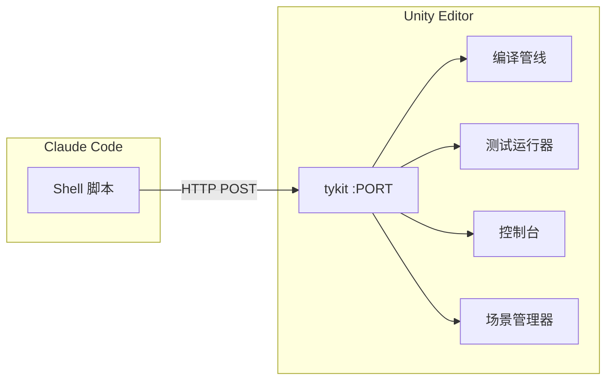

## 命令

| 命令 | 描述 |
|------|------|
| **工作流** | |
| `/qq:go` | 入口 — 检测当前状态，引导你到正确的下一步 |
| `/qq:plan` | 从设计文档或描述生成技术实现计划 |
| `/qq:execute` | 智能实现 — 读取计划，选择执行策略，逐步构建 |
| **测试** | |
| `/qq:test` | 运行单元/集成测试并检查错误 |
| **代码审阅（Codex）** | *需要 [Codex CLI](https://github.com/openai/codex)* |
| `/qq:codex-code-review` | 跨模型代码审阅（Claude + Codex + 验证循环） |
| `/qq:codex-plan-review` | 跨模型设计文档审阅 |
| **代码审阅（Claude）** | *无需额外工具* |
| `/qq:claude-code-review` | Claude subagent 深度代码审阅 |
| `/qq:claude-plan-review` | Claude subagent 深度设计文档审阅 |
| **代码审阅（快速）** | |
| `/qq:best-practice` | 快速最佳实践检查 — 18 条规则覆盖反模式、性能、运行时安全 |
| `/qq:self-review` | 审阅 skill/配置变更的质量 |
| **分析** | |
| `/qq:brief` | 架构 diff + PR 清单（2 份文档） |
| `/qq:timeline` | 提交历史时间线及阶段分析（2 份文档） |
| `/qq:full-brief` | 并行运行 brief + timeline（共 4 份文档） |
| `/qq:deps` | `.asmdef` 依赖关系图 + 矩阵 + 健康检查 |
| `/qq:doc-drift` | 对比设计文档与代码，找出不一致 |
| **工具** | |
| `/qq:commit-push` | 批量提交并推送 |
| `/qq:explain` | 用通俗语言解释模块架构 |
| `/qq:grandma` | 用日常类比解释任何概念，人人都能听懂 |
| `/qq:research` | 搜索当前问题的开源解决方案 |
| `/qq:changes` | 汇总当前会话的所有变更 |
| `/qq:doc-tidy` | 扫描仓库文档，分析组织问题，建议清理 |

## 工作原理

### 自动编译（PostToolUse Hook）

每当 Claude 编辑 `.cs` 文件时，PostToolUse hook 触发智能编译：

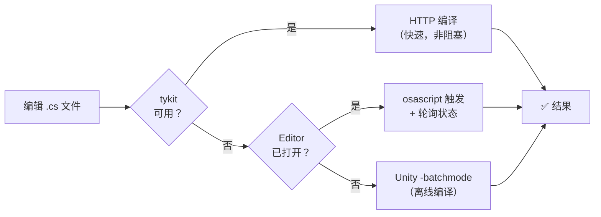

### tykit（HTTP 服务器）

详见上方独立章节 [tykit — Unity Editor HTTP 服务器](#tykit--unity-editor-http-服务器)。

### 跨模型审阅（Tribunal）

两个 AI 模型互相审阅，自动验证每条发现：

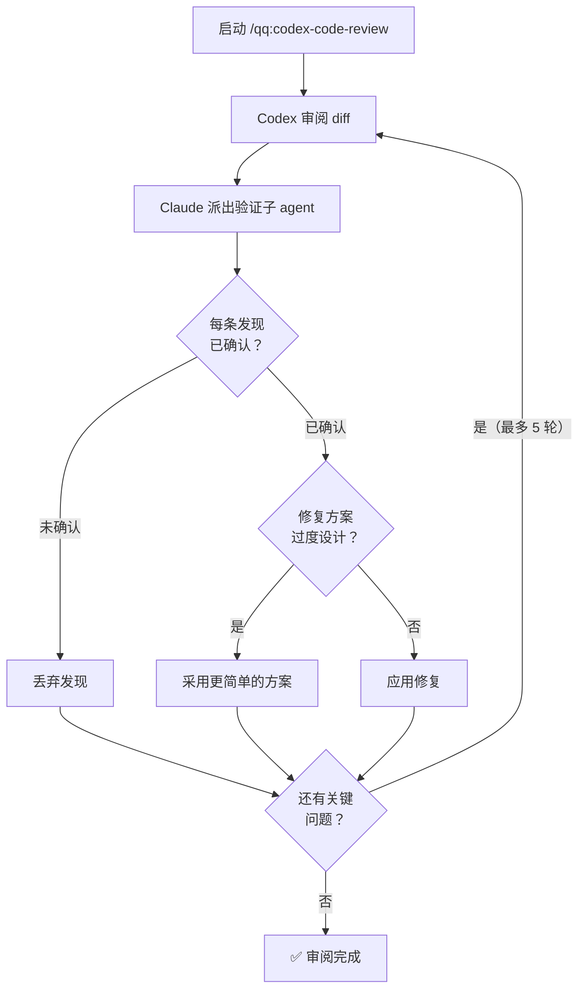

**审阅门控：** 验证子 agent 运行期间，PreToolUse hook 会阻止所有代码编辑 — 防止在发现被确认前过早修复。

### Skill 审阅强制（Stop Hook）

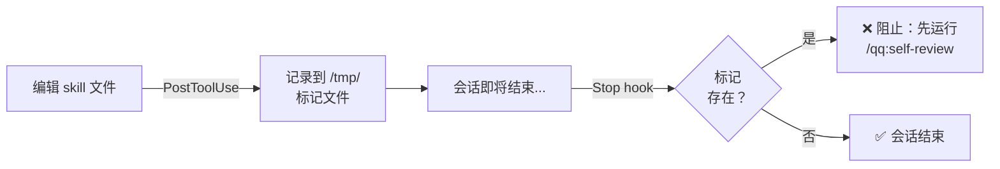

## 对比

| 特性 | quick-question | 传统 AI 工具 |
|------|:---:|:---:|
| 编辑即编译 | ✅ Hook 驱动 | ❌ 手动 |
| 测试流水线 | ✅ EditMode + PlayMode + 错误检查 | ❌ 手动 |
| 跨模型审阅 | ✅ Claude + Codex 验证循环 | ⚠️ 单模型 |
| 运行时 Editor 控制 | ✅ tykit (HTTP) | ❌ 无法访问 |
| Skill 审阅强制 | ✅ Stop hook 阻止直到审阅完成 | ⚠️ 靠自觉 |
| 场景恢复 | ✅ PlayMode 测试后自动恢复 | ❌ 停留在测试场景 |
| 推送前测试门控 | ✅ 可选 git hook | ❌ 无 |

## 自定义

### CLAUDE.md

你的编码规范。自动编译 hook 和测试命令会遵循你在此定义的规则。参见 [`templates/CLAUDE.md.example`](templates/CLAUDE.md.example) 获取 Unity 专用默认值。

### AGENTS.md

你的架构规则和审阅标准。`/qq:best-practice`、`/qq:claude-code-review` 和跨模型审阅命令会读取此文件来检测反模式和模块边界违规。参见 [`templates/AGENTS.md.example`](templates/AGENTS.md.example) 获取起始模板。

### 优先级系统

所有审阅命令按影响程度分类发现：

| 优先级 | 范围 | 处理 |
|--------|------|------|
| **P0** | 架构变更、反模式、生命周期问题 | 必须审阅 |
| **P1** | 业务逻辑、性能、错误处理 | 建议审阅 |
| **P2** | Getter/Setter、日志、配置微调 | 快速扫一眼 |

## 限制

- **仅 macOS**（v1）— 脚本使用 `osascript`、`/Applications/Unity`、`~/Library/Logs`
- **跨模型审阅功能需要 Codex CLI**
- **Unity 2021.3+**，tykit 包要求
- **tykit 仅限 localhost，无认证** — 适用于开发机，不适用于共享/CI 环境
- **编译验证使用控制台日志抓取** — 关键编译前使用 `clear-console` 避免残留错误

## 贡献

欢迎贡献！请提交 Issue 或 Pull Request。

## 许可证

[MIT](LICENSE) © Yukang Tian

---

# 日本語

> [AI Coding in Practice: An Indie Developer's Document-First Approach](https://tyksworks.com/posts/ai-coding-workflow-en/) (English) の思想に基づいて開発

## 機能

> 編集 → コンパイル → テスト → レビュー → リリース。完全自動化。

🔧 **自動コンパイル** — .cs ファイル編集後に自動コンパイル検証<br>
🧪 **テストパイプライン** — EditMode + PlayMode テスト + ランタイムエラーチェック<br>
🔍 **クロスモデルレビュー** — Claude が編成、Codex がレビュー、各指摘をソースで検証<br>
⚡ **21 個のスラッシュコマンド** — テスト、コミット、レビュー、解説、依存分析など<br>
🎮 **tykit** — Unity Editor 内の HTTP サーバー（play/stop/console/テスト実行）

## インストール

### ステップ 1：プラグインのインストール

Claude Code で：
```
/plugin marketplace add tykisgod/quick-question
/plugin install qq@quick-question-marketplace
```

### ステップ 2：tykit のインストール

```bash
git clone https://github.com/tykisgod/quick-question.git /tmp/qq-install
/tmp/qq-install/install.sh /path/to/unity-project
rm -rf /tmp/qq-install
```

前提条件：macOS、Unity 2021.3+、Claude Code、curl/python3/jq、Codex CLI（オプション）

## qq との一日

> ユウキは GTA 風のオープンワールドゲームを Unity で開発中。20 万行の C#、15 のサービスモジュール、4 人のチーム。qq をインストールしたばかり。彼の火曜日を追ってみよう。

**9:00 — コーディング開始**

ユウキは Claude に車両ヘルスシステムの追加を依頼する——衝突でダメージ、低 HP で発火、最終的に爆発。Claude は `VehicleDamageSystem.cs`、`FireEffect.cs` を作成し、`CollisionHandler.cs` を修正する。

コンパイルコマンドを実行する必要はない。Claude が `.cs` ファイルを保存するたびに、hook が自動的に起動する：

```
⚙️ Compiling Unity... ✅ Compilation successful (1.2s)
```

3 つのファイルを編集、3 回の自動コンパイル。気づきすらしない。

**9:30 — テスト実行**

```
/qq:test
```

```
EditMode:  186/186 passed
PlayMode:   42/42 passed
Runtime errors: 1 found
  [Error] NullReferenceException at VehicleDamageSystem.cs:34
  Source: VehicleDamageSystem.OnEnable() — _rigidbody not assigned
```

228 テスト全て「通過」したが、qq がコンソールに潜むランタイムエラーを検出した——Rigidbody の準備が完了する前に `GetComponent` が実行されていた。Claude がコードを読み、呼び出しを `Start()` に移動、自動コンパイル。クリーン。

**10:00 — 新メンバーが聞く：「ダメージシステムってどう動いてるの？」**

```
/qq:grandma "vehicle damage system"
```

> 「車はぜんぶ風船だと思って。何かにぶつかると小さな穴が開く——それがダメージ。穴がたくさん開くと空気がどんどん抜ける——それが発火段階。最後に空気がなくなると、風船が割れる——それが爆発。装甲値は風船の皮の厚さだよ。」

新メンバーは 30 秒で理解した。

その後、ユウキは**モジュールアーキテクチャ**をテックリードに説明する必要がある：

```
/qq:explain VehicleDamageSystem
```

Claude はソースコードと設計ドキュメントを読み、構造化された解析を出力する：責務、依存関係、データフロー、主要な設計判断。技術的だが明快。

**10:30 — 炎の VFX がしっくりこない**

他のゲームが車両の発火をどう処理しているか、ユウキにはよくわからない。

```
/qq:research
```

| ゲーム | 火災モデル | 長所 | 短所 |
|--------|-----------|------|------|
| GTA V | HP 閾値ステージ（煙 → 炎 → 爆発） | 直感的、映画的 | 固定的、プレイヤーの介入余地なし |
| アサシン クリード | 継続ダメージ + 延焼 | リアル | 複雑、バランス調整が困難 |
| ジャストコーズ | 閾値で即座に爆発 | シンプル、爽快 | プレイヤーへの警告なし |

ユウキは GTA V モデルを選択——HP 閾値に基づく 3 つのビジュアルステージ。実証済み、プレイヤーも既に理解しているパターン。

**11:00 — 深く進む前にモジュール依存をチェック**

```
/qq:deps
```

Claude は全 `.asmdef` ファイルをスキャンし、Mermaid 依存グラフとマトリクステーブルを生成。ユウキは `VehicleSystem` が `WeaponSystem` に誤って依存していることを発見——レイヤー違反。拡散する前に修正。

```
/qq:deps VehicleSystem
```

今度は `VehicleSystem` の上流・下流だけ——何に触れているかが正確にわかる焦点ビュー。

**11:30 — 設計ドキュメントはまだ正確か？**

```
/qq:doc-drift --module vehicle
```

Claude は車両設計ドキュメントと実際のコードを比較。2 つの不一致を発見：ドキュメントでは 30% HP で発火と記載、コードは 25% を使用。さらに「修理メカニクス」が文書化されているが未実装——「未実装、バグではない」と記録。

**14:00 — チームレビュー依頼前に、クロスモデルコードレビュー**

```
/qq:codex-code-review
```

diff が Codex に送信されレビューされる。約 5 分後、結果が返ってくる。**レビューゲート**が起動——各指摘が独立した subagent に検証されるまで、Claude はコードを編集できない。

```
=== Round 1/5 ===

Codex found:
  [Critical] VehicleDamageSystem applies damage during respawn — no isDead guard
  [Medium] FireEffect instantiates VFX every frame — should pool
  [Suggestion] CollisionHandler.OnCollisionEnter allocates a new List every call

Dispatching 2 verification subagents...

  [Critical] isDead guard: CONFIRMED — VehicleDamageSystem.cs:47, no check
  [Medium] VFX pooling: CONFIRMED — FireEffect.cs:23, Instantiate in Update

Gate unlocked. Fixing confirmed issues...
  ✅ Compiled. 186/186 EditMode, 42/42 PlayMode passed.

=== Round 2/5 ===
No [Critical] issues. Review passed.
```

> *ヒント：`/qq:claude-code-review` は Codex CLI なしで同じことを行う——Claude subagent を使用。同じ Gate、同じ検証ループ、外部依存なし。*

**15:00 — チーム向けレビュー資料を生成**

```
/qq:full-brief
```

2 つの agent が並列実行。4 つのドキュメントが `Docs/qq/` に生成される：

```
arch-review     — Mermaid 図：VehicleDamageSystem → Rigidbody, FireEffect → VFXPool
pr-review       — P0: isDead guard, P1: VFX pooling, P2: List allocation
timeline-arch   — Phase 1: 基礎ダメージ, Phase 2: 発火ステージ, Phase 3: 爆発 + リスポーン
timeline-review — 開発フェーズごとにグループ化されたレビュー項目
```

これは PR 説明にコピペするものではない——人間レビュアーのための構造化された資料。テックリードはアーキテクチャ図を開き、依存フローをたどり、P0 項目を読む。1 時間ではなく 15 分でレビュー完了。

**15:30 — 今日何をした？**

```
/qq:changes
```

Claude がまとめる：新規ファイル 3、変更 2、バグ修正 1（isDead guard）、パフォーマンス修正 1（VFX pooling）。コミットメッセージを書く準備完了。

**15:45 — コミット前に、もう一度チェック**

```
/qq:best-practice
```

プロジェクト固有のクイックレビュー——`AGENTS.md` のチームルールに基づくチェック：ランタイムで `FindObjectOfType` 禁止、`OnDestroy` でのクリーンアップ漏れなし、クロスモジュール依存違反なし。`FireEffect` が `OnDestroy` で `OnDamageChanged` を解除していないことを検出。修正。

**16:00 — 出荷**

```
/qq:commit-push
```

Claude は変更を 3 つの論理コミットに分割：
- `feat: vehicle damage system with HP-based collision damage`
- `feat: fire VFX stages (smoke → fire → explosion)`
- `fix: isDead guard + VFX pooling + event cleanup`

Pre-push hook が最終テストを実行：

```
[pre-push] EditMode 186/186 ✅ PlayMode 42/42 ✅
[pre-push] Runtime errors: 0
All tests passed, push allowed.
```

**16:15 — リポが散らかってきた**

この一ヶ月で、設計ドキュメント、レビュー出力、一時的な仕様書があちこちに散乱。

```
/qq:doc-tidy
```

Claude はリポジトリ全体をスキャンし、47 のドキュメントファイルを分類、整理プランを出力：
- 一時レビューファイル 12 件 → アーカイブ
- 重複した設計ドキュメント 5 件 → マージ
- 削除済みモジュールを参照する孤立ドキュメント 3 件 → 削除
- ルートディレクトリに `Docs/` に移すべきファイル 8 件

ユウキがプランを確認、承認。リポは再びクリーンに。

**一日の終わり**

```
/qq:timeline
```

ブランチ履歴を振り返り、timeline skill が 11 コミットを 3 つのセマンティックフェーズに分類：
1. コアダメージシステム（コミット 1-4）
2. 発火 VFX ステージ（コミット 5-8）
3. バグ修正とクリーンアップ（コミット 9-11）

各フェーズにアーキテクチャ進化ドキュメントとコードレビューチェックリストが付属。金曜のチームレビュー会議に最適な資料。

---

> すべてのステップにセーフティネットがあった。自動コンパイルが構文エラーを即座にキャッチ。テストがロジックバグをキャッチ。ランタイムエラーチェックが隠れた例外をキャッチ。クロスモデルレビューが設計上の欠陥をキャッチ。Gate が未検証の修正を防止。Pre-push hook が最後の関門。
>
> ユウキは「今どのコマンドを実行すべきか」を考える必要がなかった。ツールチェインが導いてくれた。

---

# 한국어

> [AI Coding in Practice: An Indie Developer's Document-First Approach](https://tyksworks.com/posts/ai-coding-workflow-en/) (English)의 철학을 기반으로 개발

## 기능

> 편집 → 컴파일 → 테스트 → 리뷰 → 배포. 완전 자동화.

🔧 **자동 컴파일** — .cs 파일 편집 후 자동 컴파일 검증<br>
🧪 **테스트 파이프라인** — EditMode + PlayMode 테스트 + 런타임 에러 체크<br>
🔍 **크로스 모델 리뷰** — Claude 오케스트레이션, Codex 리뷰, 각 발견사항 소스 검증<br>
⚡ **21개 슬래시 커맨드** — 테스트, 커밋, 리뷰, 설명, 의존성 분석 등<br>
🎮 **tykit** — Unity Editor 내 HTTP 서버(play/stop/console/테스트 실행)

## 설치

### 1단계: 플러그인 설치

Claude Code에서:
```
/plugin marketplace add tykisgod/quick-question
/plugin install qq@quick-question-marketplace
```

### 2단계: tykit 설치

```bash
git clone https://github.com/tykisgod/quick-question.git /tmp/qq-install
/tmp/qq-install/install.sh /path/to/unity-project
rm -rf /tmp/qq-install
```

사전 요구사항: macOS, Unity 2021.3+, Claude Code, curl/python3/jq, Codex CLI (선택)

## qq와 함께하는 하루

> 민수는 GTA 스타일 오픈월드 게임을 Unity로 개발 중이다. C# 20만 줄, 서비스 모듈 15개, 개발자 4명. qq를 방금 설치했다. 그의 화요일을 따라가 보자.

**9:00 — 코딩 시작**

민수가 Claude에게 차량 체력 시스템 추가를 요청한다 — 충돌 시 데미지, 저체력에서 발화, 최종적으로 폭발. Claude가 `VehicleDamageSystem.cs`, `FireEffect.cs`를 작성하고, `CollisionHandler.cs`를 수정한다.

컴파일 명령을 직접 실행할 필요가 없다. Claude가 `.cs` 파일을 저장할 때마다 hook이 자동으로 실행된다:

```
⚙️ Compiling Unity... ✅ Compilation successful (1.2s)
```

파일 3개 편집, 자동 컴파일 3번. 알아차리지도 못한다.

**9:30 — 테스트 실행**

```
/qq:test
```

```
EditMode:  186/186 passed
PlayMode:   42/42 passed
Runtime errors: 1 found
  [Error] NullReferenceException at VehicleDamageSystem.cs:34
  Source: VehicleDamageSystem.OnEnable() — _rigidbody not assigned
```

228개 테스트가 전부 "통과"했지만, qq가 콘솔에 숨어 있던 런타임 에러를 잡아냈다 — Rigidbody가 준비되기 전에 `GetComponent`가 실행된 것이다. Claude가 코드를 읽고 호출을 `Start()`로 이동, 자동 컴파일. 깔끔.

**10:00 — 신입이 묻는다: "데미지 시스템이 어떻게 돌아가요?"**

```
/qq:grandma "vehicle damage system"
```

> "모든 차가 풍선이라고 생각해 봐. 뭔가에 부딪히면 작은 구멍이 뚫려 — 그게 데미지야. 구멍이 많아지면 바람이 점점 빠져 — 그게 발화 단계야. 결국 바람이 다 빠지면 풍선이 빵 터져 — 그게 폭발이야. 장갑 수치는 풍선 껍질의 두께라고 생각하면 돼."

신입은 30초 만에 이해했다.

나중에 민수는 **모듈 아키텍처**를 테크 리드에게 설명해야 한다:

```
/qq:explain VehicleDamageSystem
```

Claude가 소스 코드와 설계 문서를 읽고, 구조화된 분석을 출력한다: 책임, 의존 관계, 데이터 흐름, 핵심 설계 결정. 기술적이지만 명확하다.

**10:30 — 화재 VFX가 어딘가 어색하다**

민수는 다른 게임들이 차량 화재 진행을 어떻게 처리하는지 확신이 없다.

```
/qq:research
```

| 게임 | 화재 모델 | 장점 | 단점 |
|------|----------|------|------|
| GTA V | HP 임계값 단계 (연기 → 화재 → 폭발) | 직관적, 영화 같은 연출 | 경직, 플레이어 개입 여지 없음 |
| 어쌔신 크리드 | 지속 데미지 + 번짐 | 사실적 | 복잡, 밸런싱 어려움 |
| 저스트 코즈 | 임계값 도달 시 즉시 폭발 | 단순, 통쾌 | 플레이어에게 경고 없음 |

민수는 GTA V 모델을 선택 — HP 임계값 기반 3단계 비주얼. 검증된 설계, 플레이어들이 이미 익숙한 패턴이다.

**11:00 — 더 깊이 들어가기 전에 모듈 의존성 점검**

```
/qq:deps
```

Claude가 모든 `.asmdef` 파일을 스캔하고, Mermaid 의존성 그래프와 매트릭스 테이블을 생성한다. 민수는 `VehicleSystem`이 `WeaponSystem`에 실수로 의존하고 있는 것을 발견 — 레이어 위반이다. 문제가 퍼지기 전에 수정한다.

```
/qq:deps VehicleSystem
```

이번에는 `VehicleSystem`의 상류/하류만 — 정확히 어떤 모듈과 연결되어 있는지 보여주는 집중 뷰.

**11:30 — 설계 문서가 아직 정확한가?**

```
/qq:doc-drift --module vehicle
```

Claude가 차량 설계 문서와 실제 코드를 비교한다. 불일치 2건 발견: 문서에는 30% HP에서 발화라고 되어 있지만, 코드는 25%를 사용. 또한 "수리 메커닉"이 문서화되어 있지만 아직 미구현 — "아직 구현 안 됨, 버그 아님"으로 표기.

**14:00 — 팀 리뷰 요청 전, 크로스 모델 코드 리뷰**

```
/qq:codex-code-review
```

diff가 Codex에 전송되어 리뷰된다. 약 5분 후 결과가 돌아온다. **리뷰 게이트**가 활성화된다 — 각 발견 사항이 독립적인 subagent에 의해 검증될 때까지 Claude는 코드를 편집할 수 없다.

```
=== Round 1/5 ===

Codex found:
  [Critical] VehicleDamageSystem applies damage during respawn — no isDead guard
  [Medium] FireEffect instantiates VFX every frame — should pool
  [Suggestion] CollisionHandler.OnCollisionEnter allocates a new List every call

Dispatching 2 verification subagents...

  [Critical] isDead guard: CONFIRMED — VehicleDamageSystem.cs:47, no check
  [Medium] VFX pooling: CONFIRMED — FireEffect.cs:23, Instantiate in Update

Gate unlocked. Fixing confirmed issues...
  ✅ Compiled. 186/186 EditMode, 42/42 PlayMode passed.

=== Round 2/5 ===
No [Critical] issues. Review passed.
```

> *팁: `/qq:claude-code-review`는 Codex CLI 없이 같은 일을 한다 — Claude subagent를 사용. 같은 Gate, 같은 검증 루프, 외부 의존성 없음.*

**15:00 — 팀을 위한 리뷰 자료 생성**

```
/qq:full-brief
```

2개의 agent가 병렬 실행. 4개의 문서가 `Docs/qq/`에 생성된다:

```
arch-review     — Mermaid 다이어그램: VehicleDamageSystem → Rigidbody, FireEffect → VFXPool
pr-review       — P0: isDead guard, P1: VFX pooling, P2: List allocation
timeline-arch   — Phase 1: 기본 데미지, Phase 2: 화재 단계, Phase 3: 폭발 + 리스폰
timeline-review — 개발 단계별로 그룹화된 리뷰 항목
```

이건 PR 설명에 복사 붙여넣기 하는 게 아니다 — 인간 리뷰어를 위한 구조화된 자료다. 테크 리드가 아키텍처 다이어그램을 열고, 의존성 흐름을 추적하고, P0 항목을 읽는다. 1시간이 아니라 15분에 리뷰 완료.

**15:30 — 오늘 뭘 했지?**

```
/qq:changes
```

Claude가 요약한다: 신규 파일 3개, 수정 2개, 버그 수정 1개 (isDead guard), 성능 수정 1개 (VFX pooling). 커밋 메시지를 쓸 준비 완료.

**15:45 — 커밋하기 전에, 한 번 더 확인**

```
/qq:best-practice
```

프로젝트 전용 빠른 리뷰 — `AGENTS.md`의 팀 규칙에 따른 점검: 런타임에서 `FindObjectOfType` 금지, `OnDestroy` 클린업 누락 불가, 크로스 모듈 의존성 위반 금지. `FireEffect`가 `OnDestroy`에서 `OnDamageChanged` 이벤트를 해제하지 않은 것을 잡아냈다. 수정.

**16:00 — 출시**

```
/qq:commit-push
```

Claude가 변경 사항을 3개의 논리적 커밋으로 분리:
- `feat: vehicle damage system with HP-based collision damage`
- `feat: fire VFX stages (smoke → fire → explosion)`
- `fix: isDead guard + VFX pooling + event cleanup`

Pre-push hook이 마지막으로 테스트를 실행:

```
[pre-push] EditMode 186/186 ✅ PlayMode 42/42 ✅
[pre-push] Runtime errors: 0
All tests passed, push allowed.
```

**16:15 — 리포가 지저분해졌다**

지난 한 달간 설계 문서, 리뷰 결과물, 임시 스펙이 여기저기 쌓였다.

```
/qq:doc-tidy
```

Claude가 리포지토리 전체를 스캔하고, 47개 문서 파일을 분류하고, 정리 계획을 출력한다:
- 임시 리뷰 파일 12개 → 아카이브
- 중복된 설계 문서 5개 → 병합
- 삭제된 모듈을 참조하는 고아 문서 3개 → 삭제
- 루트 디렉토리에 `Docs/`로 옮겨야 할 파일 8개

민수가 계획을 검토하고 승인. 리포가 다시 깔끔해졌다.

**하루의 끝**

```
/qq:timeline
```

브랜치 히스토리를 되돌아보며, timeline skill이 11개 커밋을 3개의 의미적 단계로 분류:
1. 코어 데미지 시스템 (커밋 1-4)
2. 화재 VFX 단계 (커밋 5-8)
3. 버그 수정과 정리 (커밋 9-11)

각 단계에 아키텍처 진화 문서와 코드 리뷰 체크리스트가 포함. 금요일 팀 리뷰 미팅을 위한 완벽한 자료.

---

> 모든 단계에 안전망이 있었다. 자동 컴파일이 문법 에러를 즉시 잡았다. 테스트가 로직 버그를 잡았다. 런타임 에러 체크가 숨은 예외를 잡았다. 크로스 모델 리뷰가 설계 결함을 잡았다. Gate가 미검증 수정을 막았다. Pre-push hook이 마지막 관문이었다.
>
> 민수는 "지금 어떤 명령을 실행해야 하지"라고 고민할 필요가 없었다. 도구 체인이 그를 이끌었다.
