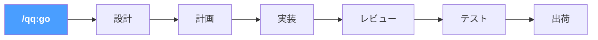

# 日本語

## 機能

**`/qq:go` — ライフサイクル対応ルーティング。** 開発サイクルのどこにいるかを検出し、次のステップを提案する。設計ドキュメントがある？計画を提案。コード実装済み？レビューを提案。テスト通過？出荷を提案。

**tykit — AI が制御する Unity Editor。** Unity Editor 内の HTTP サーバー。あらゆる AI エージェントから呼び出せる。コンパイル、テスト実行、Play Mode 制御、コンソールログ読み取り、GameObject の検索・検査 — すべて `curl` で。SDK 不要、UI 自動化不要。qq なしでも単独で動作する。**[mcp-unity](https://github.com/CoderGamester/mcp-unity)** や **[Unity-MCP](https://github.com/IvanMurzak/Unity-MCP)** を代替バックエンドとしても使用可能。

さらに：`.cs` 編集ごとの自動コンパイル、EditMode + PlayMode テストパイプライン、クロスモデルコードレビュー（Claude + Codex + 検証）、開発ライフサイクル全体をカバーする 22 個のスキル。

## ライフサイクルパイプライン



`/qq:go` と入力すると、qq がプロジェクト状態を読み取り、適切なステップにルーティングする。各ステップが次を提案。`--auto` で全パイプラインを自動実行。

## インストール

**前提条件：** macOS + Windows（Windows では [Git for Windows](https://gitforwindows.org/) が必要）、Unity 2021.3+、[Claude Code](https://docs.anthropic.com/en/docs/claude-code)、curl、python3、jq。[Codex CLI](https://github.com/openai/codex) はオプション（クロスモデルレビュー用）。*Windows サポートはプレビュー版です — 今後数週間で安定化予定。*

**ステップ 1 — プラグイン（スキル + フック）：**
```
/plugin marketplace add tykisgod/quick-question
/plugin install qq@quick-question-marketplace
```

**ステップ 2 — tykit（Unity パッケージ）：**

> ステップ 2 はオプション。スキルだけ使うなら不要 — tykit は Unity Editor の直接制御を追加する。

```bash
git clone https://github.com/tykisgod/quick-question.git /tmp/qq-install
/tmp/qq-install/install.sh /path/to/your-unity-project
rm -rf /tmp/qq-install
```

## クイックスタート

```bash
/qq:go                  # 今どこ？次に何をすべき？
/qq:go "add health system"   # アイデアからスタート
/qq:go --auto design.md      # 全パイプライン自動実行
```

または任意のスキルを直接使用：
```bash
/qq:test                      # テスト実行
/qq:best-practice             # 18 ルールのクイックチェック
/qq:codex-code-review         # クロスモデルレビュー
/qq:commit-push               # 出荷
```

## MCP サポート

qq はサードパーティの MCP Unity サーバーを tykit の代替として使用できます：

- **[mcp-unity](https://github.com/CoderGamester/mcp-unity)** — Node.js + WebSocket ブリッジ（Unity 6+ 必須）
- **[Unity-MCP](https://github.com/IvanMurzak/Unity-MCP)** — スタンドアロンサーバー、Docker/リモート対応

Claude Code で MCP を使う場合は、まず内蔵 `tykit_mcp` ブリッジの `unity_*` ツールを優先してください。mcp-unity と Unity-MCP は互換フォールバックとして引き続き利用できます。

**tykit は引き続き標準バックエンドです。** 内蔵 `tykit_mcp` は tykit を MCP として公開するだけで、tykit を置き換えるものではありません。mcp-unity は Unity 6+ が必要。Unity-MCP にはバージョン制限なし。qq 自体は Unity 2021.3+ をサポート。
