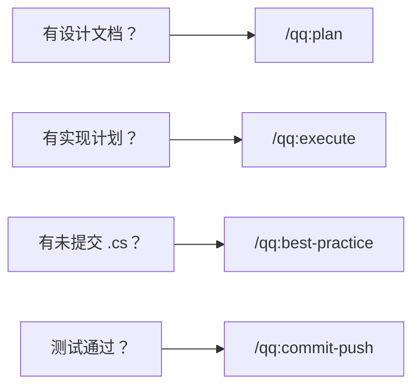
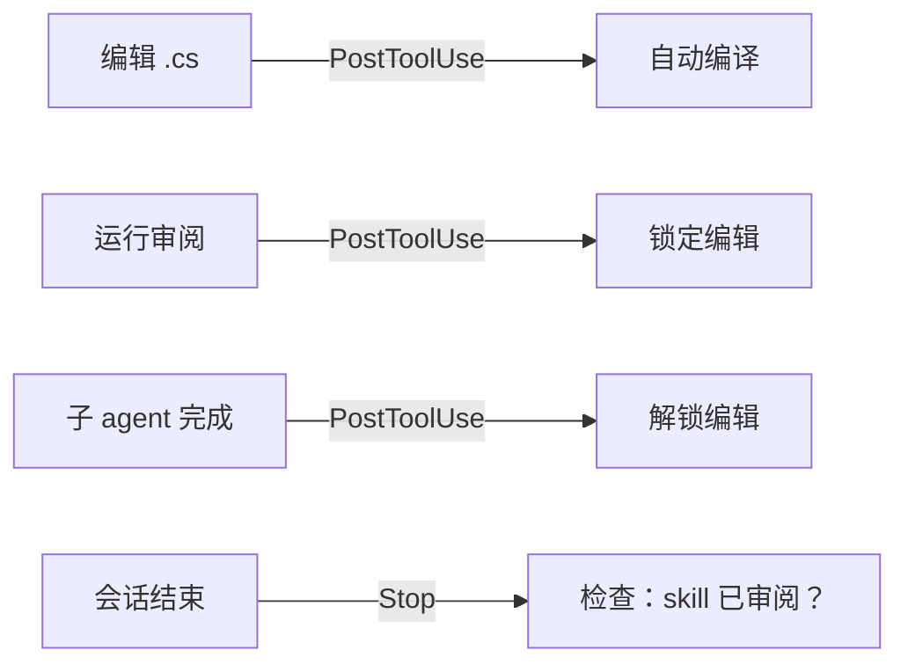
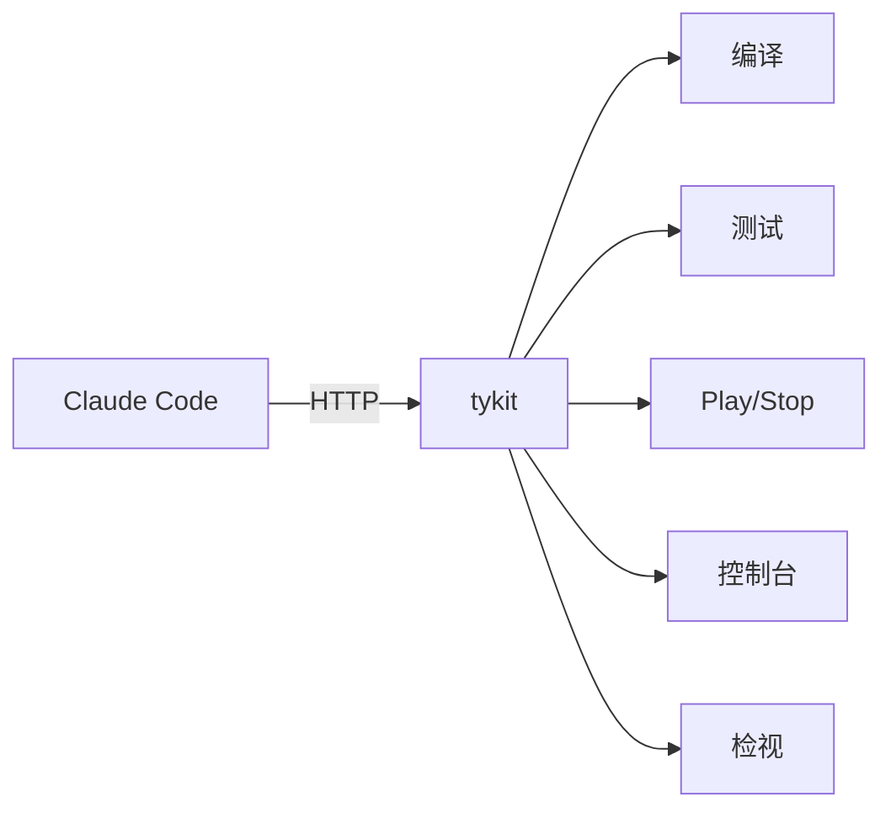
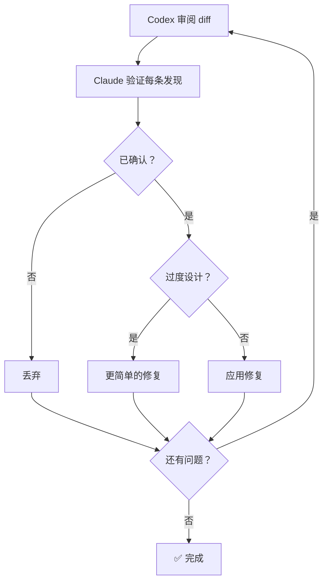

# 中文

## 功能

- **`/qq:go` — artifact-driven controller。** 读取真实项目状态和 `work_mode`，再建议下一步。原型期保持轻，功能期走设计/规划，`hardening` 阶段补测试和 doc drift。
- **tykit — 轻量级 Unity Editor 控制，零配置。** 进程内 HTTP 服务器。无需 Node.js，无需 WebSocket 桥接。自动启动，毫秒级响应。同时兼容 [mcp-unity](https://github.com/CoderGamester/mcp-unity) 和 [Unity-MCP](https://github.com/IvanMurzak/Unity-MCP) 作为替代后端。
- **自动编译** — 每次 `.cs` 编辑通过 hook 自动触发
- **测试流水线** — EditMode + PlayMode + 运行时错误检查
- **Runtime 数据层** — `.qq/runs`、`.qq/state`、`.qq/telemetry` 可被本地闭环、pre-push 和未来 CI 复用
- **确定性策略检查** — 在深度模型审阅之前，先跑可执行的 Unity 规则
- **跨模型代码审阅** — Claude 编排，Codex 审阅，每条发现逐一验证
- **22 个 skill** 覆盖完整开发周期 — 设计、规划、实现、审阅、测试、发布

## 为什么选择 qq

| | quick-question | 传统 AI 工具 |
|---|:---:|:---:|
| 感知开发周期阶段 | ✅ 生命周期感知路由 | ❌ 自己决定 |
| 编辑即编译 | ✅ Hook 驱动 | ❌ 手动 |
| 测试流水线 | ✅ EditMode + PlayMode + 错误检查 | ❌ 手动 |
| 跨模型审阅 | ✅ Claude + Codex 验证循环 | ⚠️ 单模型 |
| 控制 Unity Editor | ✅ tykit (HTTP) | ❌ 无法访问 |
| MCP 后端支持 | ✅ mcp-unity / Unity-MCP | — |
| 推送前安全检查 | ✅ 可选 git hook | ❌ 无 |

## 工作模式

qq 覆盖完整开发周期，但不应该把所有任务都压成同一条重流程。`qq-policy.json` 放团队共享默认值；每个工程师 / worktree 再用 `.qq/local-policy.json` 覆盖自己的当前模式。

产品方向只保留一份主文档：[Core Roadmap](core-roadmap.md)。

| 模式 | 适用场景 | qq 默认做法 |
|---|---|---|
| `prototype` | 新玩法、灰盒、fun check | 重点是能运行、编译是绿的，并记录 keep/drop/observe |
| `feature` | 做可保留的系统/功能 | 简短设计、实现计划、编译、目标测试、轻量审阅 |
| `fix` | bug fix、回归修复 | 先固定复现，再做最小修复和回归验证 |
| `hardening` | 风险重构、发版前、稳定性收口 | 测试、审阅、doc/code 一致性，再 push |

输入 `/qq:go` — qq 从 artifact、最近一次运行记录和 `work_mode` 读取项目状态，然后引导你到正确的下一步。不同任务请分开 worktree，每个 worktree 用自己的 `.qq/local-policy.json`。

某个 worktree 想切到原型模式时，可以直接这样写：

```bash
mkdir -p .qq
cat > .qq/local-policy.json <<'EOF'
{
  "work_mode": "prototype"
}
EOF
```

## 安装

**前置条件：**
- macOS 或 Windows（Windows 需要 [Git for Windows](https://gitforwindows.org/)）
- Unity 2021.3+
- [Claude Code](https://docs.anthropic.com/en/docs/claude-code)
- curl、python3、jq
- [Codex CLI](https://github.com/openai/codex) *（可选，用于跨模型审阅）*

*Windows 支持为预览版，未来几周会持续完善。*

**第 1 步 — 插件（skills + hooks）：**
```
/plugin marketplace add tykisgod/quick-question
/plugin install qq@quick-question-marketplace
```

**第 2 步 — tykit（Unity 包）：**

> 第 2 步是可选的 — 如果只需要 skills，可以跳过。tykit 提供直接控制 Unity Editor 的能力。

```bash
git clone https://github.com/tykisgod/quick-question.git /tmp/qq-install
/tmp/qq-install/install.sh --profile feature /path/to/your-unity-project
rm -rf /tmp/qq-install
```

安装脚本现在会同时复制 shell 和 Python runtime helper，并在 Unity 项目里自动创建起始版 `qq-policy.json`（如果项目里还没有）。共享默认 `work_mode` 是 `feature`；按任务切模式时，优先写到 `.qq/local-policy.json`。

`install.sh --profile <core|feature|hardening>` 会把 starter `policy_profile` 写进 `qq-policy.json`。

## 快速开始

```bash
/qq:go                  # 我在哪？下一步该做什么？
/qq:go "add health system"   # 从一个想法开始
/qq:go --auto design.md      # 全自动流水线，无需确认
python3 ./scripts/qq-project-state.py --pretty   # 查看 controller 读取到的项目状态
./scripts/qq-policy-check.sh --json              # 对改动过的 .cs 运行确定性规则检查
python3 ./scripts/qq-capability.py resolve --capability compile --engine unity --pretty
./scripts/qq-doctor.sh --pretty                  # 查看 provider、policy_profile、当前 work_mode 和 controller 推荐结果
```

或者直接使用任意 skill：
```bash
/qq:test                      # 运行测试
/qq:best-practice             # 快速 18 条规则检查
/qq:codex-code-review         # 跨模型审阅
/qq:commit-push               # 提交发布
```

## 命令

| 命令 | 描述 |
|------|------|
| **工作流** | |
| `/qq:go` | 入口 — controller 读取项目状态并推荐下一步 |
| `/qq:design` | 从一句话、草案或讨论写出游戏设计文档 |
| `/qq:plan` | 从设计文档或描述生成技术实现计划 |
| `/qq:execute` | 智能实现 — 读取计划，选择执行策略，逐步构建 |
| **测试** | |
| `/qq:test` | 运行单元/集成测试并检查错误 |
| **代码审阅（Codex）** | *需要 [Codex CLI](https://github.com/openai/codex)* |
| `/qq:codex-code-review` | 跨模型代码审阅（Claude + Codex + 验证循环） |
| `/qq:codex-plan-review` | 跨模型设计文档审阅 |
| **代码审阅（Claude）** | *无需额外工具* |
| `/qq:claude-code-review` | Claude subagent 深度代码审阅 |
| `/qq:claude-plan-review` | Claude subagent 深度设计文档审阅 |
| **代码审阅（快速）** | |
| `/qq:best-practice` | 快速最佳实践检查 — 先跑确定性 policy，再补模型审阅 |
| `/qq:self-review` | 审阅 skill/配置变更的质量 |
| **分析** | |
| `/qq:brief` | 架构 diff + PR 清单（2 份文档） |
| `/qq:timeline` | 提交历史时间线及阶段分析（2 份文档） |
| `/qq:full-brief` | 并行运行 brief + timeline（共 4 份文档） |
| `/qq:deps` | `.asmdef` 依赖关系图 + 矩阵 + 健康检查 |
| `/qq:doc-drift` | 对比设计文档与代码，找出不一致 |
| **工具** | |
| `/qq:commit-push` | 批量提交并推送 |
| `/qq:explain` | 用通俗语言解释模块架构 |
| `/qq:grandma` | 用日常类比解释任何概念，人人都能听懂 |
| `/qq:research` | 搜索当前问题的开源解决方案 |
| `/qq:changes` | 汇总当前会话的所有变更 |
| `/qq:doc-tidy` | 扫描仓库文档，分析组织问题，建议清理 |

## 场景

### 1. 从零构建功能

> 独立开发者。一句话需求："加个食物系统。"

```
/qq:go "add a food system"
```

qq 建议 `/qq:design`。问 3 个问题（参考游戏？数据格式？MVP？），写出设计文档。

→ "设计完成。运行 `/qq:plan`？" — 读取设计文档，探索代码库，输出 6 步实现计划，包含文件路径和接口。

→ "计划就绪。运行 `/qq:execute`？" — 创建 `IFoodSource` 接口，实现 `HungerSystem` 和 `FoodContainer`，接入现有的 `NeedSystem`。每次 `.cs` 保存通过 hook 自动编译。

→ "运行 `/qq:best-practice`？" — 发现 `Update` 里的 `GetComponent` 和缺失的事件退订。已修复。

→ "运行 `/qq:test`？" — 全部通过。→ "运行 `/qq:commit-push`？"

**或跳过所有确认：** `/qq:go --auto "add a food system"` 端到端全自动运行。

---

### 2. 合并前审阅代码

> 团队开发者。5 个文件，400 行 C# 改动。准备审阅。

```
/qq:go
```

qq 检测到未提交的 `.cs` 改动。建议 `/qq:best-practice`。发现一个 `public` 字段应该是 `[SerializeField] private`，还有缺失的 `CompareTag`。30 秒修复。

→ "运行 `/qq:codex-code-review`？" — diff 发送给 Codex。审阅门控锁定编辑。子 agent 验证：1 个关键问题确认（重生时无 `isDead` 守卫），1 个误报驳回。修复应用，门控解锁。

→ "运行 `/qq:doc-drift`？" — 设计文档写着 30% 血量着火，代码用的是 25%。文档已更新。

→ "运行 `/qq:commit-push`？" — pre-push hook 运行测试。全部通过。已推送。

---

### 3. 理解大型代码库

> 新团队成员。第一天面对 20 万行 Unity 项目。

```
/qq:grandma "task system"
```
> "想象一家餐厅。每个组员是服务员。任务系统是经理 — 看所有桌子，判断谁最近、谁有空，然后分配。紧急的桌子插队。"

技术版本：

```
/qq:explain TaskSystem
```

输出：职责、核心类、数据流、生命周期钩子、设计决策。

```
/qq:deps
```

所有 `.asmdef` 模块的 Mermaid 依赖图。`TaskSystem` 依赖 `NavigationSystem` 和 `NeedSystem`，但不依赖 `CombatSystem` — 边界清晰。

## tykit

tykit 是 Unity Editor 进程内的轻量级 HTTP 服务器：

- **零配置** — 在 `manifest.json` 加一行，打开 Unity 即可使用
- **进程内运行** — 毫秒级执行，无序列化开销
- **无外部依赖** — 无需 Node.js，无需 WebSocket 桥接，无需外部进程
- **自动配置** — 端口由项目路径自动生成，无需手动设置

**独立使用**（不需要 quick-question）：
```json
"com.tyk.tykit": "https://github.com/tykisgod/tykit.git"
```

**或配合 qq** — 在后台驱动自动编译和测试。

```bash
PORT=$(python3 -c "import json; print(json.load(open('Temp/tykit.json'))['port'])")

# 编译
curl -s -X POST http://localhost:$PORT/ \
  -d '{"command":"compile-status"}' -H 'Content-Type: application/json'

# 运行测试
curl -s -X POST http://localhost:$PORT/ \
  -d '{"command":"run-tests","args":{"mode":"editmode"}}' -H 'Content-Type: application/json'

# 读取错误
curl -s -X POST http://localhost:$PORT/ \
  -d '{"command":"console","args":{"count":50,"filter":"error"}}' -H 'Content-Type: application/json'
```

tykit 就是 HTTP。可以从 Python、GitHub Actions 或任何 AI agent 调用。完整 API 参见 [tykit API Reference](tykit-api.md)，共 13 个命令。

## 工作原理

### 四层架构，各司其职：

- **`/qq:go` 控制。** 读取项目状态 — 设计文档、实现计划、未提交代码、compile/test 状态、review gate 状态 — 推荐正确的下一个 skill。它自己不做任何工作，只负责路由。
- **Hooks 守卫。** 自动触发 — 每次 `.cs` 编辑触发编译，每次代码审阅激活门控（阻止编辑直到发现被验证），每次 skill 改动被追踪（会话结束前必须审阅）。
- **Runtime 数据层。** `.qq/runs`、`.qq/state`、`.qq/telemetry` 持久化结构化结果，供本地闭环现在使用，也供 CI 未来复用。
- **tykit 桥接。** Unity Editor 内的 HTTP 服务器。当 qq 需要编译、运行测试或读取控制台时，它与 tykit 通信。没有 UI 自动化 — 只有 HTTP。







### 跨模型审阅（Tribunal）



## 自定义

### CLAUDE.md

你的编码规范。自动编译 hook 和测试命令会遵循你在此定义的规则。参见 [`templates/CLAUDE.md.example`](../templates/CLAUDE.md.example) 获取 Unity 专用默认值。

### AGENTS.md

你的架构规则和审阅标准。`/qq:best-practice`、`/qq:claude-code-review` 和跨模型审阅命令会读取此文件来检测反模式和模块边界违规。参见 [`templates/AGENTS.md.example`](../templates/AGENTS.md.example) 获取起始模板。

### 优先级系统

所有审阅命令按影响程度分类发现：

| 优先级 | 范围 | 处理 |
|--------|------|------|
| **P0** | 架构变更、反模式、生命周期问题 | 必须审阅 |
| **P1** | 业务逻辑、性能、错误处理 | 建议审阅 |
| **P2** | Getter/Setter、日志、配置微调 | 快速扫一眼 |

## 设计原则

- **文档先行** — 先写设计再写代码。`/qq:design` → `/qq:plan` → `/qq:execute` 强制这个顺序。
- **Artifact 驱动控制** — `/qq:go` 应该读取工程事实，而不是主要靠 prompt 猜阶段。
- **验证，而非信任** — 跨模型审阅的发现会由子 agent 独立验证，然后才修改代码。
- **先执行 policy，再做深度审阅** — 低争议的 Unity 问题应先由可执行规则捕获，再交给模型补上下文。
- **修复要适度** — 每次审阅都包含过度设计检查。如果修复比问题本身还重，用更简单的方案。
- **自动安全网** — hooks 无需你主动调用就会触发。编译、审阅门控、skill 强制始终开启。
- **松耦合** — 每个 skill 只做一件事。流水线是建议性的（"要运行 X 吗？"），不是强制的。

基于 [AI 编程实践：独立开发者的文档驱动方法](https://tyksworks.com/posts/ai-coding-workflow-zh/) 的理念开发。

## 常见问题

**1. 支持 Windows 吗？**
支持。macOS 和 Windows 均已支持。Windows 上需要安装 [Git for Windows](https://gitforwindows.org/)（提供 bash 和标准 Unix 工具）。macOS 使用 `osascript` 检测 Editor；Windows 使用等效的 PowerShell 路径。

**2. 必须安装 Codex CLI 吗？**
不是必须，但推荐。`/qq:claude-code-review` 仅用 Claude 也能工作，但 `/qq:codex-code-review` 效果更好——第二个模型能抓住单模型的盲区。跨模型审阅是默认推荐方式。

**3. 能和 Cursor / Copilot / 其他 AI 工具一起用吗？**
skill 和 hook 需要 Claude Code。tykit（HTTP 服务器）可与任何能发送 HTTP 请求的工具配合使用。如果你希望 qq 走 MCP，优先使用内置 `tykit_mcp` bridge；第三方 MCP Unity 服务器（mcp-unity 或 Unity-MCP）仍然作为兼容 fallback — 参见 [MCP 支持](#mcp-支持)。

**4. 编译失败了会怎样？**
自动编译 hook 会在终端显示错误。Claude 读取错误信息，修复代码，重新编译。你不需要做任何事。

**5. 能不装 quick-question 单独用 tykit 吗？**
可以。在 `Packages/manifest.json` 里加一行就行。详见 [tykit API 参考](tykit-api.md)。

## MCP 支持

qq 支持第三方 MCP Unity 服务器作为 tykit 的替代方案：

- **[mcp-unity](https://github.com/CoderGamester/mcp-unity)** — Node.js + WebSocket 桥接（需要 Unity 6+）
- **[Unity-MCP](https://github.com/IvanMurzak/Unity-MCP)** — 独立服务器，支持 Docker/远程部署

如果 Claude Code 中配置了内置 `tykit_mcp` bridge，qq skill 应优先使用它的 `unity_*` 工具进行编译、测试和控制台访问。第三方 MCP 服务器仍然可兼容使用，但应视为 fallback。

**tykit 仍然是标准后端。** 内置 `tykit_mcp` 只是把 tykit 包装成 MCP；只有第三方 MCP 后端才会让 tykit 变成可选。

**兼容性：** mcp-unity 需要 Unity 6+。Unity-MCP 无特定版本要求。qq 本身支持 Unity 2021.3+。

| 能力 | tykit 直连 | tykit_mcp | mcp-unity | Unity-MCP |
|------|------------|-----------|-----------|-----------|
| 编译 | `compile` | `unity_compile` | `recompile_scripts` | `assets-refresh` |
| 运行测试 | `run-tests` | `unity_run_tests` | `run_tests` | `tests-run` |
| 读取控制台 | `console` | `unity_console` | `get_console_logs` | `console-get-logs` |
| 清除控制台 | `clear-console` | `unity_console`（`action=clear`） | — | — |

## 限制

- **macOS + Windows** — Windows 需要 [Git for Windows](https://gitforwindows.org/)；`osascript` 和 `/Applications/Unity` 路径为 macOS 专用，Windows 通过 `scripts/platform/windows.sh` 使用等效的 PowerShell 和注册表路径
- **跨模型审阅功能需要 Codex CLI**
- **Unity 2021.3+**，tykit 包要求
- **tykit 仅限 localhost，无认证** — 适用于开发机，不适用于未做网络管控的共享环境
- **编译验证使用控制台日志抓取** — 关键编译前使用 `clear-console` 避免残留错误

## 贡献

欢迎贡献！请提交 Issue 或 Pull Request。

## 许可证

[MIT](../LICENSE) © Yukang Tian
