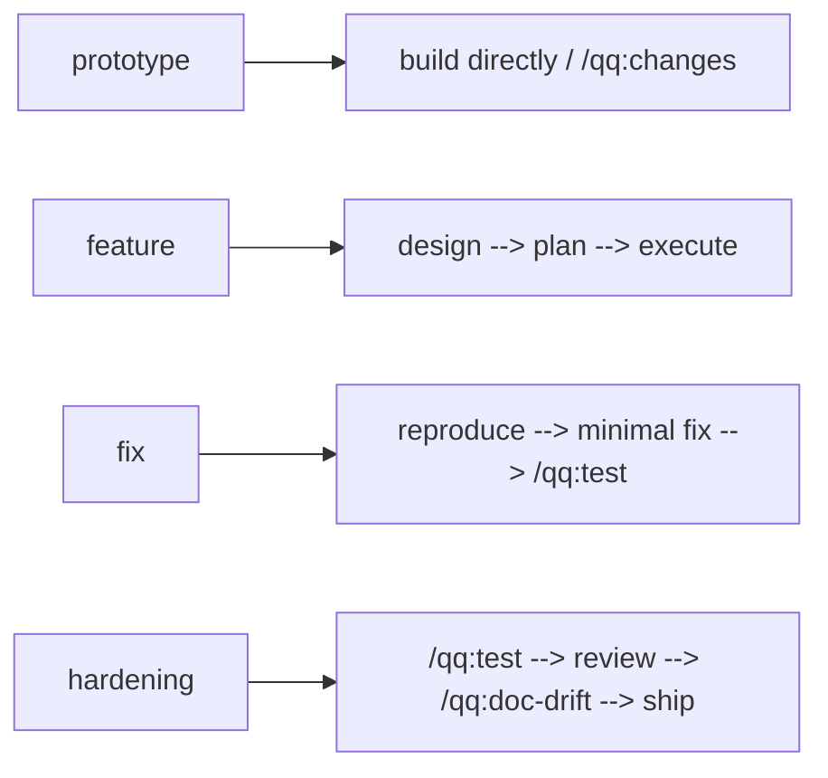
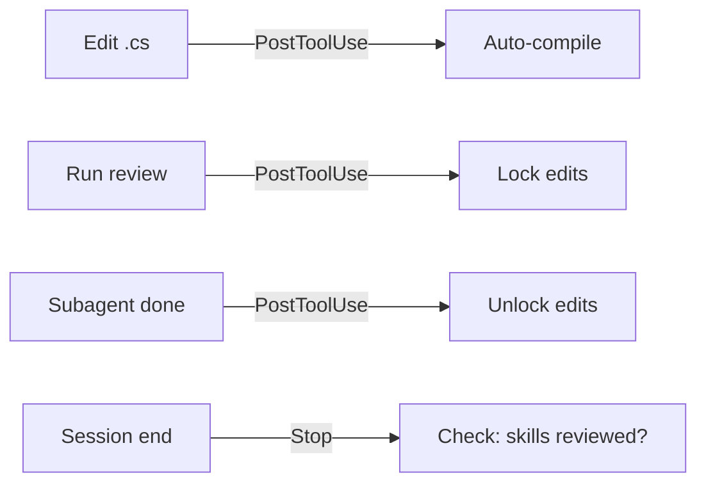
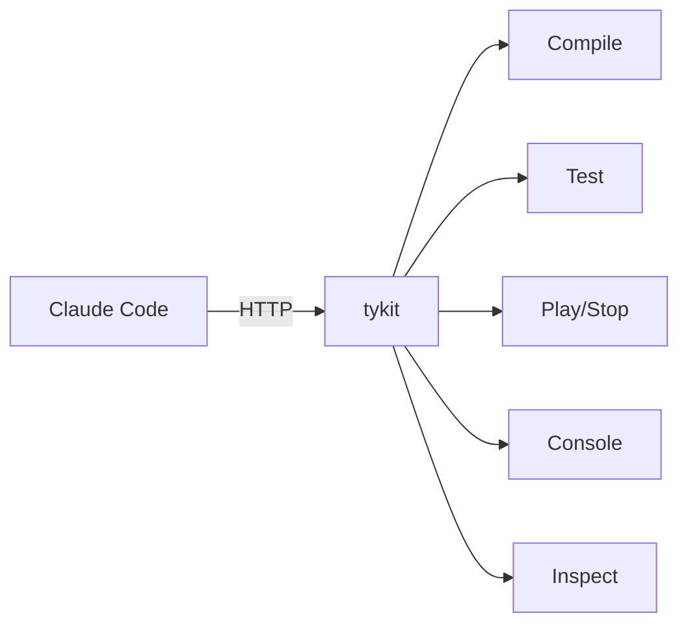

# Architecture Overview

qq is a game development agent runtime for Claude Code. It supports Unity, Godot, Unreal, and S&box, providing artifact-driven control, auto-compilation hooks, test pipelines, executable policy checks, and cross-model code review.

## Four-Layer Architecture

qq operates as four layers, each with a single responsibility.

```
Controller (/qq:go)       Reads state, recommends next step
        |
Hooks (hooks.json)        Fire automatically on tool use / session end
        |
Runtime Data (.qq/)       Structured logs, state, telemetry
        |
Engine Bridges            In-process execution per engine
```

### Layer 1 -- Controller (`/qq:go`)

The controller reads project state from `.qq/state/` and recommends the right next skill. It consumes:

- `work_mode` and `policy_profile` from configuration
- Last compile and test results
- Design docs, plans, uncommitted code
- Review gate state

Configuration flows from shared defaults in `qq.yaml`, with local overrides in `.qq/local.yaml`.

The controller is a router, not an implementation engine. It delegates all real work to skills.

### Layer 2 -- Hooks

Hooks fire automatically via the Claude Code hook system, defined in `hooks/hooks.json`:

| Trigger | Condition | Action |
|---------|-----------|--------|
| PostToolUse | Write or Edit `.cs`/`.gd` files | Auto-compile via engine-specific scripts |
| PostToolUse | Bash runs code-review or plan-review | Activate review gate (lock edits) |
| PostToolUse | Agent subagent completes | Increment verification counter (release gate) |
| PreToolUse | Edit or Write while gate is active | Block edits until review verification completes |
| Stop | Session ending | Block if skills modified without `/qq:self-review`; clean up temp files |

All temp files are keyed by `$PPID` for session isolation (e.g., `/tmp/claude-codex-review-gate-$PPID`).

### Layer 3 -- Runtime Data

Structured data lives under `.qq/` in the target project:

- `.qq/runs/` -- Execution logs (JSON), one per skill invocation
- `.qq/state/` -- Latest status snapshots (compile, test, project state)
- `.qq/telemetry/` -- Usage and timing data

Both the controller and hooks read and write here. `qq-run-record.py` and `qq-runtime.sh` handle writes; `qq-project-state.py` is the primary reader.

### Layer 4 -- Engine Bridges

Each engine has a verified, in-process execution path:

| Engine | Primary Path | Fallbacks |
|--------|-------------|-----------|
| Unity | tykit HTTP server (in-process, ms response) | osascript/PowerShell editor trigger, then batch mode |
| Godot | Editor addon + headless GDScript check | -- |
| Unreal | Editor command via Python, UnrealBuildTool | -- |
| S&box | Editor bridge, `dotnet build` | -- |

## Work Mode Routing

The controller selects a workflow based on `work_mode`:



## Hook Firing Patterns



## Claude-tykit Communication (Unity)



## Smart Compilation Stack (Unity)

`unity-compile-smart.sh` orchestrates a three-tier fallback for Unity compilation:

1. **tykit mode** -- HTTP call to the in-process tykit server running inside Unity Editor. This is the fastest path: non-blocking, millisecond response times, and no process spawning.

2. **Editor trigger** -- When tykit is unavailable, the script uses `osascript` on macOS or PowerShell on Windows to send a compile command to the running Unity Editor. Slower than tykit but avoids a full batch invocation.

3. **Batch mode** -- When the Editor is not open at all, the script falls back to `Unity -quit -batchmode`. This is the slowest path but works headlessly and is the only option for CI or closed-Editor scenarios.

Shared utilities (Editor detection, Unity path lookup, tykit port discovery) live in `unity-common.sh`.

## State-Driven Routing

`qq-project-state.py` is the primary source of truth for `/qq:go`. It assembles a state snapshot that includes:

- **work_mode** -- prototype, feature, fix, or hardening
- **policy_profile** -- which checks to enforce
- **trust_level** -- controls review gate strictness
- **compile status** -- last result, timestamp, error count
- **test status** -- pass/fail/skip counts, last run timestamp
- **worktree state** -- uncommitted changes, branch, divergence from remote

The controller uses this snapshot to recommend the next skill. It falls back to git heuristics (branch name, diff size, recent commits) only when `.qq/state/` data is unavailable or stale.

## Related Documentation

- [Adapter Contract](adapter-contract.md) -- engine adapter interface spec
- [S&box Adapter Spec](sbox-adapter-spec.md) -- S&box-specific implementation
- [Hook System](../hooks.md) -- detailed hook documentation
- [Cross-Model Review](../cross-model-review.md) -- Codex Tribunal flow
- [Configuration](../configuration.md) -- qq.yaml reference
