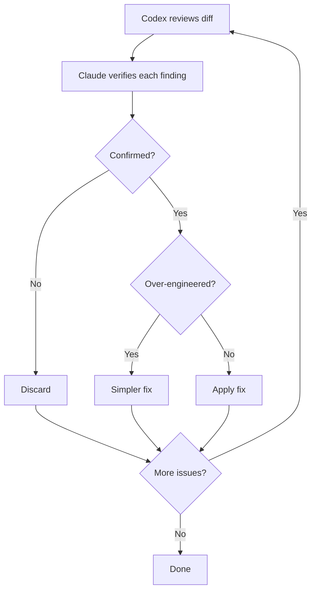

# Cross-Model Review (Codex Tribunal)

Single-model code review has blind spots. A model reviewing its own output tends to share the same assumptions that produced the code in the first place. Cross-model review addresses this by having Codex independently review the diff while Claude verifies each finding against the actual source. Each model catches things the other misses, producing higher-confidence results than either alone.

## The Tribunal Flow

The cross-model review (`/qq:codex-code-review`) runs as an automated loop with up to 5 rounds:

1. Claude sends the diff to Codex CLI for review via `code-review.sh`
2. Codex returns findings classified by severity (Critical, Moderate, Suggestion)
3. The Review Gate activates -- Edit and Write operations are blocked
4. Claude dispatches parallel subagents to verify each finding against the actual source code
5. Each subagent performs an over-engineering check: is the proposed fix proportionate to the problem?
6. Confirmed critical issues are fixed; over-engineered suggestions get simpler alternatives
7. The gate unlocks once at least one verification subagent completes
8. The loop repeats until no critical issues remain or 5 rounds are reached

## Review Gate Mechanism

The review gate is a mechanical constraint that prevents code edits while findings are unverified.

- **Gate file:** `$QQ_TEMP_DIR/claude-codex-review-gate-$PPID`
- **Activation:** The PostToolUse hook sets the gate after `code-review.sh` runs
- **Effect:** The PreToolUse hook blocks all Edit and Write operations on `.cs` and `Docs/*.md` files
- **Release:** The gate unlocks once at least one verification subagent completes (tracked by the PostToolUse Agent hook)
- **Isolation:** Each session uses `$PPID` to scope its gate file, so concurrent sessions do not interfere

The gate is cleaned up automatically when the review loop ends.

## Priority Classification

All review commands -- cross-model and Claude-only alike -- classify findings into three tiers:

| Priority | Scope | Action |
|----------|-------|--------|
| P0 | Architecture changes, anti-patterns, lifecycle issues | Must review |
| P1 | Business logic, performance, error handling | Worth reviewing |
| P2 | Getters/setters, logging, config tweaks | Quick scan |

Only P0 (Critical) findings trigger automatic fixes and additional review rounds. P1 findings are fixed at discretion. P2 findings are reported but typically not acted on.

## Claude-Only Alternative

`/qq:claude-code-review` provides the same review loop without requiring Codex CLI. Instead of sending the diff to an external model, it dispatches a Claude subagent (Opus) to perform the initial review. The verification step is identical: parallel subagents verify each finding against the source code, with the same over-engineering checks.

The Claude-only variant also uses the review gate to block edits during verification. The loop structure, round limits, and termination conditions are the same.

## Plan Review

The cross-model pattern extends beyond code. Both `/qq:codex-plan-review` and `/qq:claude-plan-review` apply the same review-verify-fix loop to design documents and implementation plans instead of code diffs. This catches architectural issues before they reach implementation.

## Requirements

- **Cross-model review** (`/qq:codex-code-review`, `/qq:codex-plan-review`): Requires Codex CLI (`npm install -g @openai/codex`)
- **Claude-only review** (`/qq:claude-code-review`, `/qq:claude-plan-review`): No additional requirements

## Related Docs

- [Hook System](hooks.md) -- review gate hooks (PreToolUse, PostToolUse, Stop)
- [Architecture Overview](../dev/architecture/overview.md) -- where review fits in the plugin layers
- [Configuration](configuration.md) -- `policy_profile` controls review intensity
