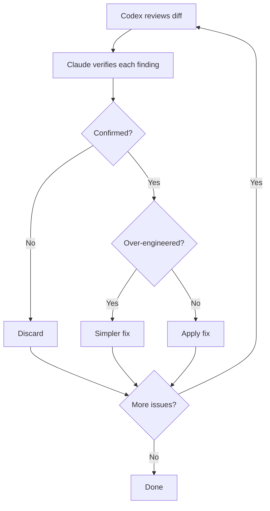

# Cross-Model Review (Codex Tribunal)

> This document covers both review modes: cross-model (Codex) and Claude-only. Both share the same verification loop, gate mechanism, and round limits.

Single-model code review has blind spots. A model reviewing its own output tends to share the same assumptions that produced the code in the first place. Cross-model review addresses this by having Codex independently review the diff while Claude verifies each finding against the actual source. Each model catches things the other misses, producing higher-confidence results than either alone.

## The Tribunal Flow

The cross-model review (`/qq:codex-code-review`) runs as an automated loop with up to 5 rounds:

1. Claude sends the diff to Codex CLI for review via `code-review.sh`
2. Codex returns findings classified by severity (Critical, Moderate, Suggestion)
3. The Review Gate activates -- Edit and Write operations are blocked
4. Claude has a subagent verify each finding against the actual source code (one subagent for the whole round by default, a few in parallel when the findings are many)
5. Each subagent performs an over-engineering check: is the proposed fix proportionate to the problem?
6. Confirmed critical issues are fixed; over-engineered suggestions get simpler alternatives
7. The gate unlocks once ALL verification subagents complete
8. The loop repeats until no critical issues remain or 5 rounds are reached

```mermaid
flowchart TD
    A["Codex reviews diff"] --> B["Claude verifies each finding"]
    B --> C{"Confirmed?"}
    C -->|No| D["Discard"]
    C -->|Yes| E{"Over-engineered?"}
    E -->|Yes| F["Simpler fix"]
    E -->|No| G["Apply fix"]
    D --> H{"More issues?"}
    F --> H
    G --> H
    H -->|Yes| A
    H -->|No| I["Done"]
```

## Review Gate Mechanism

The review gate is a mechanical constraint that prevents code edits while findings are unverified.

- **Gate file:** `$QQ_TEMP_DIR/review-gate-<session_id>`
- **Format:** `<ts>:<completed>:<expected>` — timestamp, number of completed verification subagents, total expected
- **Activation:** `code-review.sh`, `claude-review.sh`, `plan-review.sh`, and `claude-plan-review.sh` open the gate themselves once a review has actually run; the PostToolUse(Bash) hook only announces it
- **Effect:** The PreToolUse hook blocks all Edit and Write operations on `.cs` and `Docs/*.md` files
- **Release:** The gate unlocks once ALL verification subagents complete (`completed >= expected`), tracked by the PostToolUse Agent hook
- **Stop hook:** `review-gate.sh stop` prevents session exit while verification is still incomplete
- **Isolation:** Each session scopes its gate file by its Claude Code session id, so concurrent sessions do not interfere

The gate is cleaned up automatically when the review loop ends.

## Priority Classification

All review commands -- cross-model and Claude-only alike -- classify findings into three tiers:

| Priority | Scope | Action |
|----------|-------|--------|
| P0 | Architecture changes, anti-patterns, lifecycle issues | Must review |
| P1 | Business logic, performance, error handling | Worth reviewing |
| P2 | Getters/setters, logging, config tweaks | Quick scan |

Only P0 (Critical) findings trigger automatic fixes and additional review rounds. P1 findings are fixed at discretion. P2 findings are reported but typically not acted on.

Some checks ride along on every run, even when a round-2 custom prompt replaces the criteria:

- **Plan / design review — provenance:** protections, restrictions added to stop a player choice, and scope cuts need the user's own words ([`shared/user-decisions.md`](../../shared/user-decisions.md)). Unbacked items come back as one Critical finding; the fix is to cite the user or move the item to a "Needs the user's decision" list.
- **Code review — test quality:** new or changed tests are checked for whether they can fail and whether their expected values are independent of the code under test.
- **Code review — `--spec <path>` (optional, repeatable):** also checks the code against design docs and plans: Missing, Wrong, Unrequested, and Needs runtime check. These come back tagged `[Spec]`, separate from the severities. Confirmed ones are acted on too (missing work is finished or handed off, unrequested protections go to the user); if that writes code, one more round without `--spec` reviews it.

## Claude Review Alternative

`/qq:claude-code-review` provides the same review loop using `claude-review.sh`, which invokes `claude -p` as a process-isolated reviewer. This is architecturally symmetric with the Codex path: a separate process performs the initial review, then verification subagents check each finding against the actual source. The verification step is structurally identical — parallel subagents verify each finding with the same over-engineering checks — but because the reviewer and verifiers share the same model family, the cross-model blind-spot advantage is reduced. The loop structure, review gate, round limits, and termination conditions are all shared.

## Plan Review

The cross-model pattern extends beyond code. Both `/qq:codex-plan-review` and `/qq:claude-plan-review` apply the same review-verify-fix loop to design documents and implementation plans instead of code diffs. This catches architectural issues before they reach implementation.

## Requirements

- **Codex review** (`/qq:codex-code-review`, `/qq:codex-plan-review`): Requires Codex CLI (`npm install -g @openai/codex`)
- **Claude review** (`/qq:claude-code-review`, `/qq:claude-plan-review`): Requires Claude CLI (`claude`)
- **MCP one-shot review**: `qq_code_review` and `qq_plan_review` MCP tools are available for non-Claude hosts (one-shot, no verification loop)

## Related Docs

- [Hook System](hooks.md) -- review gate hooks (PreToolUse, PostToolUse, Stop)
- [Architecture Overview](../dev/architecture/overview.md) -- where review fits in the plugin layers
- [Configuration](configuration.md) -- `policy_profile` controls review intensity
