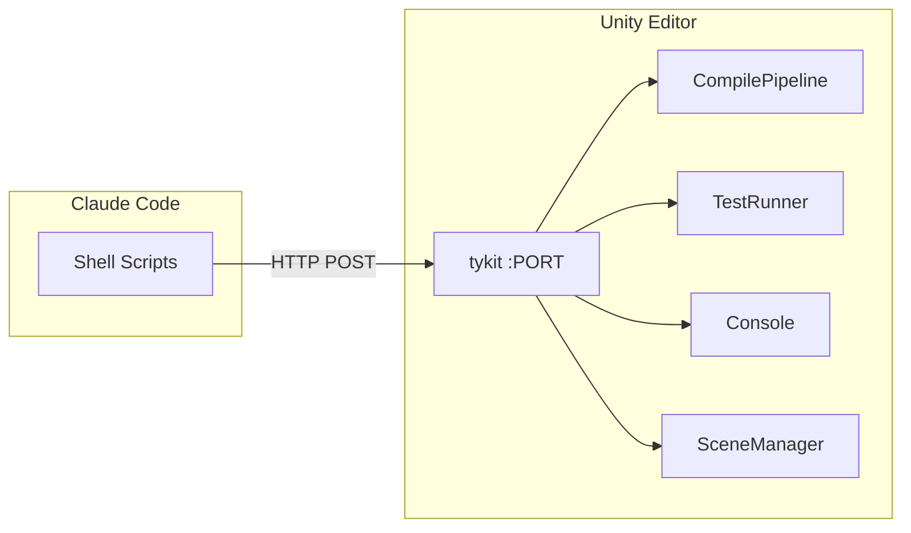

# tykit API Reference

tykit is a standalone HTTP server that auto-starts inside Unity Editor. **Any AI agent** (Claude Code, Codex, custom tools) can control Unity via simple HTTP calls — no SDK, no plugin API, no UI automation.

You can use tykit independently or as part of quick-question. When used with qq, it powers auto-compilation and test execution.

## Standalone Install

No need to install quick-question. Just add one line to your Unity project's `Packages/manifest.json`:

```json
"com.tyk.tykit": "https://github.com/tykisgod/tykit.git"
```

Open Unity — tykit starts automatically. Port is stored in `Temp/tykit.json`.

## What You Can Do

**Run tests and get results:**
```bash
PORT=$(python3 -c "import json; print(json.load(open('Temp/tykit.json'))['port'])")

# Start EditMode tests
curl -s -X POST http://localhost:$PORT/ \
  -d '{"command":"run-tests","args":{"mode":"editmode"}}' \
  -H 'Content-Type: application/json'

# Poll for results
curl -s -X POST http://localhost:$PORT/ \
  -d '{"command":"get-test-result"}' \
  -H 'Content-Type: application/json'
```

**Control Play Mode:**
```bash
curl -s -X POST http://localhost:$PORT/ \
  -d '{"command":"play"}' -H 'Content-Type: application/json'

# Read console output while running
curl -s -X POST http://localhost:$PORT/ \
  -d '{"command":"console","args":{"count":20,"filter":"error"}}' \
  -H 'Content-Type: application/json'

curl -s -X POST http://localhost:$PORT/ \
  -d '{"command":"stop"}' -H 'Content-Type: application/json'
```

**Find and inspect GameObjects:**
```bash
curl -s -X POST http://localhost:$PORT/ \
  -d '{"command":"find","args":{"name":"Player"}}' \
  -H 'Content-Type: application/json'

curl -s -X POST http://localhost:$PORT/ \
  -d '{"command":"inspect","args":{"id":12345}}' \
  -H 'Content-Type: application/json'
```

## Full API Reference

| Command | Args | Description |
|---------|------|-------------|
| `status` | — | Editor state overview |
| `compile-status` | — | Current compilation state |
| `get-compile-result` | — | Compilation result with errors |
| `run-tests` | `mode`, `filter` | Start EditMode/PlayMode tests |
| `get-test-result` | `runId` (optional) | Poll test results |
| `play` | — | Enter Play Mode |
| `stop` | — | Exit Play Mode |
| `console` | `count`, `filter` | Read console logs |
| `find` | `name` or `type` | Find GameObjects in scene |
| `inspect` | `id` | Inspect GameObject components |
| `refresh` | — | Refresh AssetDatabase |
| `save-scene` | — | Save current scene |
| `clear-console` | — | Clear console buffer |

## How quick-question Uses tykit

When qq's auto-compile hook fires, it tries tykit first — a single HTTP call that triggers incremental compilation without stealing keyboard focus. If tykit isn't available, it falls back to osascript or batch mode. Tests via `/qq:test` also run through tykit for fast, non-blocking execution. This is why qq is significantly faster than batch-mode alternatives.


