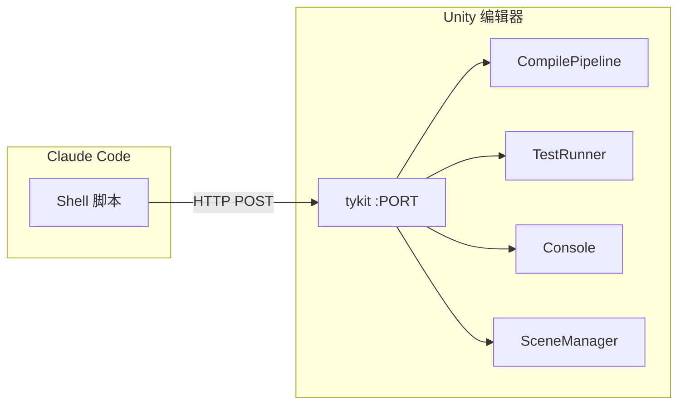

# tykit API 参考

tykit 是一个在 Unity 编辑器内自动启动的独立 HTTP 服务器。**任何 AI agent**（Claude Code、Codex、自定义工具）都可以通过简单的 HTTP 调用控制 Unity——不需要 SDK、不需要插件 API、不需要 UI 自动化。

你可以独立使用 tykit，也可以作为 quick-question 的一部分。搭配 qq 使用时，它驱动自动编译和测试执行。

## 独立安装

不需要安装 quick-question。只需在 Unity 项目的 `Packages/manifest.json` 中加一行：

```json
"com.tyk.tykit": "https://github.com/tykisgod/tykit.git"
```

打开 Unity——tykit 自动启动。端口存储在 `Temp/tykit.json`。

## 你能做什么

**运行测试并获取结果：**
```bash
PORT=$(python3 -c "import json; print(json.load(open('Temp/tykit.json'))['port'])")

# 启动 EditMode 测试
curl -s -X POST http://localhost:$PORT/ \
  -d '{"command":"run-tests","args":{"mode":"editmode"}}' \
  -H 'Content-Type: application/json'

# 轮询结果
curl -s -X POST http://localhost:$PORT/ \
  -d '{"command":"get-test-result"}' \
  -H 'Content-Type: application/json'
```

**控制 Play Mode：**
```bash
curl -s -X POST http://localhost:$PORT/ \
  -d '{"command":"play"}' -H 'Content-Type: application/json'

# 运行时读取控制台输出
curl -s -X POST http://localhost:$PORT/ \
  -d '{"command":"console","args":{"count":20,"filter":"error"}}' \
  -H 'Content-Type: application/json'

curl -s -X POST http://localhost:$PORT/ \
  -d '{"command":"stop"}' -H 'Content-Type: application/json'
```

**查找和检视 GameObject：**
```bash
curl -s -X POST http://localhost:$PORT/ \
  -d '{"command":"find","args":{"name":"Player"}}' \
  -H 'Content-Type: application/json'

curl -s -X POST http://localhost:$PORT/ \
  -d '{"command":"inspect","args":{"id":12345}}' \
  -H 'Content-Type: application/json'
```

## 完整 API 参考

| 命令 | 参数 | 描述 |
|------|------|------|
| `status` | — | 编辑器状态概览 |
| `compile-status` | — | 当前编译状态 |
| `get-compile-result` | — | 编译结果及错误信息 |
| `run-tests` | `mode`, `filter` | 启动 EditMode/PlayMode 测试 |
| `get-test-result` | `runId`（可选） | 轮询测试结果 |
| `play` | — | 进入 Play Mode |
| `stop` | — | 退出 Play Mode |
| `console` | `count`, `filter` | 读取控制台日志 |
| `find` | `name` 或 `type` | 在场景中查找 GameObject |
| `inspect` | `id` | 检视 GameObject 组件 |
| `refresh` | — | 刷新 AssetDatabase |
| `save-scene` | — | 保存当前场景 |
| `clear-console` | — | 清空控制台缓冲区 |

## quick-question 如何使用 tykit

当 qq 的自动编译 hook 触发时，首先尝试 tykit——一个 HTTP 调用即可触发增量编译，不会抢走键盘焦点。tykit 不可用时，回退到 osascript 或批处理模式。`/qq:test` 的测试也通过 tykit 运行，实现快速、非阻塞执行。这就是 qq 比批处理模式方案快得多的原因。


