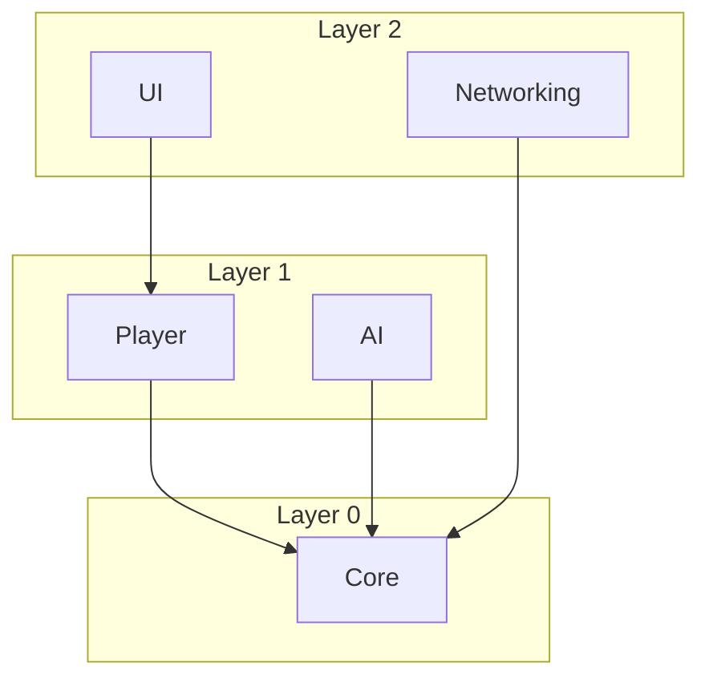

Respond in the user's preferred language (detect from their recent messages, or fall back to the language setting in CLAUDE.md).

Analyze the .asmdef dependency relationships of all modules in the project, outputting a Mermaid diagram + dependency matrix + issue detection.

## Execution Steps

### 1. Collect All .asmdef Files

Use Glob to find `Assets/**/*.asmdef`, excluding Tests and Editor asmdefs (filenames containing `.Tests.`, `.Editor.`, or `.PlayModeTests.`).

### 2. Build GUID → Name Mapping

For each .asmdef file:
- Read the .asmdef to get the `name` field
- Read the corresponding .asmdef.meta to get the `guid` field
- Build a GUID → Name lookup table

### 3. Parse Dependency Relationships

For each .asmdef:
- Read the GUIDs in the `references` array
- Convert to human-readable names via the lookup table
- Record: `ModuleA → [depends on ModuleB, depends on ModuleC]`

### 4. Output Mermaid Dependency Graph

Generate a Mermaid flowchart, arranged by layer from top to bottom:

````markdown

````

- Normal dependencies: solid arrow `-->`
- Circular dependencies: red dashed `-.->|cycle|`
- Layer violations: orange bold `==>|violation|`

### 5. Output Dependency Matrix

Use a table to show module-to-module dependencies at a glance:

```markdown
| Module ↓ Depends on → | Core | Player | AI | UI | ... |
|------------------------|:----:|:------:|:--:|:--:|:---:|
| Core                   |  -   |        |    |    |     |
| Player                 |  ✓   |   -    |    |    |     |
| AI                     |  ✓   |        | -  |    |     |
| UI                     |      |   ✓    |    | -  |     |
```

### 6. Detect Issues

**Circular dependency detection:**
- Run DFS on the dependency graph to detect cycles
- If cycles exist, list the full circular path

**Layer violation detection:**
Read the project's `AGENTS.md` for the defined architecture layers and dependency direction. If no layer definition exists, infer layers from the dependency graph (modules with no dependencies are Layer 0, their dependents are Layer 1, etc.).
Detect any cases where a lower layer depends on a higher layer.

### 7. Output Health Summary

```
### Dependency Health
- Total modules: N
- Average dependencies: X
- Most dependencies: ModuleName (Y dependencies)
- Circular dependencies: None / Found (list them)
- Layer violations: None / Found (list them)
```

### 8. Self-Check (Required)

After generating output, **review the Mermaid diagram and matrix yourself**:
- Is the Mermaid syntax valid (will it render)?
- Do the ✓ marks in the matrix match the dependency graph?
- Are the layer groupings reasonable?
- Are any modules missing?

If issues are found, fix them before presenting to the user.

## Optional Arguments

If the user specifies a module name (e.g. "Player"), only analyze the dependency chain for that module (both upstream and downstream) rather than a full analysis. The Mermaid diagram should only show related modules.
