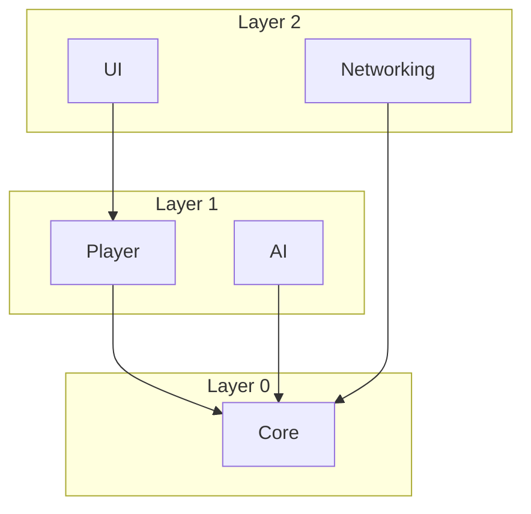

Respond in the user's preferred language (detect from their recent messages, or fall back to the language setting in CLAUDE.md).

Arguments: $ARGUMENTS
- No arguments: analyze all .asmdef files in the project
- A module name (e.g. "Player"): analyze only that module's dependency chain, upstream and downstream; the Mermaid diagram shows only related modules

## Execution Steps

### 1. Collect All .asmdef Files

Use Glob to find `Assets/**/*.asmdef`, excluding Tests and Editor asmdefs (filenames containing `.Tests.`, `.Editor.`, or `.PlayModeTests.`).

If the project has no .asmdef files (pure directory-based project), scan `using` statements in .cs files instead, aggregate modules by namespace, and build the dependency graph from the using references.

### 2. Build GUID → Name Mapping

For each .asmdef, read its `name` field and the `guid` field of its `.asmdef.meta`.

### 3. Parse Dependency Relationships

For each .asmdef, map the GUIDs in its `references` array to names through the lookup table and record `ModuleA → [ModuleB, ModuleC]`.

### 4. Output Mermaid Dependency Graph

Generate a Mermaid flowchart, arranged by layer from top to bottom. Layers are inferred from the graph: modules with no dependencies are Layer 0, modules depending only on Layer 0 are Layer 1, etc.

````markdown

```mermaid
graph TD
    subgraph "Layer 0"
        Core
    end
    subgraph "Layer 1"
        Player
        AI
    end
    subgraph "Layer 2"
        UI
        Networking
    end

    Player --> Core
    AI --> Core
    UI --> Player
    Networking --> Core
```
````

- Normal dependencies: solid arrow `-->`
- Circular dependencies: red dashed `-.->|cycle|`
- Layer violations: orange bold `==>|violation|`

### 5. Output Dependency Matrix

```markdown
| Module ↓ Depends on → | Core | Player | AI | UI | ... |
|------------------------|:----:|:------:|:--:|:--:|:---:|
| Core                   |  -   |        |    |    |     |
| Player                 |  ✓   |   -    |    |    |     |
| AI                     |  ✓   |        | -  |    |     |
| UI                     |      |   ✓    |    | -  |     |
```

### 6. Detect Issues

**Circular dependencies:** run DFS on the dependency graph; list every full circular path.

**Layer violations** need declared layers: read them from `AGENTS.md` or the project's architecture docs and report every edge from a lower declared layer to a higher one. With no declared layers, show the inferred layering and cycles only, and say that no layer rule was checked.

### 7. Output Health Summary

```
### Dependency Health
- Total modules: N
- Average dependencies: X
- Most dependencies: ModuleName (Y dependencies)
- Circular dependencies: None / Found (list them)
- Layer violations: None / Found (list them) / Not checked (no declared layers)
```
