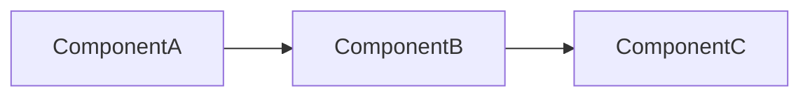

> Run qq scripts as `${CLAUDE_PLUGIN_ROOT}/bin/<name>`: they are not on PATH, so a bare `qq-execute-checkpoint.py` exits 127.

Respond in the user's preferred language (detect from their recent messages, or fall back to the language setting in CLAUDE.md).

Generate a technical implementation plan for Unity that `/qq:execute` can consume. It turns an existing design into engineering steps; it is not a game design document.

> **Editor commands instead of code:** a one-shot editor-state change (scene tweak, prefab override, UI adjustment, one-off data fix) can be a step marked "execute via Editor command X", named for the project's channel ([`shared/unity-live-state.md`](../../shared/unity-live-state.md)), e.g. unity-cli `set_component_properties` or tykit `set-property`. Official Unity CLI commands: [`shared/unity-cli-reference.md`](../../shared/unity-cli-reference.md) (look parameters up with `unity command --project-path "$PWD" --query <keyword> --detail full --json`); tykit: [`shared/tykit-reference.md`](../../shared/tykit-reference.md). With no channel, or when the change needs version control, compile-time validation, or repeatable behavior, plan it as code or an asset change.

Arguments: $ARGUMENTS
- A file path to a game design document
- A brief description (1-2 sentences) of what to build
- No arguments: check conversation context for a recent design discussion

## 1. Understand the Input

**Design document** (from `Docs/qq/`, `Docs/design/`, a Notion export, or inline): read it fully and extract the technical requirements.

**One-liner** ("add a health system"): explore the codebase first, then ask only what the code can't answer (which systems it touches, data format preference, hard constraints), at most 5 questions.

## 2. Explore the Codebase

Read AGENTS.md if it exists (architecture layers, module boundaries), the relevant code under `Assets/Scripts/`, and the `.asmdef` structure. Follow the project's existing patterns (event bus, service locator, dependency injection, …); introduce a new one only when the design requires it.

## 2.5. Cross-cutting Seams

Only when `.claude/seams.yml` exists. It lists the project's fan-out points: adding one thing (an enum value, interface implementation, event, registration, config row) needs matching edits elsewhere, and a missed one compiles clean but breaks or silently does nothing at runtime.

For each such addition in the plan, match it against the keys in `.claude/seams.yml` and copy the matched seam's `sites[].grep` commands into the plan's Cross-cutting Seams section (template below). Take seam points from `seams.yml`, not from memory. Append newly found seams to `.claude/seams.yml`, not just to this plan.

## 3. Write the Plan

One markdown document in this format, 1-3 pages.

```markdown
# [Feature Name] — Implementation Plan

Design doc: <path> (or "none: from conversation")
User's request: copied verbatim from the design doc or the conversation

## Needs the user's decision
Copied from the design doc as is (omit if none). Undecided: build the normal rule, not these items.

## Goal
One sentence. What technical capability is added.

## Architecture


## Key Types
| Type | Kind | Purpose |
|------|------|---------|
| `Foo` | MonoBehaviour | Does X |
| `Bar` | ScriptableObject | Stores Y |
| `IFoo` | interface | Contract for X |

## Interfaces
```csharp
public interface IFoo {
    void DoSomething(SomeEvent e);
    float Value { get; }
    event Action<float> OnValueChanged;
}
```

## Data Schema
Any new config fields, serialized data, or save structures.
Use actual field names and types.

## Milestones
Milestone 1 is the thinnest slice where the user can run the game and see the core of the feature, even roughly. Every milestone ends in something the user can run and check.

| Milestone | Steps | Checklist items | How to try it | What to look at |
|---|---|---|---|---|
| 1 | 1-4 | 1, 3 | debug panel / test scene / cheat command | 1-5 things |

**Not in this plan:** design items this plan does not build at all. Each needs the user's words agreeing to defer it; without them, put it in a milestone. Ordering work across this plan's milestones needs no one's agreement. If you group steps into phases, end each milestone at a phase boundary.

## Steps
Ordered, each step is a shippable increment. Include:
- Exact file paths (create or modify)
- What to implement
- Dependencies on previous steps
- Done criteria (how to verify this step works)

1. **Create IFoo interface** — `Assets/Scripts/Systems/IFoo.cs`
   - Define the contract shown above
   - No deps
   - Done: compiles

2. **Implement FooSystem** — `Assets/Scripts/Systems/FooSystem.cs`
   - MonoBehaviour implementing IFoo
   - [SerializeField] private fields for config
   - Depends on: step 1
   - Done: compiles + can attach to GameObject

3. **Wire into existing BarSystem** — `Assets/Scripts/Systems/BarSystem.cs`
   - Add IFoo dependency, call on trigger
   - Depends on: step 1, 2
   - Done: compiles + integration test passes

4. **Tests** — `Assets/Tests/EditMode/FooSystemTests.cs`
   - Test damage calculation, edge cases (zero, negative, overflow)
   - Depends on: step 2
   - Done: `/qq:add-tests` can implement this coverage without ambiguity, then all tests green

## Cross-cutting Seams
> Only when `.claude/seams.yml` exists and the change adds an enum value, registration, event, or config row. One row per fan-out point it touches, seeded from `seams.yml`.

| Seam | Locate (grep) | Needs change? | How |
|---|---|---|---|
| `Skills.GetLevel` switch | `rg "case WorkType\." -- Assets/Scripts/` | yes | add a case per new WorkType; default still throws |

## Constraints
- What NOT to do (anti-patterns to avoid)
- Assembly definition placement
- Execution order dependencies
- Existing systems that must not break

## Testing Strategy
- EditMode: [what pure logic to test]
- PlayMode: [what integration to test]

## Open Questions
- Anything unresolved that might change the plan
```

## The plan must

1. Give exact file paths (create or modify) for every step, not descriptions.
2. Keep each step to 1-3 files; split bigger ones.
3. Have a correct depends-on chain: no step uses something not yet created.
4. Compile after each step on its own.
5. Write actual interface signatures, not prose descriptions.
6. Contain no placeholders: no "TBD", "TODO", "implement later", or "similar to step N".
7. Make test steps concrete enough that `/qq:add-tests` can implement them without re-planning.
8. **Milestone 1 early:** Milestone 1 shows the core of the feature by the shortest path. For the rest it uses simple complete stand-ins (fixed numbers, a debug spawn, an existing system), each replaced by a named step in a later milestone. If it holds most of the steps, move work into later milestones, never into "Not in this plan".
9. **Coverage:** The plan delivers the quoted user's request, and every Acceptance Checklist item is covered by a milestone or listed under "Not in this plan".

Put `- [ ]` checkboxes only on steps: `/qq:execute` ticks them by step title, falling back to position, so a checkbox anywhere else can be ticked by mistake.

If the design doc is ambiguous, say so in Open Questions instead of guessing. For a non-trivial technical decision (a pathfinding algorithm, a state machine structure), invoke `/qq:tech-research` before committing to one in the plan.

## 4. Save the Plan

Save to `Docs/qq/<branch-name>/<feature-name>_implementation.md` (branch name from `git branch --show-current | tr '/' '_'`).

## 5. Record Decisions

Record the key technical decisions (architecture choices, patterns, key interfaces):
```bash
qq-decisions.py add --project . --phase plan --key "<decision>" --value "<choice>" --reason "<why>"
```

## 6. Handoff

Plan review comes before execution; don't offer `/qq:execute` directly. Check for Codex CLI with `which codex 2>/dev/null || where codex 2>/dev/null`:

- **Codex available** → recommend `/qq:codex-plan-review`
- **Codex not available** → recommend `/qq:claude-plan-review`

**`--auto` mode:** run the Codex check first, then `qq-execute-checkpoint.py pipeline-advance --project . --completed-skill "/qq:plan" --next-skill "<the review skill chosen above>" --plan-doc "<saved-plan-path>" --design-doc "<design-doc-path, if the input was one>"`, then invoke that skill with `--auto`.
